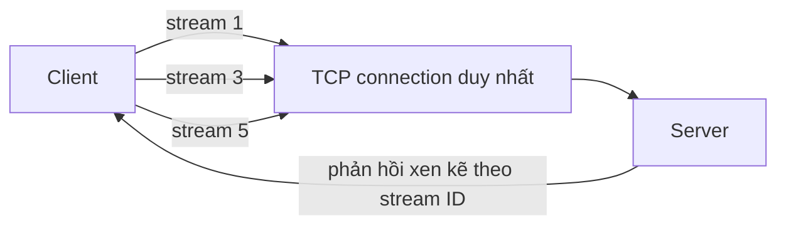

# ⚡ HTTP/2: Ghép kênh trên một kết nối TCP và cái giá phải trả

> Nguồn: `026-HTTP2.txt` · [Udemy](https://ua.udemy.com/course/fundamentals-of-backend-communications-and-protocols/learn/lecture/34630272)

Chào các bạn! Hôm nay mình dành hẳn một bài riêng cho **HTTP/2**, giao thức gần như đã trở thành mặc định trước khi HTTP/3 xuất hiện. *Đừng học thuộc, đừng cố tuân theo từng luật — hãy nhìn vào kiến trúc và cách người ta tiến hóa giao thức, đó mới là thứ khiến mình mê mẩn.* Cá nhân mình vẫn thích HTTP/1.1 trong một số use case, nhưng HTTP/2 cũng rất đáng học.

### 🔍 HTTP/1.1 nhìn từ góc độ socket

Chúng ta nhìn mọi thứ từ góc độ **TCP connection (kết nối TCP)** thay vì sơ đồ trừu tượng — coi như đang zoom vào tận bên trong:

* Một TCP connection được tạo ra, gửi request đi. Ngay lập tức "ống" đó bị coi là bận và không ai được dùng connection này cho việc khác. Vì sao? Vì **pipelining (gửi nối tiếp nhiều request không chờ phản hồi)** đã không thành công với chúng ta.
* Xong response, browser lại gửi request tiếp: HTML xong tới JavaScript, CSS, ảnh… Cứ thế lặp lại trên cùng connection.
* Vì một connection là điểm nghẽn, browser mở tới **6 connections** và chạy song song để lấy response đồng thời. Chrome chọn con số 6 — mình không biết vì sao, có lẽ là thử sai mà ra. Con số này tính theo domain.

### ⚙️ HTTP/2: tất cả request trên một kết nối, mỗi request một stream

HTTP/2 nói: hãy gửi tất cả request đồng thời trên **cùng một TCP connection**. Điểm thú vị là mỗi request được gắn một **stream ID (mã luồng)** duy nhất:

* Client thường dùng số lẻ: 1, 3, 5, 7.
* Khi server muốn gửi stream về cho client, server chọn số chẵn. Đó là cách giao thức HTTP/2 được xây dựng.
* Server có thể xử lý đồng thời (nếu là multithreaded server) và trả về không cần đúng thứ tự: stream 7 có thể xong trước stream 3. *Nghe rất hay, nhưng chưa hoàn toàn đúng — vì chúng ta vẫn bị trói bởi thứ tự của TCP, mình sẽ nói ngay bên dưới.*

Mô hình một connection nhiều stream:

Cái được của HTTP/2 khá rõ:

* **Multiplexing (ghép kênh)** trên một connection giúp tiết kiệm tài nguyên: một connection thay vì sáu.
* **Nén cả header lẫn data**. HTTP/1.1 từng nén được header nhưng tính năng đó bị vô hiệu, Cloudflare tắt hẳn với HTTP/1.1 — *dù giờ Cloudflare đã chạy HTTP/3 hết rồi*.
* **Secure by default (mặc định bảo mật)**. Vì sao? Vì hiện tượng **protocol ossification (sự "hóa đá" của giao thức)**: các giao thức có những luật cố định và bị hardcode trong middle boxes, router; muốn thay đổi thì phải update router, nếu không sẽ bị từ chối. Tiến hóa giao thức cực kỳ khó, nên người ta chọn cách thương lượng qua TLS.

### 💡 Server push: ý tưởng đẹp nhưng đã "chết"

**Server push (đẩy tài nguyên từ server)** ngày nay xem như đã chết, nhưng vì mục đích legacy mình vẫn kể lại. Ý tưởng rất hấp dẫn: client GET `index.html`, server tự suy luận "à, bạn sẽ cần CSS, JavaScript, JPEG" rồi đẩy hết về trước. Nghe hay đấy, nhưng:

* Server **không biết** client có thực sự cần hay không. Client có thể đã **cache** sẵn những tài nguyên đó, còn server cứ push — lãng phí tài nguyên.
* Muốn cấu hình để đỡ lãng phí thì mọi thứ trở nên rất "nasty", rất nhanh.
* Client thì bối rối: xưa nay HTTP là một request một response, tự nhiên nhận một lúc bốn streams response — "chuyện gì đang xảy ra vậy?".
* Về bản chất đây là **breaking change với mô hình web**: API thông thường không thể tương thích. Đó là lý do server push không thành công. *Mình từng rất hào hứng với nó trong video trên kênh YouTube của mình 4-5 năm trước, nhưng mọi thứ thay đổi, và mình cũng học được nhiều.*

Thứ thay thế nó là **early hints** — một header cho phép client biết trước về những tài nguyên có thể cần trong tương lai, thay vì server tự ý đẩy đi.

### 🧠 TCP head-of-line blocking và cái giá CPU

Đây là vấn đề lớn nhất của HTTP/2. Giả sử bạn gửi 5 streams theo thứ tự, TCP sẽ đánh số sequence lên các segment theo đúng thứ tự đó — vì đó là thuộc tính của TCP, và bạn thật ra *muốn* nó như vậy. Nhưng nhìn tổng thể, request số 10 chẳng liên quan gì request số 1; về mặt logic nó hoàn toàn có thể đến trước. Vậy mà:

* Nếu segment đầu của request 1 bị mất, dù các request từ 2 đến 10 đã đến server đầy đủ, **server sẽ không xử lý bất kỳ cái nào** — thậm chí nó không biết chúng tồn tại.
* Chỉ vì **một packet** của request 1 bị mất, toàn bộ phần còn lại bị chặn. Đó là **TCP head-of-line blocking (chặn đầu hàng)**.
* *TCP chỉ là một dòng byte "ngu ngốc", nó không biết stream là gì cả.*

Thêm một gánh nặng nữa: HTTP/2 có protocol-level headers, stream lẻ phía client, stream chẵn phía server, và là giao thức nhị phân. Backend phải đọc và parse đủ thứ: stream header, flow control ở tầng stream, "đã có stream 3 mà chưa thấy stream 4"… Tất cả đều ngốn **CPU**. Ngay khi implement HTTP/2, CPU của backend tăng vọt vì khối lượng việc cộng thêm đó.

*Nothing is free, các bạn ạ. Mọi thứ đều có ưu điểm và nhược điểm, và việc của backend engineer là hiểu điều đó.* Bạn có thể nói "mình sẽ spin thêm Docker container, tạo thêm pod Kubernetes, ai quan tâm" — được thôi nếu bạn nhiều tiền. Nhưng nếu muốn giữ tài nguyên ở mức tối thiểu thì phải hiểu con dao hai lưỡi này.

### 📊 Khi nào HTTP/2 đáng dùng? (và demo hiệu năng)

Lý do HTTP/2 sinh ra là vì client gửi **rất nhiều request trên cùng một connection**. Nhưng nếu bạn chỉ gửi một request mỗi phút hoặc mỗi giây, và backend xử lý nhanh tới mức trả response ngay lập tức, thì dùng HTTP/2 chẳng để làm gì.

* **HTTP/2 không tự động nhanh hơn.** Chính workload quyết định độ nhanh. Nếu bạn gửi 100 request cùng lúc, HTTP/2 rất đẹp vì nó stream hết trên một connection, trong khi browser bị giới hạn 6 connections.
* Demo: một trang load 100 ảnh — cắt ra từ một ảnh lớn, trong đó có cả hình Michael Scott — chạy trên HTTP/1.1 rồi HTTP/2, với mạng bị làm chậm giả lập 3G/4G để nhìn cho rõ. HTTP/1.1 mất một khoảng thời gian đáng kể, còn HTTP/2 nhanh hơn hẳn nhờ multiplexing và không bị giới hạn số connection.
* HTTP/2 vẫn có **giới hạn số stream tối đa**, nhưng con số này có thể cấu hình được.
* *Nhớ kỹ phần nhược điểm: bạn chỉ thấy CPU cao khi có nhiều request chạy đồng thời. Hiểu điều này quan trọng hơn nhớ danh sách tính năng.*

Bảng đối chiếu nhanh HTTP/1.1 và HTTP/2:

| Tiêu chí | HTTP/1.1 | HTTP/2 |
|---|---|---|
| Số connection | Browser mở tới 6 connection mỗi domain | Một connection duy nhất |
| Đồng thời | Một request tại một thời điểm, pipelining thất bại | Nhiều stream song song |
| Nén | Header không được nén | Nén cả header lẫn data |
| Bảo mật | Không bắt buộc | Secure by default |
| Điểm yếu | Chậm khi trang nhiều tài nguyên | TCP head-of-line blocking, tốn CPU |

### 🎯 Tự kiểm tra nhanh

**Câu 1:** Client và server dùng stream ID chẵn lẻ theo quy ước nào?

<b>Xem đáp án</b>

**Đáp án:** Client dùng số lẻ 1, 3, 5, 7; server dùng số chẵn khi muốn gửi stream về.

Giải thích: Đây là cách giao thức HTTP/2 được xây dựng.

Tham chiếu: Mục HTTP/2 — tất cả request trên một kết nối.

**Câu 2:** Vì sao server push thất bại?

<b>Xem đáp án</b>

**Đáp án:** Server không biết client có thực sự cần hay đã cache sẵn, và nó là breaking change với mô hình web một request một response.

Giải thích: Thứ thay thế nó là early hints — client biết trước tài nguyên thay vì bị server tự ý đẩy.

Tham chiếu: Mục Server push.

**Câu 3:** TCP head-of-line blocking là gì?

<b>Xem đáp án</b>

**Đáp án:** Một segment bị mất khiến toàn bộ các segment phía sau bị chặn, dù chúng thuộc stream khác.

Giải thích: TCP chỉ là một dòng byte "ngu ngốc", nó không biết stream là gì; thứ tự giao hàng áp cho cả connection.

Tham chiếu: Mục TCP head-of-line blocking và cái giá CPU.

**Câu 4:** Khi nào HTTP/2 không đem lại lợi ích gì?

<b>Xem đáp án</b>

**Đáp án:** Khi bạn chỉ gửi một request mỗi phút hoặc mỗi giây và backend trả response ngay lập tức.

Giải thích: HTTP/2 không tự động nhanh hơn — chính workload quyết định, chỉ đẹp khi nhiều request đồng thời.

Tham chiếu: Mục Khi nào HTTP/2 đáng dùng.

**Câu 5:** Vì sao backend tốn CPU hơn khi chạy HTTP/2?

<b>Xem đáp án</b>

**Đáp án:** Vì phải parse binary framing, stream header, flow control tầng stream và quản lý thứ tự stream.

Giải thích: Ngay khi implement HTTP/2, CPU backend tăng vọt vì khối lượng việc cộng thêm.

Tham chiếu: Mục TCP head-of-line blocking và cái giá CPU.

Tóm lại, chúng ta đã ôn lại HTTP/1.1, hiểu HTTP/2 hoạt động ra sao, và nhìn thẳng vào cả ưu lẫn nhược điểm — vì không có gì là hoàn hảo. Hiểu được vì sao server push thất bại và vì sao head-of-line blocking lại đau như vậy sẽ giúp các bạn rất nhiều khi thiết kế hệ thống. Ở bài tiếp theo, chúng ta sẽ xem **HTTP/3** và QUIC giải quyết những vấn đề này bằng cách thay luôn cả TCP. Hẹn gặp các bạn! 🚀

## Nguồn tham khảo

- [Udemy — HTTP/2](https://ua.udemy.com/course/fundamentals-of-backend-communications-and-protocols/learn/lecture/34630272)
- [RFC 9113 — HTTP/2](https://www.rfc-editor.org/rfc/rfc9113.html)
