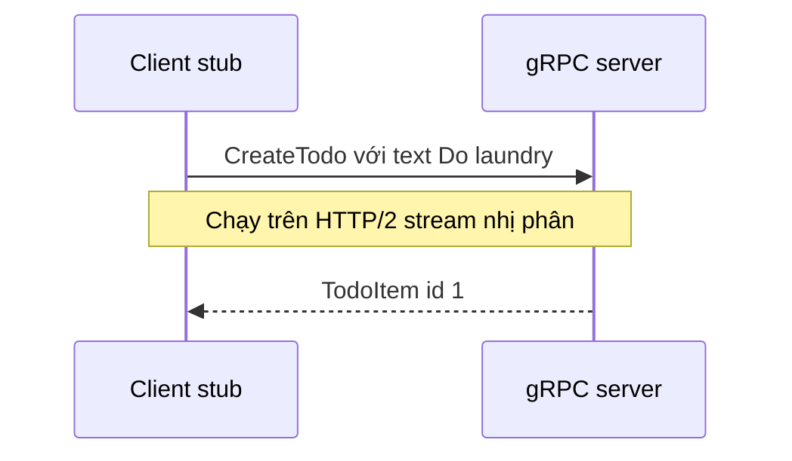

# 🔧 gRPC: Khi một protocol cố "thống trị" mọi giao tiếp client - server

> Nguồn: `028-gRPC.txt` · [Udemy](https://ua.udemy.com/course/fundamentals-of-backend-communications-and-protocols/learn/lecture/34630280)

Chào các bạn! Hôm nay chúng ta nói về **gRPC** (viết tắt của Google RPC — gọi thủ tục từ xa). Nó được xây trên **HTTP/2** và tận dụng tối đa các stream để cho bạn đủ thứ: bidirectional streaming, unidirectional streaming, request/response. Điều khiến nó cực kỳ hấp dẫn là bên cạnh nó còn có **protocol buffers (định dạng tuần tự hóa nhị phân)** — schema gọn gàng, hỗ trợ nhiều ngôn ngữ, compile được ra ngôn ngữ bạn muốn.

### 🎯 Động lực: vấn đề nằm ở client library, không phải ở protocol

Chúng ta đã có quá nhiều giao thức: SOAP, REST, GraphQL, WebSockets, rồi TCP/UDP server tự chế. Vậy tại sao cần thêm một cái nữa? Vấn đề lớn nhất nằm ở **client library (thư viện phía client)**:

* Mỗi giao thức buộc client và server phải đồng ý với nhau về "ngôn ngữ" chung — đúng những đặc tính của protocol mà chúng ta đã bàn.
* Mỗi ngôn ngữ lại cần một library riêng: dùng SOAP thì cần SOAP library, dùng HTTP thì cần HTTP library. Duy trì và vá library cực kỳ vất vả.
* Các hệ thống enterprise từng "phát điên" vì chuyện này: batch hàng loạt library cũ, thêm feature mới, vá lỗ hổng bảo mật — rất khó.

Ý tưởng của gRPC: làm **một library duy nhất** cho các ngôn ngữ phổ biến. Bạn viết file định nghĩa protocol buffer, rồi từ đó sinh ra các **stub** cho ngôn ngữ của bạn — library về cơ bản được sinh tự động, bạn không phải tự viết. *Tất nhiên bug vẫn có thể xảy ra trong library đó, bạn vẫn phải update và regenerate, nhưng đó là cách nó hoạt động.*

Bên dưới, gRPC dùng **HTTP/2** như một implementation hoàn toàn ẩn: nó lộ ra một API cho bạn dùng, còn bên trong nói trực tiếp với HTTP/2. Có một vấn đề mở là chuyển sang HTTP/3, nhưng nhóm gRPC chưa hoàn toàn bị thuyết phục — cần một lý do rất tốt để thay đổi toàn bộ implementation vốn gắn chặt với low-level API của HTTP/2. *Và mình đồng ý một phần: đổi cả nền móng thì phải có lý do chính đáng.*

### 🧩 Bốn chế độ của gRPC

Đây là phần khiến gRPC khác biệt — một giao thức làm được mọi kiểu giao tiếp:

1. **Unary (request/response)**: client gửi một request, server trả một response. Cần gì đơn giản thì dùng cái này.
2. **Server streaming**: client gửi request, server stream nội dung về. Ví dụ tải file lớn, hoặc "cho tôi tiến trình công việc", "cho tôi mọi event đang diễn ra".
3. **Client streaming**: ví dụ upload file lớn, server hầu như không nói gì lại.
4. **Bidirectional streaming**: cả client và server cùng nói chuyện với nhau.

Một cuộc gọi unary cơ bản diễn ra như sau:

### ⚙️ Dựng từ số 0: proto file, server và client

Mình build một todo app bằng Node.js và Visual Studio Code, dùng JavaScript cho cả hai phía — nhưng bạn hoàn toàn có thể dùng Python cho client và Node.js cho backend, vì **protocol buffers là language neutral (trung lập ngôn ngữ)**, đó là một đặc tính của nó.

Trình tự mình làm:

1. Khởi tạo project mới, rồi tạo **proto file** — đây là schema giao tiếp bắt buộc khi dùng gRPC. Khai báo `syntax = "proto3"` vì đó là phiên bản protocol buffer mới nhất, rồi khai báo package, ví dụ `todo` — một package có thể chứa nhiều service, mình chỉ làm một service `Todo`.
2. Service có hai phương thức RPC: `CreateTodo` (nhận một text, trả về một `TodoItem`) và `ReadTodos` (không nhận gì, trả về `TodoItems`).
3. Định nghĩa message `TodoItem` gồm `int32 id = 1` (như cột ID trong database) và `string text`. Với mảng, protocol buffers dùng từ khóa `repeated` — đó là cách mình khai báo `TodoItems`.
4. Có một điều "xấu xí": protocol buffers **không có khái niệm "không tham số"** như `void` trong C. Bạn phải định nghĩa một message rỗng thật sự. Mình từng đặt tên nó là `void` và bị lỗi "unexpected token void" vì `void` là từ bị reserve — đổi thành `NoParams` là xong.
5. gRPC dùng **protocol compiler** tương tự công cụ của Google để compile proto sang ngôn ngữ bạn chọn; nó tự động hóa hết, không phải tự đi tìm đúng bản cho từng hệ điều hành như trước.
6. Phía server: cài library `grpc` và **proto loader** (cái này compile proto thành các file JavaScript chứa schema kèm getters/setters; Python hay C# cũng làm y hệt). Dùng proto loader load file proto theo kiểu synchronous để có **package definition**, rồi nạp nó vào gRPC object để lấy ra package `todo` — giờ bạn đã có toàn bộ schema và message trong tay.
7. Tạo server bằng `new grpc.Server()`, **bind** vào địa chỉ và port — ví dụ `0.0.0.0:40000`, listen trên mọi interface. Không cần khai báo protocol vì mặc định đã là HTTP/2. Server cần **credentials**, nhưng có thể bypass bằng `createInsecure` (giao tiếp plaintext — mình sẽ có video riêng về cách dùng SSL với certificate).
8. Quan trọng: hai dòng tạo server **không hề biết** service của bạn là gì. Phải gọi `addService`: tham số đầu là service definition lấy từ package, tham số hai là object map tên method sang hàm xử lý (`createTodo`, `readTodos`). Cuối cùng `start()` để bắt đầu listen.
9. Vài lỗi vặt đáng nhớ: đặt tên project trùng với `grpc` khiến npm từ chối cài đặt, và gọi sai object (`grpc` thay vì `gRPC`) gây lỗi "cannot read property todo of undefined". *Những lỗi nhỏ này là chuyện thường, và đó chính là cách chúng ta học.*

### 🔄 Call object, callback và kỷ luật schema

Method trong gRPC luôn nhận **hai tham số**: một object gọi là `call` — không phải request đơn thuần mà là toàn bộ "cuộc gọi", bạn có quyền truy cập cả TCP connection và mọi thứ khác — và một **callback** để gửi response về cho client. Sau đó:

* Server lưu todo vào một mảng trong memory: ID bằng độ dài mảng cộng một, item đầu tiên là 1, item thứ hai là 2… *Mình "ăn gian" ở đây — đây chỉ là ví dụ, đừng làm thế trong production.*
* Trả kết quả về bằng cách gọi `call(null, todoItem)`: truyền `null` để kích thước payload tự tính, kèm item vừa tạo.
* Phía client: phần đầu giống hệt server vì nó cũng phải hiểu package và service, nhưng thay vì listen thì client **connect** — tạo client object từ package/service với IP và port (ví dụ localhost, port 40000) cùng credentials `createInsecure` (client credentials và server credentials khác nhau về metadata).
* Gọi `createTodo` bằng một **JSON object** như `{ id: -1, text: 'Do laundry' }` là được — không cần tạo class trung gian nào cả, *đây là điểm mình cực kỳ thích*. Callback nhận vào `error` và `response` từ server.

Chạy demo: server nhận **call object**, trong đó request đúng y hệt object mà client gửi (id và text) — tất cả ở dạng **nhị phân nén**, bạn không nhìn thấy được nhưng cứ tin mình đi. Gửi tiếp "Walk the dog", "Study"… server lưu hết.

Rồi tới `readTodos`: client gửi empty object (message rỗng lúc nãy), server trả về cả mảng. Ở đây có một bài học về schema: bạn **không thể gửi mảng "trần"** — phải bọc trong object đúng khóa như `items` vì schema phải khớp chính xác từng chữ. *Schema là hợp đồng, không thể "xấp xỉ" được.* Và trả cả mảng một lần là ý tồi nếu bạn có 30.000 todo — cực kỳ tốn CPU và đắt đỏ; tốt hơn là stream về và để client xác nhận từng phần.

### 🌊 Streaming: đừng "nhồi" hết mọi thứ vào họng client

Để làm đúng bài, mình định nghĩa thêm một hàm `readTodosStream`, trả về một **stream kiểu `TodoItem`** — mỗi lần một item, không phải mảng `repeated`:

* Phía client gọi hàm, nhưng lần này **không còn callback**: nó nhận một call object và gửi empty object. Sau đó lắng nghe event `data` để nhận từng item và event `end` khi server kết thúc — in ra "server done".
* Phía server: với mỗi todo, gọi `call.write(item)`, xong hết thì `call.end()`.
* Lợi ích rất rõ: bạn có thể ghi một item, chờ client xử lý vài mili giây rồi ghi tiếp — đo lường được, không dồn nén mọi thứ vào client trong một cú duy nhất. *Giống như buổi hẹn hò đầu tiên vậy: từ từ thôi, các bạn, từ từ thôi.*
* Trong demo, client nhận từng item một theo thứ tự, và có một chút phòng thủ cần thiết: kiểm tra dữ liệu có thể `null`/`undefined` trước khi dùng.

### 📊 Ưu điểm, nhược điểm và câu chuyện Spotify - Hermes

**Ưu điểm:** gRPC nhanh và compact nhờ đứng trên HTTP/2 với giao thức nhị phân; **một client library** thay vì vô số library, do team gRPC và cộng đồng quản lý; một giao thức làm được đủ thứ — upload progress, download feedback, stream log, stream event; và cả **cancel request** — thứ cực khó làm với HTTP/2: client phải có định danh duy nhất cho request (có thể dùng stream ID), backend phải đọc yêu cầu hủy và tự nguyện dừng lại. Protocol buffers cũng là một message format rất mạnh.

**Nhược điểm:**

* **Schema bắt buộc** — nhiều người thích điều này, nhưng có use case bị schema làm chậm. Không ai muốn maintain 700 file proto và sửa mỗi khi schema thay đổi; dân REST thích sự linh hoạt của JSON.
* Vẫn là **thick client**: là library thì có bug, thậm chí có cả vấn đề bảo mật trong chính library đó.
* **Proxy khá tricky** — nhưng đã làm được: Nginx có thể làm gRPC layer 7 reverse proxy và load balancing, hiểu được stream, khác hoàn toàn với kiểu layer 4 chỉ bypass connection.
* **Không có native error handling** — bạn phải tự xây lấy.
* **Không có native browser support**: browser không expose API stream của HTTP/2 (cố ý trừu tượng hóa), nên bạn cần một gRPC-web proxy — web app trỏ vào proxy, proxy chuyển request thành gRPC thật, kiểu **sidecar pattern**.
* **Timeout**: kết nối chạy lâu dễ bị kill vì "không ai dùng"; và vì HTTP/2 chạy trên TCP nên connection có thể chết bất cứ lúc nào. Nếu connection chết khi bạn có 7 streams đủ loại — unary, bidirectional, server-side, client-side — tất cả phải thiết lập lại từ đầu. *Đặt hết trứng vào một rổ.*

Bảng đối chiếu nhanh gRPC và REST:

| Tiêu chí | gRPC | REST |
|---|---|---|
| Định dạng dữ liệu | Nhị phân với protocol buffers | JSON dạng text linh hoạt |
| Schema | Bắt buộc, compile từ proto file | Không bắt buộc |
| Client library | Một library sinh tự động cho nhiều ngôn ngữ | Mỗi bên tự xử lý |
| Streaming | Bốn chế độ, kể cả bidirectional | Chủ yếu request/response |
| Browser | Cần gRPC-web proxy kiểu sidecar | Gọi trực tiếp |

**Tự viết protocol riêng thì sao?** Hoàn toàn được chứ. Spotify từng làm **Hermes** — một giao thức tuyệt vời, không có vấn đề gì. Nhưng chỉ Spotify dùng nó: mỗi nhân viên mới vào đều phải được dạy về Hermes, không ai bên ngoài biết đến nó, cũng chẳng rõ có open source không. Kết quả là Spotify **chuyển sang gRPC** không phải vì Hermes dở, mà vì ai cũng biết gRPC. *Đôi khi độ phổ biến thắng — giống như ai cũng làm web app vì HTTP có mặt khắp nơi vậy.*

### 🎯 Tự kiểm tra nhanh

**Câu 1:** Vấn đề gốc mà gRPC sinh ra để giải quyết là gì?

<b>Xem đáp án</b>

**Đáp án:** Gánh nặng client library — mỗi giao thức, mỗi ngôn ngữ cần một library riêng phải bảo trì và vá lỗi.

Giải thích: gRPC sinh stub tự động cho ngôn ngữ bạn chọn từ một file proto duy nhất.

Tham chiếu: Mục Động lực.

**Câu 2:** Kể tên bốn chế độ giao tiếp của gRPC.

<b>Xem đáp án</b>

**Đáp án:** Unary (request/response), server streaming, client streaming và bidirectional streaming.

Giải thích: Một giao thức làm được mọi kiểu giao tiếp — đó là điểm khác biệt của gRPC.

Tham chiếu: Mục Bốn chế độ của gRPC.

**Câu 3:** Vì sao protocol buffers cần một message rỗng thay vì `void`?

<b>Xem đáp án</b>

**Đáp án:** Vì protocol buffers không có khái niệm "không tham số"; `void` là từ reserve nên phải định nghĩa message rỗng như `NoParams`.

Giải thích: Mình từng đặt tên `void` và ăn lỗi "unexpected token void".

Tham chiếu: Mục Dựng từ số 0.

**Câu 4:** Vì sao không thể gửi mảng "trần" qua gRPC?

<b>Xem đáp án</b>

**Đáp án:** Vì schema phải khớp chính xác từng chữ — mảng phải bọc trong object đúng khóa như `items`.

Giải thích: Schema là hợp đồng, không thể "xấp xỉ" được; trả cả mảng lớn một lần còn rất tốn CPU, nên stream sẽ tốt hơn.

Tham chiếu: Mục Call object, callback và kỷ luật schema.

**Câu 5:** Vì sao Spotify chuyển từ Hermes sang gRPC?

<b>Xem đáp án</b>

**Đáp án:** Vì ai cũng biết gRPC — nhân viên mới không cần được dạy một protocol riêng, còn Hermes chỉ mình Spotify dùng.

Giải thích: Đôi khi độ phổ biến thắng, giống như HTTP có mặt khắp nơi vậy.

Tham chiếu: Mục Ưu điểm, nhược điểm và câu chuyện Spotify.

Tóm lại, gRPC đã giải bài toán "một giao thức cho mọi nhu cầu": microservices ngày nay gần như mặc định dùng nó — request/response, stream log, stream event, upload file lớn, tất cả đều gRPC. Vì đứng trên HTTP/2 nên chỉ một connection là đủ. Trong kiến trúc cloud native với service mesh, ứng dụng của bạn có thể chỉ nói HTTP/1.1 còn sidecar container và proxy lo phần gRPC giúp bạn — library không còn là vấn đề nữa. Nhưng nếu chỉ xây một ứng dụng đơn giản, gRPC có thể là **overkill**. Hẹn gặp các bạn ở bài tiếp theo — **WebRTC** — để xem giao thức thời gian thực này giải quyết bài toán kết nối peer-to-peer như thế nào nhé! 🚀

## Nguồn tham khảo

- [Udemy — gRPC](https://ua.udemy.com/course/fundamentals-of-backend-communications-and-protocols/learn/lecture/34630280)
- [gRPC — Core concepts, architecture and lifecycle](https://grpc.io/docs/what-is-grpc/core-concepts/)
