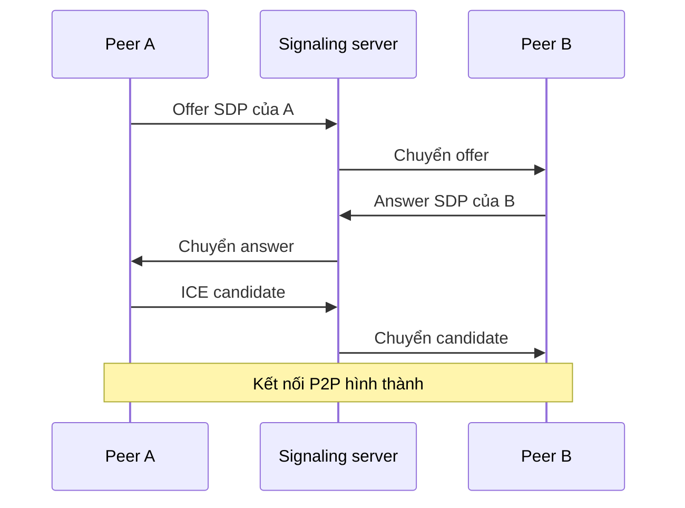

# 🎥 WebRTC: Hiểu tận gốc video call thời gian thực — SDP, ICE, STUN, TURN và bài demo trên trình duyệt

> Nguồn: `029-WebRTC.txt` · [Udemy](https://ua.udemy.com/course/fundamentals-of-backend-communications-and-protocols/learn/lecture/34630282)

Các bạn có bao giờ tự hỏi vì sao gọi video trên trình duyệt lại mượt đến vậy, dù hai người chẳng đi chung một server nào không? Hôm nay mình sẽ mổ xẻ **WebRTC (truyền thông thời gian thực trên web)** — công nghệ đứng sau mọi ứng dụng call video chạy trên web — đi từ triết lý peer-to-peer cho tới từng viên gạch **SDP, ICE, STUN, TURN**. Và như mọi khi: *không hộp đen, chúng ta sẽ hiểu tường tận bên dưới đường truyền.*

### 🎯 Vì sao WebRTC ra đời: con đường ngắn nhất giữa hai peer

WebRTC là dự án **miễn phí, mã nguồn mở**, mang giao tiếp thời gian thực đến trình duyệt và ứng dụng mobile. Mục tiêu gồm 3 phần: định nghĩa một protocol nối **peer-to-peer (ngang hàng)** — đường đi ngắn nhất, độ trễ thấp nhất; cung cấp **API đơn giản, đẹp** cho mọi người; và một khi đã nằm trong trình duyệt, nó trở thành chuẩn — mọi ma sát biến mất.

Nhu cầu gốc là truyền **media (audio/video)** theo cách chuẩn hóa, độ trễ thấp. UDP là lựa chọn tốt vì gần như không có acknowledgement qua lại, nhưng ta vẫn cần một protocol "khá hơn" một chút. Quan trọng nhất: **không đi vòng qua server trung gian**, vì reverse proxy hay TURN đều phải terminate traffic, xử lý, giải mã rồi mã hóa lại — tốn kém và cộng thêm độ trễ. Với livestream hay call video, bạn muốn mọi thứ đến nhanh nhất có thể, nên **peer-to-peer chính là đường nhanh nhất**. Nghe hơi giống torrent phải không? Đại khái là vậy.

WebRTC còn mở khóa giao tiếp "giàu" giữa các trình duyệt: truy cập camera, micro mà không phải tự viết app từ đầu — browser, thiết bị IoT, mobile đều dùng chung bộ API.

Kịch bản thú vị nằm ở chỗ: A muốn nối tới B nhưng **hai bên chưa hề biết nhau**. A tự hỏi "công chúng chạm tới mình bằng cách nào?" — có public IP không, router có cho mở port forwarding không, có hiện diện công khai không? B cũng làm y hệt, kèm danh sách mã hóa, tham số bảo mật, codec nén video mà mình hỗ trợ. Tất cả gom lại thành một **offer**. Trớ trêu là WebRTC bảo bạn: gửi cục string đó sang bên kia bằng gì cũng được — WhatsApp, QR code, tweet, WebSocket, HTTP fetch. *Nghe vô lý kiểu "tôi cho bạn kết nối P2P, với điều kiện hai bạn đã liên lạc được với nhau" — nhưng hiểu ra rồi thì rất hợp lý, mình sẽ nói tiếp ở phần signaling.*

---

### 🌐 NAT — kẻ đứng giữa bạn và peer

Nếu bạn có **public IP**, mọi chuyện đơn giản: mở port, đưa IP cho người ta, họ kết nối thẳng vào (kiểu instance EC2). Nhưng gần như ai cũng nằm **sau NAT (Network Address Translation — dịch địa chỉ mạng)**: router giữ public IP (ví dụ 5.5.5.5), còn bạn là 10.0.0.2, gateway 10.0.0.1, các thiết bị khác .3, .4, .5...

Khi bạn gửi request tới một web server ngoài Internet, máy bạn **subnet masking** (255.255.255.0) để biết không cùng mạng, rồi gửi cho gateway kèm MAC của router qua ARP. Router thay địa chỉ nguồn bằng public IP cộng một **port ngẫu nhiên**, đồng thời ghi lại **bảng NAT**: 10.0.0.2:8992 đi tới server:80 được gán external 5.5.5.5:3333. Server trả lời về 5.5.5.5:3333, router tra bảng rồi "swizzle" ngược về 10.0.0.2:8992. Nắm được cái bảng này là nắm được gốc rễ của mọi vấn đề.

Các router có **4 kiểu NAT** (mỗi hãng triển khai một kiểu, đừng quá tuyệt đối):

1. **1-1 NAT / full cone**: địa chỉ ngoài luôn map vào trong, **không quan tâm ai gửi tới**. Tuyệt vời cho P2P: biết 5.5.5.5:3333 là người khác gửi stream tới được ngay, không cần liên lạc trước.
2. **Address-restricted NAT**: chỉ cho vào nếu **địa chỉ nguồn đã từng liên lạc** với mình (không xét port).
3. **Port-restricted NAT**: phải khớp **cả địa chỉ lẫn port** của lần liên lạc trước đó.
4. **Symmetric NAT**: khắt khe nhất — chỉ đúng cặp 4-tuple đã ghi trong bảng mới được vào, không nới bất kỳ trường hợp nào.

WebRTC mặc định chạy đẹp với 3 kiểu đầu — 90% giao tiếp thực tế diễn ra ở đó — riêng symmetric thì *gần như vô dụng với mình; nếu rơi vào trường hợp này, theo quan điểm cá nhân, mình thà tìm cách khác còn hơn.* Lý do symmetric "phá" mọi thứ: mapping được tạo ra **chỉ dành cho một server cụ thể**, không tái dùng được cho peer khác.

---

### 📡 STUN, TURN và ICE: bộ ba vượt NAT

**STUN (Session Traversal Utilities for NAT)** trả lời đúng một câu hỏi: "public IP:port của tôi qua NAT là gì?" Bạn gửi packet, server nhét địa chỉ nó nhìn thấy vào packet trả về — hết. Vì quá nhẹ (chạy port 3478, bản TLS dùng 5349, chỉ cần một Docker container), **Google cung cấp STUN public miễn phí** (stun1, stun2, stun3, stun4).

Ví dụ: máy A sau router hỏi STUN → biết mình là 5.5.5.5:3333; máy B hỏi → 7.7.7.8:4444; hai bên trao đổi qua signaling rồi kết nối. Với **full cone**, B gửi thẳng tới là vào được luôn. Với **address-restricted**, gói đầu tiên bị chặn ("ai đấy? tao không biết mày") — hai bên phải **gửi trước cho nhau một gói** để router hai bên ghi nhớ địa chỉ, sau đó mới nối được; port-restricted cũng vậy nhưng chặt hơn. Còn **symmetric NAT thì STUN thua**: mapping tạo ra chỉ để nói chuyện với STUN server, không chia sẻ được cho peer.

Đó là lúc cần **TURN — server hỗ trợ NAT traversal bằng cách trung chuyển gói tin**, không làm gì khác ngoài relay qua lại. Nghe quen không? Nó giống reverse proxy nhưng nhẹ hơn vì không soi sâu vào thông tin tầng 4 hay deep packet inspection kiểu proxy tầng 7. Mọi giao tiếp đều chảy qua hub này nên **đắt và cực kỳ tốn công vận hành** — chẳng ai cho TURN miễn phí, muốn dùng thì tự dựng. Discord cũng tự xây TURN server để kiểm soát traffic của mình.

Rồi làm sao chọn giữa núi lựa chọn đó? **ICE (cơ chế kết nối tương tác — Interactive Connectivity Establishment)** thu thập **mọi khả năng** người khác có thể chạm tới bạn: local IP (cùng mạng thì khỏi cần public), reflexive qua STUN, relayed qua TURN, nhiều public IP khác nhau... Mỗi địa chỉ là một **ICE candidate**; cái này fail thì cái khác chạy. Quá trình "trickling" này **tốn thời gian** — mình từng sốt ruột không chờ đủ và ăn đủ loại lỗi. Tất cả candidate được gói vào **SDP** để gửi sang peer.

**SDP (giao thức mô tả phiên — Session Description Protocol)** mô tả ICE candidate, phương án mạng, media, bảo mật... và cả một đống thứ mình thừa nhận là đọc không hết. *Theo mình nó không hẳn là protocol — nó là format.* Bạn có thể nhét "đồ riêng" vào đây, và Discord đã làm đúng vậy: tự viết SDP tùy biến gắn với hệ thống voice server riêng thay vì phụ thuộc STUN/TURN mặc định.

Bảng đối chiếu nhanh bộ ba vượt NAT:

| Thành phần | Vai trò | Chi phí vận hành |
|---|---|---|
| STUN | Cho biết public IP:port của bạn sau NAT | Rất nhẹ, có server public miễn phí |
| TURN | Trung chuyển gói tin khi P2P bất khả thi | Đắt, tốn public IP, mọi traffic dồn qua một choke point |
| ICE | Thu thập mọi candidate rồi chọn đường hoạt động | Tốn thời gian trickling, phải chờ đủ mới chốt SDP |

---

### 🔑 Signaling & SDP offer/answer: cặp đôi không thể tách rời

**Signaling** thực chất chỉ là: "làm sao gửi cục SDP sang bên kia?" — WebSocket/socket.io là lựa chọn phổ biến; có candidate mới thì gửi tiếp; QR code, tweet, WhatsApp đều hợp lệ, WebRTC không quan tâm. Điều bắt buộc là **chờ ICE trickle xong** rồi mới chốt SDP, kẻo gửi "nửa SDP" thì vô dụng.

Còn đây là chỗ mình từng mắc: "muốn nói chuyện P2P thì trước hết hai bên phải nói chuyện được với nhau." Nghĩ kỹ thì hợp lý — bạn dựng một signaling server tạm để trao đổi, xong việc thì "thả" hai bên về kết nối trực tiếp, đổi lấy hiệu năng P2P. Luồng đi chuẩn như sau:

1. A tạo **offer** (chính là SDP của A) và đặt làm **local description**.
2. Offer được signal sang B; B đặt nó làm **remote description**.
3. B tạo **answer** (SDP của B), đặt làm **local description**, chờ đủ candidate rồi signal ngược lại.
4. A nhận answer và đặt làm **remote description** — kết nối hình thành.

Toàn cảnh quá trình signaling và trao đổi ICE candidate:

Mỗi bên luôn có 2 bước: **local description** của mình và **remote description** của đối phương. Một chi tiết bảo mật đáng lưu ý: SDP phơi cả **local IP** của bạn — từng có người tên Sammy khai thác điều này, lợi dụng application layer gateway trên router để mở toang port nội bộ và truy cập từ một malicious server. *Đọc xong mình chỉ biết nói: hay lắm, kính nể.*

Và quan điểm của mình vẫn vậy: **đừng để hộp đen**. Bạn là engineer, hãy hiểu từng dòng mình dùng — nếu nó hỏng mà bạn không hiểu tại sao, đó mới là điều đáng xấu hổ. Có thắc mắc cứ hỏi, hỏi hết mọi thứ.

---

### ⚙️ Demo 2 trình duyệt, ưu nhược điểm và những thứ "beyond WebRTC"

Mình mở thẳng **DevTools của 2 trình duyệt** trên cùng một máy (không VS Code, không npm) và làm một chat channel siêu tối giản: bên A tạo `RTCPeerConnection` rồi `createDataChannel`, gắn `onmessage`/`onopen`; đăng ký `onicecandidate` để **in lại SDP mỗi khi có candidate** (vì chỉ khi hết trickle mới biết SDP hoàn chỉnh); gọi `createOffer()` → `setLocalDescription` — hai ICE candidate xuất hiện. Copy SDP "tweet" sang B: B tạo peer connection riêng, nhận data channel qua `ondatachannel`, `setRemoteDescription(offer)`, `createAnswer()` → `setLocalDescription` → copy answer về A → `setRemoteDescription(answer)`. **Connection open** cả hai đầu, và tin nhắn "yo pair B what up" đi thẳng qua data channel. Muốn làm video call? Chỉ thêm một bước `addTrack` với stream lấy từ camera — mọi thứ khác y nguyên.

**Ưu điểm:**

* **Peer-to-peer là đường nhanh nhất**: đi thẳng, không qua bên thứ ba; router trên Internet hầu hết chỉ chuyển tiếp packet.
* **Độ trễ thấp cho nội dung băng thông lớn**: UDP cứ thế mà đẩy — hai bên càng gần nhau thì hiệu năng càng đỉnh.
* **API chuẩn, đẹp**: chạy ngay trong browser, không cần cài đặt gì.

**Nhược điểm:**

* P2P đôi khi không chạy → phải nhờ TURN, mà **vận hành STUN/TURN rất cực**, tốn public IP, tốn tiền, mọi traffic dồn qua một choke point.
* Với đa người tham gia thì P2P **sụp đổ**: 100 người cần kết nối mesh kiểu mỗi-người-nối-mọi-người — hàng nghìn kết nối; thay vào đó hãy để tất cả nối vào một **server trung tâm** bạn toàn quyền kiểm soát; giới WebRTC gọi hướng này là **SFU (bộ chuyển tiếp chọn lọc)** hoặc **MCU (bộ phối trộn đa điểm)** — Discord đã theo đúng con đường đó.
* Gaming nhiều người: 3 người thì được, 100 người thì mình không thấy ổn.

"Beyond" còn có: **`addIceCandidate`** cho candidate sinh ra sau khi SDP đã gửi (port bị firewall chặn, kết nối đứt — ta thêm candidate mới vào SDP); **cấu hình ICE server** với TURN kèm username/password (ví dụ STUN của Mozilla); dự án mã nguồn mở **Coturn** để tự dựng STUN/TURN; và **`getUserMedia()`** của Media API. Xong phần này, các bạn có thể tự tin rằng không có phép thuật nào ở đây cả — chỉ là một chuỗi cơ chế mà mình vừa tháo tung từng mảnh.

### 🎯 Tự kiểm tra nhanh

**Câu 1:** Vì sao WebRTC ưu tiên kết nối peer-to-peer?

<b>Xem đáp án</b>

**Đáp án:** Vì P2P là đường ngắn nhất, độ trễ thấp nhất — không phải đi vòng qua server trung gian tốn kém.

Giải thích: Reverse proxy hay TURN đều phải terminate traffic, xử lý, giải mã rồi mã hóa lại — cộng thêm độ trễ.

Tham chiếu: Mục Vì sao WebRTC ra đời.

**Câu 2:** Offer/answer và local/remote description hoạt động thế nào?

<b>Xem đáp án</b>

**Đáp án:** A tạo offer, đặt làm local description; B nhận và đặt làm remote description rồi tạo answer; A nhận answer và đặt làm remote description.

Giải thích: Mỗi bên luôn có local description của mình và remote description của đối phương.

Tham chiếu: Mục Signaling & SDP offer/answer.

**Câu 3:** STUN và TURN khác nhau ở điểm nào?

<b>Xem đáp án</b>

**Đáp án:** STUN chỉ cho biết public IP:port; TURN trung chuyển toàn bộ gói tin khi không thể nối trực tiếp.

Giải thích: STUN rất nhẹ và có bản public miễn phí; TURN đắt, phải tự dựng và tốn công vận hành.

Tham chiếu: Mục STUN, TURN và ICE.

**Câu 4:** Vì sao symmetric NAT làm STUN "thua"?

<b>Xem đáp án</b>

**Đáp án:** Vì mapping được tạo chỉ dành cho một server cụ thể, không tái dùng được cho peer khác.

Giải thích: NAT chỉ cho đúng cặp 4-tuple đã ghi trong bảng đi qua, không nới bất kỳ trường hợp nào.

Tham chiếu: Mục NAT và Mục STUN, TURN và ICE.

**Câu 5:** Vì sao đa người tham gia không dùng mesh P2P?

<b>Xem đáp án</b>

**Đáp án:** Vì 100 người cần hàng nghìn kết nối mỗi-người-nối-mọi-người; thay vào đó nên dùng server trung tâm, SFU hoặc MCU.

Giải thích: Discord đã theo con đường server trung tâm tự kiểm soát thay vì mesh.

Tham chiếu: Mục Demo 2 trình duyệt, ưu nhược điểm.

Hẹn gặp lại các bạn ở bài tiếp theo, nơi chúng ta tiếp tục giải mã những giao thức "dưới đường truyền"! 🚀

## Nguồn tham khảo

- [Udemy — WebRTC](https://ua.udemy.com/course/fundamentals-of-backend-communications-and-protocols/learn/lecture/34630282)
- [MDN — WebRTC API](https://developer.mozilla.org/en-US/docs/Web/API/WebRTC_API)
- [MDN — Signaling and video calling](https://developer.mozilla.org/en-US/docs/Web/API/WebRTC_API/Signaling_and_video_calling)
