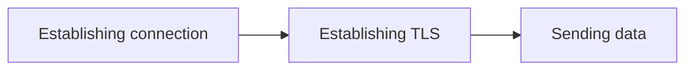

# 🌐 Many Ways to HTTPS: Ba Trụ Cột Của Mọi Kết Nối Web

> Nguồn: `030-HTTPS-Communication-Basics-Intro.txt` · [Udemy](https://ua.udemy.com/course/fundamentals-of-backend-communications-and-protocols/learn/lecture/34630368)

Section trước chúng ta đã đi qua một loạt giao thức: TCP, UDP, mô hình một-hai-ba server, các loại socket, WebRTC, gRPC... và tất nhiên mình không thể kể hết mọi giao thức ngoài kia — mục tiêu chỉ là để các bạn có bức tranh tổng quan mà thôi.

Còn đây là một trong những section mình thích nhất: **Many Ways to HTTPS** — nhiều cách nói chuyện qua HTTPS, và mỗi cách ảnh hưởng đến **latency (độ trễ)** theo một kiểu rất khác nhau. Lần này chúng ta không đào quá sâu vào bản thân HTTPS, vì nó phổ biến đến mức ai cũng gặp hằng ngày, mà sẽ tập trung vào **cách cấu hình** nó.

### 🌍 HTTPS ở khắp mọi nơi — và vì thế, cấu hình cũng muôn hình vạn trạng

HTTPS có mặt ở mọi website, mọi API, mọi ứng dụng di động. Chính vì nó ở khắp mọi nơi nên có **vô số cách cấu hình khác nhau**, và chọn đúng cấu hình cho backend của các bạn là một bài toán thực sự thú vị — nó ảnh hưởng trực tiếp đến trải nghiệm người dùng cuối.

Nói cách khác, đây không còn là chuyện "HTTPS là gì" nữa, mà là chuyện "HTTPS của bạn được lắp ráp theo kiểu nào".

---

### 🧱 Ba trụ cột của mọi kết nối HTTPS

Suy cho cùng, mọi câu chuyện HTTPS chỉ xoay quanh ba việc:

1. **Establishing connection (thiết lập kết nối)** — phải kết nối được tới backend trước đã.
2. **Establishing TLS (Transport Layer Security)** — kết nối xong thì phải mã hóa, vì đây là HTTPS chứ không phải HTTP.
3. **Sending data (gửi dữ liệu)** — cuối cùng mới là gửi dữ liệu thật sự.

Sơ đồ ba trụ cột đó trông như thế này:

Ba trụ cột này chính là thứ chúng ta sẽ ghép lại theo đủ kiểu khác nhau, và các bạn sẽ thấy **QUIC** gộp chúng nhanh đến mức nào. Các bài trong section này cứ thế xây dựng lên nhau, mỗi bài một cấu hình.

---

### ⏱️ Những thao tác đắt đỏ và nghệ thuật giữ kết nối

Điểm mấu chốt các bạn cần nhớ: cả ba trụ cột trên đều **đắt đỏ (expensive)**. Mình không muốn thiết lập kết nối, bắt tay mã hóa, rồi chỉ để gửi được một mẩu dữ liệu nhỏ — xong lại lặp lại từ đầu cho mẩu tiếp theo.

Khi gửi xong dữ liệu, các bạn đóng kết nối. Nhưng chúng ta muốn **giữ kết nối sống càng lâu càng tốt** để gửi được càng nhiều dữ liệu càng hay, vì mỗi lần bắt tay lại là một lần tốn thời gian.

*Đây chính là gốc rễ của mọi kỹ thuật tối ưu mà các bạn sẽ thấy trong section này: trả giá cho việc bắt tay ít nhất có thể, và tái sử dụng mọi thứ đã thiết lập.*

---

### 🗺️ Bản đồ các cách HTTPS chúng ta sẽ đi qua

Có hơn **7 cách** để nói chuyện qua HTTPS, và chúng ta sẽ đi từng bài một. Đây là lộ trình:

1. **HTTPS over TCP với TLS 1.2** — cách cổ điển. Mình sẽ không nhắc TLS 1.1 vì nó đã deprecated, gần như không ai còn dùng.
2. **HTTPS over TCP với TLS 1.3** — bớt được một round trip.
3. **HTTPS over QUIC** — gộp kết nối và mã hóa lại làm một.
4. **HTTPS over TFO (TCP Fast Open)** — một cấu hình thú vị khác.
5. **HTTPS over TCP với TLS 1.3 và 0-RTT (gửi dữ liệu ngay vòng đầu)** — ép số round trip xuống mức thấp nhất có thể.
6. **HTTPS over QUIC với 0-RTT** — phiên bản mạnh nhất, thú thật với các bạn là vậy.

Nhìn nhanh toàn bộ các cấu hình trong một bảng:

| Cách cấu hình | Nền tảng | Đặc điểm chính |
|---|---|---|
| TCP + TLS 1.2 | TCP | Cách cổ điển, nhiều round trip nhất |
| TCP + TLS 1.3 | TCP | Bớt được một round trip |
| QUIC (HTTP/3) | QUIC trên UDP | Gộp kết nối và mã hóa làm một |
| TFO + TLS 1.3 | TCP | Cấu hình thú vị khác, dựa trên cookie |
| TCP + TLS 1.3 + 0-RTT | TCP | Gửi dữ liệu ngay vòng đầu |
| QUIC + 0-RTT | QUIC trên UDP | Phiên bản mạnh nhất |

Mục tiêu xuyên suốt của chúng ta là giảm số **round trip (vòng khứ hồi)** — mỗi vòng là một lần gửi đi rồi ngồi chờ phản hồi về. Càng ít vòng, người dùng càng thấy nhanh.

### 🎯 Tự kiểm tra nhanh

**Câu 1:** Ba trụ cột của mọi kết nối HTTPS là gì?

<b>Xem đáp án</b>

**Đáp án:** Thiết lập kết nối, thiết lập TLS và gửi dữ liệu.

Giải thích: Mọi cấu hình HTTPS chỉ là cách ghép ba việc này theo các kiểu khác nhau.

Tham chiếu: Mục Ba trụ cột của mọi kết nối HTTPS.

**Câu 2:** Vì sao ba thao tác đó bị coi là đắt đỏ?

<b>Xem đáp án</b>

**Đáp án:** Vì mỗi lần bắt tay đều tốn thời gian; chiến lược là giữ kết nối sống càng lâu càng tốt và tái sử dụng mọi thứ đã thiết lập.

Giải thích: Không muốn bắt tay lại chỉ để gửi một mẩu dữ liệu nhỏ.

Tham chiếu: Mục Những thao tác đắt đỏ và nghệ thuật giữ kết nối.

**Câu 3:** Vì sao TLS 1.1 không xuất hiện trong lộ trình?

<b>Xem đáp án</b>

**Đáp án:** Vì nó đã deprecated, gần như không ai còn dùng.

Giải thích: Lộ trình bắt đầu từ TLS 1.2 cho tới các cấu hình hiện đại.

Tham chiếu: Mục Bản đồ các cách HTTPS chúng ta sẽ đi qua.

**Câu 4:** Mục tiêu xuyên suốt của section này là gì?

<b>Xem đáp án</b>

**Đáp án:** Giảm số round trip — càng ít vòng gửi đi rồi ngồi chờ, người dùng càng thấy nhanh.

Giải thích: Mỗi round trip là một lần gửi đi và chờ phản hồi về.

Tham chiếu: Mục Bản đồ các cách HTTPS chúng ta sẽ đi qua.

**Câu 5:** Vì sao cấu hình HTTPS lại là bài toán thú vị?

<b>Xem đáp án</b>

**Đáp án:** Vì HTTPS ở khắp mọi nơi nên có vô số cách cấu hình, và chọn đúng cấu hình ảnh hưởng trực tiếp đến latency cũng như trải nghiệm người dùng cuối.

Giải thích: Câu hỏi không còn là "HTTPS là gì" mà là "HTTPS của bạn được lắp ráp theo kiểu nào".

Tham chiếu: Mục HTTPS ở khắp mọi nơi — và vì thế, cấu hình cũng muôn hình vạn trạng.

Nào, cùng nhảy vào bài đầu tiên! 🚀

## Nguồn tham khảo

- [Udemy — HTTPS Communication Basics Intro](https://ua.udemy.com/course/fundamentals-of-backend-communications-and-protocols/learn/lecture/34630368)
- [MDN — HTTPS](https://developer.mozilla.org/en-US/docs/Glossary/HTTPS)
