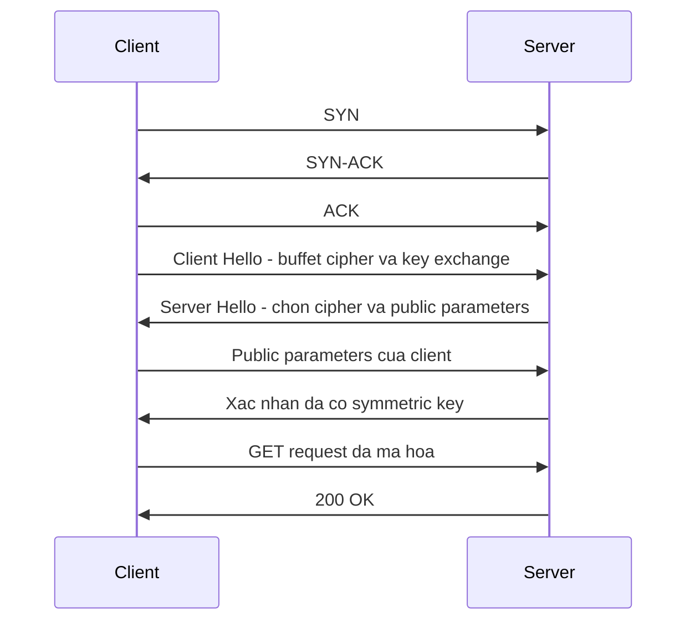

# 🔐 HTTPS over TCP với TLS 1.2: Hai Chuyến Bắt Tay Cổ Điển

> Nguồn: `031-HTTPS-over-TCP-with-TLS-12.txt` · [Udemy](https://ua.udemy.com/course/fundamentals-of-backend-communications-and-protocols/learn/lecture/34630854)

Hôm nay chúng ta bắt đầu với công thức phổ biến nhất, thứ mà các bạn gặp ở khắp mọi nơi: **HTTPS over TCP với TLS 1.2**. Nghe dài dòng vậy thôi, chứ trình tự chỉ có ba bước: thiết lập kết nối TCP, bắt tay TLS, rồi mới gửi dữ liệu.

Và các bạn để ý nhé, chính vì HTTPS phải "nằm trên" TCP mà câu chuyện mới có tới hai chuyến bắt tay. Hiểu được cái gì đang xảy ra dưới đường truyền, các bạn sẽ tự tin cấu hình và debug được mọi thứ.

### 🔌 Bước 1: Ba cái bắt tay của TCP

HTTPS muốn chạy trên TCP thì chỉ có hai giao thức support được nó: **HTTP/1.1** và **HTTP/2**. Còn **HTTP/3** không chạy trên TCP — nó chạy trên QUIC, nên loại khỏi câu chuyện này.

Về phiên bản TLS, **TLS 1.2** (Transport Layer Security — giao thức bảo mật lớp vận chuyển) là phiên bản tối thiểu mà chúng ta bàn trong khóa học. TLS 1.0 và 1.1 đã deprecated và không còn an toàn; chúng vẫn tồn tại đâu đó, nhưng chỉ vì lý do **backward compatibility (tương thích ngược)** mà thôi.

Việc đầu tiên luôn là thiết lập kết nối, và nó được thực hiện bằng **TCP three-way handshake (bắt tay ba bước)**:

1. Client gửi **SYN**.
2. Server trả lời **SYN-ACK**.
3. Client gửi **ACK**.

Thế là xong một kết nối TCP đẹp đẽ, và cả client lẫn server đều có một **stateful connection (kết nối có lưu trạng thái)**.

---

### 🧮 Bước 2: Tại sao hai bên phải "thỏa thuận" một khóa chung?

Lúc này kết nối vẫn **chưa được mã hóa**, nên bất cứ thứ gì gửi lên đó đều vô nghĩa. Bước tiếp theo là mã hóa.

Để mã hóa, client và server phải đồng ý với nhau trên một **symmetric key (khóa đối xứng)**, vì chúng ta luôn mã hóa bằng **symmetric encryption algorithm (thuật toán mã hóa đối xứng)** — ví dụ AES hay ChaCha20. Đây là **block cipher (mã khối)**: đưa từng block dữ liệu, đưa symmetric key vào, mã hóa; muốn giải mã ra plaintext gốc thì phải dùng đúng cùng một key đó.

Vấn đề là: cùng một key vừa mã hóa vừa giải mã, vậy làm sao hai bên thỏa thuận được key giống nhau? Không thể để client tự sinh key rồi gửi thẳng đi — bất kỳ ai đứng giữa đều có thể **sniff (nghe lén)** được, vì key đó đang đi dưới dạng plaintext.

Giải pháp là dùng **key exchange algorithm (thuật toán trao đổi khóa)**. Thuật toán này chạy ngay bên trong phần **Client Hello / Server Hello** của TLS handshake.

---

### 📨 Client Hello và Server Hello: cuộc đàm phán kiểu buffet

**Client Hello** giống như một lời chào tự giới thiệu: "Chào server, là tôi đây, tôi sắp mã hóa đây". Và nó gửi kèm nguyên một **buffet** những thứ mình hỗ trợ:

* Các loại mã hóa đối xứng: AES-128, AES-256...
* Các thuật toán trao đổi khóa: RSA, Diffie-Hellman...
* Cùng những **TLS extension** khác, ví dụ **SNI (Server Name Indication)**.

Kiểu như: "Tôi support hết đám này, bất cứ thứ gì bạn muốn, cứ nói". Đến đây hai bên vẫn **chưa bắt đầu mã hóa** — họ đang đàm phán.

**Server Hello** là lời đáp: server nhìn qua buffet, loại bỏ những thứ không ổn, rồi chốt: "Dùng key exchange này nhé, dùng AES-256 nhé". Và để tiết kiệm thời gian, server gửi luôn **parameters** cho phần key exchange của mình.

---

### 🔄 Chốt khóa và gửi request đầu tiên

Client nhận parameters từ server, tự sinh private parameters của mình, kết hợp với public parameters của server — thế là client có **symmetric key**. Nhưng server thì chưa.

Client gửi ngược public parameters của mình về, server kết hợp với phần của nó — giờ cả hai đều đã có symmetric key.

Về mặt kỹ thuật, client có thể bắt đầu mã hóa ngay, nhưng cần đợi vòng cuối xác nhận. Server nói: "Xong rồi, tôi có key, bạn có key, bắt đầu mã hóa đi". Lúc này client mới gửi **GET request** đã mã hóa bằng symmetric key.

Server nhận vào một luồng dữ liệu mã hóa, giải mã bằng đúng key đó, nhìn thấy một GET request đẹp đẽ, xử lý và trả về **200 OK** kèm kết quả.

Cả hai chuyến bắt tay gộp lại trông như thế này:

*Đó chính là TLS 1.2 trong toàn bộ vinh quang và cả sự cồng kềnh của nó: TCP handshake một chuyến, TLS handshake thêm hai vòng khứ hồi nữa, rồi mới tới dữ liệu thật.*

### 🎯 Tự kiểm tra nhanh

**Câu 1:** Vì sao HTTPS over TCP có tới hai chuyến bắt tay?

<b>Xem đáp án</b>

**Đáp án:** Vì TLS nằm trên TCP — phải thiết lập TCP trước, rồi mới bắt tay TLS, sau đó mới gửi dữ liệu.

Giải thích: Chính vì HTTPS "nằm trên" TCP mà câu chuyện mới có hai chuyến bắt tay.

Tham chiếu: Mục Bước 1: Ba cái bắt tay của TCP.

**Câu 2:** Vì sao khóa học không nhắc TLS 1.0 và 1.1?

<b>Xem đáp án</b>

**Đáp án:** Chúng đã deprecated và không còn an toàn, chỉ tồn tại vì backward compatibility.

Giải thích: TLS 1.2 là phiên bản tối thiểu được bàn trong khóa học.

Tham chiếu: Mục Bước 1: Ba cái bắt tay của TCP.

**Câu 3:** Vì sao không thể để client tự sinh symmetric key rồi gửi thẳng?

<b>Xem đáp án</b>

**Đáp án:** Vì key đó đi dưới dạng plaintext, bất kỳ ai đứng giữa đều có thể sniff được; phải dùng key exchange algorithm.

Giải thích: Thuật toán trao đổi khóa chạy ngay trong Client Hello và Server Hello.

Tham chiếu: Mục Tại sao hai bên phải "thỏa thuận" một khóa chung?

**Câu 4:** Client Hello và Server Hello trao đổi những gì?

<b>Xem đáp án</b>

**Đáp án:** Client dâng buffet cipher, key exchange và TLS extension; server chọn cipher rồi gửi kèm parameters cho phần key exchange.

Giải thích: Hai bên đàm phán trước khi bắt đầu mã hóa.

Tham chiếu: Mục Client Hello và Server Hello: cuộc đàm phán kiểu buffet.

**Câu 5:** Khi nào client gửi GET request đầu tiên?

<b>Xem đáp án</b>

**Đáp án:** Sau khi client tính ra symmetric key, gửi public parameters về, và server xác nhận bắt đầu mã hóa.

Giải thích: Server nhận luồng dữ liệu mã hóa, giải mã bằng đúng key và trả về 200 OK.

Tham chiếu: Mục Chốt khóa và gửi request đầu tiên.

Ở bài sau, TLS 1.3 sẽ cắt bớt một vòng khứ hồi — và các bạn sẽ thấy nó gọn gàng hơn hẳn! 🚀

## Nguồn tham khảo

- [Udemy — HTTPS over TCP with TLS 1.2](https://ua.udemy.com/course/fundamentals-of-backend-communications-and-protocols/learn/lecture/34630854)
- [RFC 5246 — The Transport Layer Security (TLS) Protocol Version 1.2](https://www.rfc-editor.org/rfc/rfc5246)
- [MDN — HTTPS](https://developer.mozilla.org/en-US/docs/Glossary/HTTPS)
