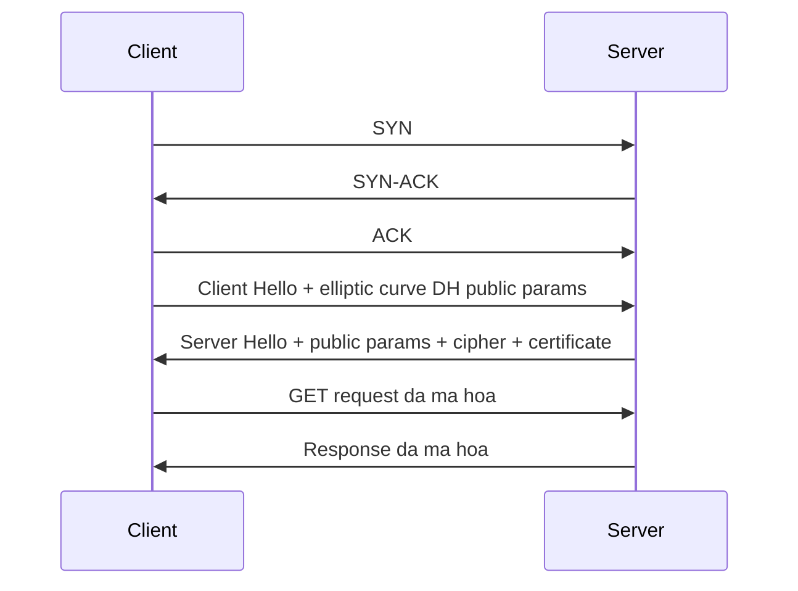

# ⚡ HTTPS over TCP với TLS 1.3: Bớt Hẳn Một Vòng Khứ Hồi

> Nguồn: `032-HTTPS-over-TCP-with-TLS-13.txt` · [Udemy](https://ua.udemy.com/course/fundamentals-of-backend-communications-and-protocols/learn/lecture/34630856)

Tiếp nối TLS 1.2, chúng ta đi sang **HTTPS over TCP với TLS 1.3**. Vẫn là TCP, vẫn là HTTP/1.1 hoặc HTTP/2, nhưng khác biệt nằm ở chỗ handshake hoàn tất chỉ trong **một round trip (vòng khứ hồi)**. Nghe nhỏ nhặt, nhưng các bạn biết rồi đấy — thời gian chờ mới là thứ giết chúng ta.

### ⚡ Khác biệt cốt lõi: ít hơn một round trip

Vì vẫn chạy trên TCP nên bước đầu tiên không thay đổi: chúng ta vẫn thực hiện **TCP three-way handshake** — SYN, SYN-ACK, ACK — để client và server có một **stateful connection (kết nối có lưu trạng thái)**. Giao thức tầng trên vẫn là **HTTP/1.1** hoặc **HTTP/2**, đúng như ở TLS 1.2.

Nhưng phần TLS thì khác hẳn: TLS 1.3 hoàn tất handshake chỉ trong **một round trip**, ít hơn TLS 1.2 đúng một vòng.

| Tiêu chí | TLS 1.2 | TLS 1.3 |
|---|---|---|
| Số round trip cho handshake | 2 | 1 |
| Client Hello | Dâng cả buffet lựa chọn | Chốt trước elliptic curve Diffie-Hellman, gửi kèm public parameters |
| Server Hello | Chọn cipher và gửi parameters | Gửi public parameters + cipher + certificate |
| Khi có symmetric key | Sau nhiều vòng đàm phán | Server có ngay sau một round trip |

---

### 🎲 Client Hello "chốt sớm" thay vì dâng cả buffet

Ở TLS 1.2, client dâng nguyên một buffet lựa chọn rồi ngồi chờ server chọn. TLS 1.3 không làm vậy nữa.

Client nói: "Này server, chúng ta đang dùng TLS 1.3, tôi **assume (giả định)** luôn thuật toán trao đổi khóa — dùng **elliptic curve Diffie-Hellman** — thay vì tự chế ra một cái". Nó chỉ gửi một **nhúm nhỏ các thuật toán trao đổi khóa** (handful), kèm luôn **public parameters** của mình.

Điểm hay: client sinh private keys và **chuẩn bị sẵn một bó** (compile a bunch of them) — phòng trường hợp server từ chối một cái thì vẫn còn cái khác. Nó cũng gửi kèm TLS extension kiểu: "Tôi nghĩ nên dùng AES-256, nhưng không quan trọng lắm vì server cứ thoải mái chọn".

---

### 🤝 Server gật đầu — và có key ngay lập tức

Server nhận Client Hello và thấy: "Ồ, client chọn thuật toán trao đổi khóa hợp lý đấy, tôi theo luôn". Thế là server **sinh private parameters** của mình, kết hợp với public parameters của client — và **ngay lập tức server có symmetric key (khóa đối xứng)**, chỉ sau một round trip. Handshake vẫn chưa kết thúc, nhưng key thì server đã có.

Nhưng client thì cần key, nên server quay lại gửi về:

1. **Public parameters** của phần key exchange.
2. **Cipher đã chọn**.
3. **Certificate** — thứ quan trọng mà mình quên nhắc ở bài TLS 1.2.

---

### 📜 Client xác thực chứng chỉ và bắt đầu mã hóa

Client nhận gói đó, lấy public parameters của server kết hợp với private parameters của mình — thế là có symmetric key theo thuật toán Diffie-Hellman. Đồng thời, client **xác thực certificate** của server có hợp lệ hay không, đúng như nó làm ở TLS 1.2.

Giờ cả hai đã có symmetric key, thế là:

* Client mã hóa **GET request**, gửi đi.
* Server dùng đúng key đó (vì cùng một kết nối, nó biết key gắn với connection nào) để giải mã.
* Server gửi trả response đã mã hóa.

Toàn bộ handshake TLS 1.3 trên nền TCP gói lại như sau:

Đẹp gọn hơn hẳn. Một round trip ít hơn — nghe nhỏ, nhưng ở quy mô hàng triệu người dùng thì đó là cả một sự khác biệt.

---

### 💡 Lời khuyên thực chiến: cứ TLS 1.3 mà dùng

Lời khuyên thẳng thắn của mình: **luôn dùng TLS 1.3** thay vì 1.2 nếu có thể. Mình không thấy lý do gì để không dùng TLS 1.3, ngoại trừ đúng một tình huống: **backward compatibility (tương thích ngược)** — tức là bạn có một client library quá cũ không support 1.3. Chỉ khi đó thì buộc phải ở lại 1.2 thôi.

Còn lại thì cứ upgrade. Đây là một trong những nâng cấp "một nốt nhạc" mà hiệu quả rõ rệt nhất.

### 🎯 Tự kiểm tra nhanh

**Câu 1:** TLS 1.3 tiết kiệm được gì so với TLS 1.2?

<b>Xem đáp án</b>

**Đáp án:** Một round trip — handshake hoàn tất chỉ trong một vòng.

Giải thích: Ở quy mô hàng triệu người dùng, một vòng ít hơn là cả một sự khác biệt.

Tham chiếu: Mục Khác biệt cốt lõi: ít hơn một round trip.

**Câu 2:** Client Hello của TLS 1.3 khác gì TLS 1.2?

<b>Xem đáp án</b>

**Đáp án:** Không dâng cả buffet; client giả định dùng elliptic curve Diffie-Hellman, gửi nhúm nhỏ thuật toán kèm public parameters, và chuẩn bị sẵn một bó private key.

Giải thích: Client chốt sớm thay vì để server chọn từ danh sách dài.

Tham chiếu: Mục Client Hello "chốt sớm" thay vì dâng cả buffet.

**Câu 3:** Khi nào server có symmetric key?

<b>Xem đáp án</b>

**Đáp án:** Ngay sau khi nhận Client Hello — chỉ sau một round trip, dù handshake chưa kết thúc.

Giải thích: Server sinh private parameters, kết hợp với public parameters của client là có key.

Tham chiếu: Mục Server gật đầu — và có key ngay lập tức.

**Câu 4:** Client nhận được gì từ Server Hello?

<b>Xem đáp án</b>

**Đáp án:** Public parameters của key exchange, cipher đã chọn và certificate để xác thực.

Giải thích: Client kết hợp public parameters của server với private parameters của mình để ra symmetric key.

Tham chiếu: Mục Client xác thực chứng chỉ và bắt đầu mã hóa.

**Câu 5:** Khi nào nên ở lại TLS 1.2?

<b>Xem đáp án</b>

**Đáp án:** Chỉ khi vướng backward compatibility — ví dụ client library quá cũ không support TLS 1.3.

Giải thích: Mọi trường hợp còn lại nên upgrade lên TLS 1.3.

Tham chiếu: Mục Lời khuyên thực chiến: cứ TLS 1.3 mà dùng.

Tiếp theo, chúng ta sẽ bước sang một nền tảng hoàn toàn khác — **QUIC**, nơi kết nối và mã hóa được gộp làm một. Hẹn gặp lại các bạn! 🚀

## Nguồn tham khảo

- [Udemy — HTTPS over TCP with TLS 1.3](https://ua.udemy.com/course/fundamentals-of-backend-communications-and-protocols/learn/lecture/34630856)
- [RFC 8446 — The Transport Layer Security (TLS) Protocol Version 1.3](https://www.rfc-editor.org/rfc/rfc8446)
- [RFC 5246 — The Transport Layer Security (TLS) Protocol Version 1.2](https://www.rfc-editor.org/rfc/rfc5246)
