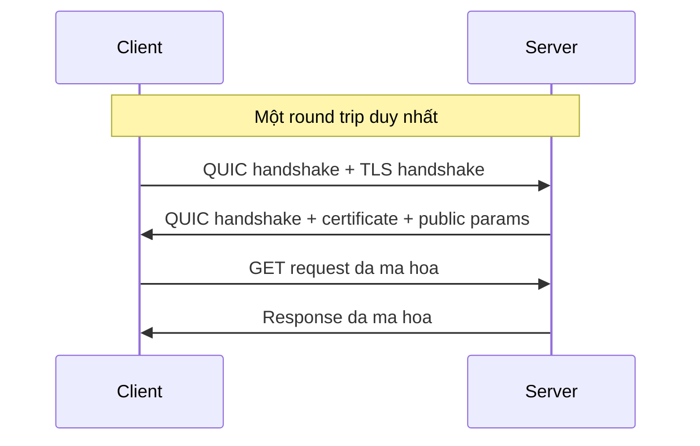

# 🚀 HTTPS over QUIC (HTTP/3): Kết Nối Và Mã Hóa Gộp Trong Một Vòng Khứ Hồi

> Nguồn: `033-HTTPS-over-QUIC-HTTP3.txt` · [Udemy](https://ua.udemy.com/course/fundamentals-of-backend-communications-and-protocols/learn/lecture/34630858)

Đây rồi, **HTTPS over QUIC** — còn được biết đến với tên gọi **HTTP/3**. Lần này chúng ta đổi hẳn nền tảng từ TCP sang **QUIC**, và mọi thứ thay đổi: kết nối và mã hóa được gộp trong cùng một vòng khứ hồi.

Mình đã có hẳn một bài riêng về QUIC trước đó, và đây chính là lúc QUIC tỏa sáng trong bối cảnh HTTPS.

### 🧠 QUIC gộp gần như mọi thứ vào một round trip

QUIC thông minh ở đúng một chỗ: nó gộp gần như toàn bộ quá trình vào **một round trip (vòng khứ hồi) duy nhất**.

Cụ thể, bạn gửi luôn connection — tức **three-way handshake** của QUIC — và **TLS handshake diễn ra trong cùng round trip đó**. Không có lý do gì để tách ra cả: nếu đã phải chờ một vòng để thiết lập kết nối, thì mã hóa luôn trong vòng đó đi cho xong.

Kết quả là chỉ sau một vòng, QUIC vừa thiết lập xong kết nối, vừa hoàn tất TLS. Đó cũng là lý do giao thức này gắn với cái tên **HTTP/3**.

Nếu tách thành các bước, nó trông như thế này:

1. Client gửi yêu cầu thiết lập kết nối QUIC.
2. TLS handshake đi kèm luôn trong cùng vòng đó — kèm cả certificate.
3. Server và client có symmetric key, và dữ liệu truyền trên kết nối đã mã hóa.

Còn đây là sơ đồ lượt đi về gộp chung của QUIC:

---

### 🕰️ Tại sao ngày xưa TCP và TLS lại phải tách rời?

Câu hỏi hay: nếu gộp được thì tại sao bao nhiêu năm nay chúng ta vẫn làm hai chuyến bắt tay riêng biệt?

Câu trả lời nằm ở lịch sử. **TCP được phát minh trước**, rồi **TLS mới ra đời sau**, đơn giản vì thời đó chúng ta... chưa quan tâm đến mã hóa.

Còn bây giờ thì khác: đương nhiên là chúng ta muốn mã hóa mọi lúc, mọi nơi. Vậy thì tại sao không **thiết lập kết nối và mã hóa cùng lúc**? Vấn đề chỉ là xếp cùng một lượng packet vào cùng một request mà thôi.

Đó cũng là lý do ở TLS 1.2 và 1.3 trên nền TCP, các bạn luôn thấy hai chuyến bắt tay nối đuôi nhau: một của TCP, một của TLS.

Nói cách khác, QUIC đã **kết hợp TLS 1.3 với handshake của chính nó** để thiết lập kết nối. Phần logic trao đổi khóa và symmetric key thì giống hệt TLS 1.3 — mình không kể lại chi tiết nữa.

| Tiêu chí | TCP + TLS | QUIC |
|---|---|---|
| Nền tảng bên dưới | TCP | UDP |
| Handshake | Hai chuyến nối đuôi nhau | Gộp kết nối và TLS trong một round trip |
| Trạng thái kết nối | Stateful connection | Stateful connection |
| Gốc lịch sử | TCP ra đời trước, TLS sau | Thiết kế mã hóa ngay từ đầu |

---

### 📦 Bên dưới vẫn là UDP, nhưng trên mặt là một kết nối stateful

Điểm rất đáng nhớ: toàn bộ QUIC được xây trên nền **UDP**. Về mặt kỹ thuật, nó chỉ là một bó **UDP segment/datagram** bay qua bay lại giữa hai bên.

Nhưng nhìn từ góc độ client-server, nó **trông giống hệt một kết nối có trạng thái** — và thực sự là như vậy: QUIC vẫn là một **stateful connection (kết nối có lưu trạng thái)**.

Về phần bảo mật:

* **Certificate** cũng được chia sẻ trong quá trình này.
* Client và server thiết lập được **symmetric key (khóa đối xứng)**.
* **GET request** được mã hóa bằng symmetric key rồi gửi đi, response cũng dùng đúng symmetric key đó để mã hóa trả về.
* Không ai ở giữa có thể **sniff (nghe lén)** hay hiểu được bất cứ thứ gì.

Còn nhớ ba trụ cột ở đầu section không? QUIC gộp trọn cả ba: kết nối, mã hóa và dữ liệu.

### 🎯 Tự kiểm tra nhanh

**Câu 1:** QUIC gộp được gì trong một round trip?

<b>Xem đáp án</b>

**Đáp án:** Thiết lập kết nối (three-way handshake của QUIC) và TLS handshake, kèm cả certificate.

Giải thích: Nếu đã phải chờ một vòng để thiết lập kết nối, mã hóa luôn trong vòng đó.

Tham chiếu: Mục QUIC gộp gần như mọi thứ vào một round trip.

**Câu 2:** Vì sao ngày xưa TCP và TLS lại tách rời nhau?

<b>Xem đáp án</b>

**Đáp án:** Vì lịch sử — TCP được phát minh trước, TLS ra đời sau khi nhu cầu mã hóa xuất hiện.

Giải thích: Ngày đó chúng ta chưa quan tâm đến mã hóa nên không gộp chung.

Tham chiếu: Mục Tại sao ngày xưa TCP và TLS lại phải tách rời?

**Câu 3:** QUIC chạy trên nền gì và trông thế nào từ góc client-server?

<b>Xem đáp án</b>

**Đáp án:** QUIC chạy trên UDP — về kỹ thuật chỉ là các UDP datagram bay qua lại, nhưng từ góc client-server trông như một kết nối stateful.

Giải thích: QUIC vẫn là một stateful connection đúng nghĩa.

Tham chiếu: Mục Bên dưới vẫn là UDP, nhưng trên mặt là một kết nối stateful.

**Câu 4:** Bảo mật trong QUIC diễn ra thế nào?

<b>Xem đáp án</b>

**Đáp án:** Certificate được chia sẻ, hai bên thiết lập symmetric key, GET request và response đều được mã hóa; không ai ở giữa sniff được.

Giải thích: Logic trao đổi khóa và symmetric key giống hệt TLS 1.3.

Tham chiếu: Mục Bên dưới vẫn là UDP, nhưng trên mặt là một kết nối stateful.

**Câu 5:** QUIC liên hệ thế nào với ba trụ cột của HTTPS?

<b>Xem đáp án</b>

**Đáp án:** QUIC gộp trọn cả ba — kết nối, mã hóa và dữ liệu.

Giải thích: Đó là lý do QUIC được xem là rất mạnh mẽ trong bối cảnh HTTPS.

Tham chiếu: Mục Bên dưới vẫn là UDP, nhưng trên mặt là một kết nối stateful.

QUIC quả là một thứ rất mạnh mẽ. Nhưng câu chuyện chưa dừng ở đây — ở bài tiếp theo, chúng ta sẽ thử một cấu hình TFO hết sức thú vị. Hẹn gặp lại! 🚀

## Nguồn tham khảo

- [Udemy — HTTPS over QUIC (HTTP/3)](https://ua.udemy.com/course/fundamentals-of-backend-communications-and-protocols/learn/lecture/34630858)
- [RFC 9000 — QUIC: A UDP-Based Multiplexed and Secure Transport](https://www.rfc-editor.org/rfc/rfc9000)
- [RFC 9001 — Using TLS to Secure QUIC](https://www.rfc-editor.org/rfc/rfc9001)
- [RFC 9114 — HTTP/3](https://www.rfc-editor.org/rfc/rfc9114)
