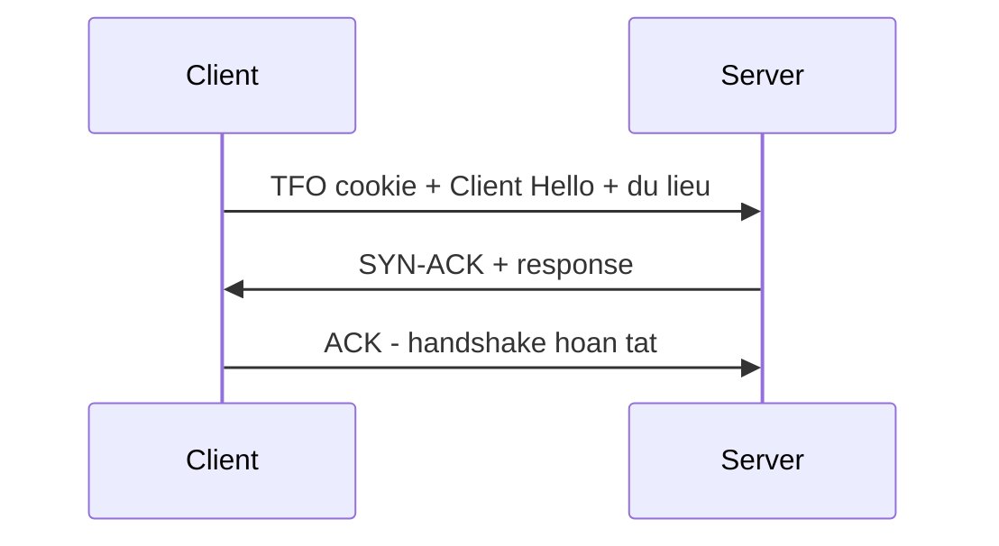

# 🍪 HTTPS over TFO (TCP Fast Open) với TLS 1.3: Ý Tưởng Lý Thuyết Mình Tự Nghĩ Ra

> Nguồn: `034-HTTPS-over-TFO-with-TLS-13.txt` · [Udemy](https://ua.udemy.com/course/fundamentals-of-backend-communications-and-protocols/learn/lecture/34630860)

Đây là một bài đặc biệt: **HTTPS over TFO (TCP Fast Open)** ghép với TLS 1.3. Mình nói trước luôn cho các bạn khỏi bất ngờ — đây là một kịch bản **lý thuyết do chính mình thiết kế**, mình không chắc nó có khả thi về mặt kỹ thuật hay không, và mình cũng chưa từng thấy nó ngoài thực tế.

Nhưng nó là một bài tập tư duy cực kỳ hay về round trip, nên mình vẫn đưa vào để các bạn cùng suy nghĩ.

### 🧠 Vấn đề gốc: chưa bắt tay xong thì chưa được gửi dữ liệu

Nhớ lại nỗi đau của **TCP handshake (bắt tay TCP)**: khi muốn thiết lập kết nối, chúng ta phải làm **three-way handshake**, và **không được gửi dữ liệu cho tới khi kết nối hoàn tất**. Ba bước bắt tay đó là một chặng chờ bắt buộc, không thể nhảy qua.

Câu hỏi đặt ra: nếu kết nối này... đã từng tồn tại trước đây rồi thì sao? Có nhất thiết phải thiết lập lại từ đầu không?

Với TFO, câu trả lời là không. Ý tưởng của nó rất giống **session resumption (tái sử dụng phiên)**: thay vì trả giá lại từ đầu, ta dùng lại thứ đã có sẵn.

Mỗi lượt gửi đi rồi chờ phản hồi về như vậy được gọi là một **round trip (vòng khứ hồi)** — và toàn bộ section này của chúng ta thực chất là đi tìm cách cắt bớt số vòng đó.

---

### 🍪 TCP Fast Open và chiếc cookie đánh thức kết nối cũ

**TCP Fast Open** dùng **cookie** để **resume (khôi phục)** một kết nối đã tồn tại trước đó — không cần thiết lập lại, chỉ cần khôi phục. Đây chính là tinh thần **session resumption (tái sử dụng phiên)**.

Cookie này là một **encrypted hash (chuỗi băm được mã hóa)** được định nghĩa sẵn ở phía server. Nếu client đã có **TFO cookie** trong tay, nó có thể gửi cookie kèm với request, và **ngay lập tức gửi theo toàn bộ dữ liệu**.

Và dữ liệu đó là gì? Chính là **Client Hello** của TLS 1.3. Vậy là client gửi cookie và Client Hello trong cùng một hơi thở.

Điểm thú vị là cơ chế này không đợi three-way handshake xong mới cho dữ liệu lên đường — nó dựa vào cookie để bắt đầu sớm.

| Tiêu chí | TCP handshake thường | TCP Fast Open |
|---|---|---|
| Gửi dữ liệu trước khi handshake xong | Không được | Gửi ngay trong SYN nếu có cookie |
| Cơ chế | SYN, SYN-ACK, ACK | Cookie đã lưu từ phiên trước |
| Bảo mật | Được thiết kế cho kết nối tin cậy | Không được thiết kế cho bảo mật |

---

### 📨 Server nói "được" — cả handshake lẫn kết nối xong cùng lúc

Nếu server support và chấp nhận yêu cầu đó, nó có thể **SYN-ACK ngay lập tức**, kèm theo luôn response. Bước thứ ba sẽ là **ACK**, khép lại kết nối — và **handshake cũng được hoàn tất ngay tại đó**.

Nói cách khác, phần chờ đợi đắt giá nhất gần như biến mất. Nghe rất hấp dẫn phải không?

Để ý nhé: server vừa xác nhận kết nối, vừa trả dữ liệu trong cùng một lượt — điều mà một kết nối TCP thông thường không cho phép.

Toàn bộ lượt đi về gói gọn trong sơ đồ:

---

### ⚠️ Vì sao mình chưa từng thấy nó ngoài thực tế

Có một lý do rất lớn khiến kịch bản này khó thành hiện thực: **TCP Fast Open không thực sự an toàn**. Ngay từ đầu nó đã **không được thiết kế cho bảo mật**, nên mình không thấy nó được dùng trong thực tế.

Còn nếu các bạn từng tự hỏi vì sao TFO nghe rất hay mà ít gặp trong đời thực, thì câu trả lời nằm ở chữ "không được thiết kế cho bảo mật". TFO có tồn tại — chỉ là ghép nó với TLS 1.3 theo kiểu này thì mình chưa từng thấy ai làm.

*Nói thẳng ra, đây là kiểu bài tập mình rất thích: ghép hai công nghệ lại, xem round trip giảm được bao nhiêu, rồi tự hỏi "tại sao điều này chưa xảy ra?".* Hiểu được lý do "chưa xảy ra" đôi khi còn giá trị hơn cả việc nó thành công.

Mình nghĩ đây cũng là một bài tập tốt để các bạn tự phác ra giấy: thử vẽ lại các lượt gửi và tự đếm xem tiết kiệm được bao nhiêu vòng khứ hồi.

### 🎯 Tự kiểm tra nhanh

**Câu 1:** Vấn đề gốc mà TCP Fast Open tìm cách giải quyết là gì?

<b>Xem đáp án</b>

**Đáp án:** TCP không cho gửi dữ liệu trước khi three-way handshake hoàn tất; nếu kết nối từng tồn tại, TFO khôi phục thay vì thiết lập lại từ đầu.

Giải thích: Ý tưởng giống session resumption — dùng lại thứ đã có sẵn.

Tham chiếu: Mục Vấn đề gốc: chưa bắt tay xong thì chưa được gửi dữ liệu.

**Câu 2:** TFO cookie là gì?

<b>Xem đáp án</b>

**Đáp án:** Một encrypted hash do server định nghĩa sẵn; client có cookie có thể gửi kèm request và gửi luôn dữ liệu ngay.

Giải thích: Cookie dùng để resume kết nối đã tồn tại trước đó.

Tham chiếu: Mục TCP Fast Open và chiếc cookie đánh thức kết nối cũ.

**Câu 3:** Trong kịch bản lý thuyết này, dữ liệu được gửi sớm là gì?

<b>Xem đáp án</b>

**Đáp án:** Client Hello của TLS 1.3 — gửi cùng cookie trong cùng một hơi thở.

Giải thích: Nhờ vậy cả handshake lẫn kết nối gần như xong cùng lúc.

Tham chiếu: Mục TCP Fast Open và chiếc cookie đánh thức kết nối cũ.

**Câu 4:** Vì sao Hussein chưa từng thấy TFO + TLS 1.3 ngoài thực tế?

<b>Xem đáp án</b>

**Đáp án:** Vì TCP Fast Open không thực sự an toàn — ngay từ đầu nó không được thiết kế cho bảo mật.

Giải thích: TFO có tồn tại, nhưng ghép với TLS 1.3 theo kiểu này thì chưa ai làm.

Tham chiếu: Mục Vì sao mình chưa từng thấy nó ngoài thực tế.

**Câu 5:** Vì sao bài tập "tại sao điều này chưa xảy ra" có giá trị?

<b>Xem đáp án</b>

**Đáp án:** Vì hiểu lý do một thứ chưa thành công đôi khi còn giá trị hơn cả việc nó thành công.

Giải thích: Đây là kiểu bài tập Hussein rất thích: ghép hai công nghệ rồi tự hỏi vì sao.

Tham chiếu: Mục Vì sao mình chưa từng thấy nó ngoài thực tế.

Ở bài sau, chúng ta sẽ quay lại với một thứ có thật và đang ngày càng phổ biến: **TLS 1.3 với 0-RTT (gửi dữ liệu ngay vòng đầu)**. Hẹn gặp lại! 🚀

## Nguồn tham khảo

- [Udemy — HTTPS over TFO with TLS 1.3](https://ua.udemy.com/course/fundamentals-of-backend-communications-and-protocols/learn/lecture/34630860)
- [RFC 7413 — TCP Fast Open](https://www.rfc-editor.org/rfc/rfc7413)
