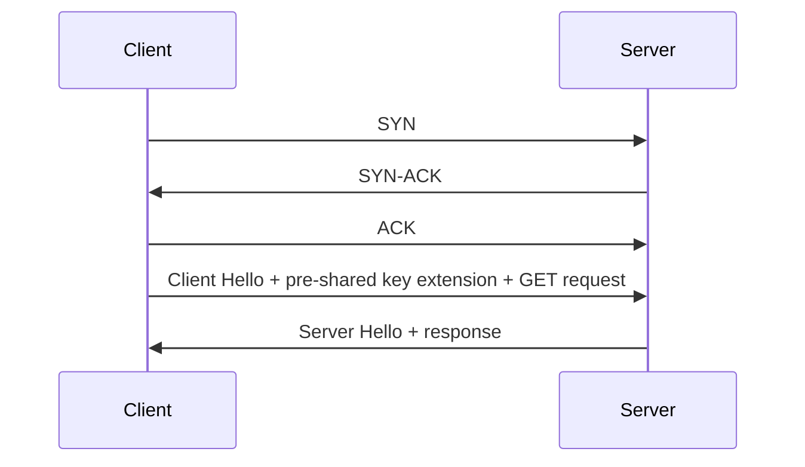

# 🏎️ HTTPS over TCP với TLS 1.3 và 0-RTT: Gửi Request Trong Cùng Hơi Thở

> Nguồn: `035-HTTPS-over-TCP-with-TLS-13-and-0RTT.txt` · [Udemy](https://ua.udemy.com/course/fundamentals-of-backend-communications-and-protocols/learn/lecture/34630864)

Đây là một bài rất thú vị, và thật ra nó **đang ngày càng trở nên phổ biến**: **HTTPS over TCP với TLS 1.3 và 0-RTT (gửi dữ liệu ngay vòng đầu)**. Ý tưởng rất đơn giản: nếu trước đó client và server đã từng nói chuyện TLS với nhau, thì lần này chúng ta không bắt tay lại từ đầu nữa.

Điểm khác biệt so với TLS 1.3 "thường" nằm ở chỗ: lần này client không cần chờ đàm phán xong mới gửi dữ liệu — request được gửi ngay trong lượt **Client Hello** đầu tiên. Đó chính là ý nghĩa của cái tên **0-RTT (gửi dữ liệu ngay vòng đầu)**.

Nghe có vẻ mới, nhưng thực ra đây là kết quả tự nhiên của một câu hỏi rất cũ: nếu hai bên đã từng tin nhau, tại sao lần sau lại phải bắt tay từ số không?

### 🔁 Điều kiện tiên quyết: một phiên cũ và pre-shared key

Giả sử trước đây đã có một phiên TLS giữa client và server, và **server biết về phiên đó**. Khi ấy, một **pre-shared key (khóa chia sẻ trước)** có thể đã được chia sẻ cho client.

Khi client quay lại và **đưa ra một hint (gợi ý)** về key đó, server có thể dùng luôn key ấy và **bắt đầu mã hóa ngay lập tức** — không cần đàm phán lại từ đầu. Đây chính là bản chất của **session resumption (tái sử dụng phiên)**: phiên cũ được dùng lại thay vì xây mới từ số không.

Câu hỏi đặt ra rất tự nhiên: nếu key đã có sẵn trong tay cả hai bên, tại sao còn phải đàm phán lại làm gì? Đó chính là lúc 0-RTT phát huy tác dụng.

| Tiêu chí | TLS 1.3 thường | TLS 1.3 + 0-RTT |
|---|---|---|
| Điều kiện | Phiên mới | Đã có pre-shared key từ phiên trước |
| Gửi request | Sau khi handshake xong | Ngay trong Client Hello đầu tiên |
| Chặng chờ đàm phán TLS | Có | Được cắt bỏ |

---

### 🏃 Client Hello và GET request trong cùng một hơi thở

Bước đầu vẫn không đổi vì chúng ta **vẫn chạy trên TCP**: vẫn phải làm **three-way handshake (bắt tay ba bước)**.

Nhưng rồi chuyện hay xảy ra:

1. Client gửi **Client Hello** kèm **TLS extension** tên là **pre-shared key**.
2. Ngay lập tức, nó dùng **symmetric key đã sinh sẵn** từ phiên trước để mã hóa luôn request.
3. Vậy là **Client Hello và GET request được gửi đi trong cùng một hơi thở**.

Nhìn trên trục thời gian, nó diễn ra như sau:

Phía server, nếu chấp nhận pre-shared key, nó sẽ đáp lại kiểu: "Ồ, anh này muốn resume phiên cũ đây mà. Được, tôi tin anh" — gửi **Server Hello** — và thực tế là nó **đã giải mã xong GET request** rồi.

Điểm mấu chốt nằm ở chữ "trong cùng một hơi thở": hai gói tin được gửi đi cùng nhau, không gói nào phải chờ gói kia.

Server xử lý request và kết thúc kết nối ngay tại đó. Bao nhiêu round trip tiết kiệm được hết.

Và đây là điều mình muốn các bạn để ý: server không hề chờ tới khi handshake kết thúc mới hiểu request — nó đã hiểu request ngay từ gói đầu tiên.

---

### ⏱️ Cả cuộc chơi chỉ là bài toán chờ đợi

*Mình muốn các bạn ghi nhớ điều này: toàn bộ câu chuyện HTTPS rốt cuộc chỉ là một bài toán chờ đợi — và chính **thời gian chờ là thứ giết chết chúng ta**.*

Vấn đề nằm ở **round trip time (thời gian một vòng khứ hồi)**: bạn gửi request, rồi phải **ngồi chờ** tới khi response về mới làm được việc tiếp theo. Đó là **latency (độ trễ)** — và chúng ta muốn cắt nó đi.

Nếu client gửi được dữ liệu **trước** — ngay trong vòng đầu tiên — thì tất nhiên response cũng về nhanh hơn, và độ trễ gần như biến mất.

Các bạn để ý nhé: 0-RTT **không xóa bỏ three-way handshake của TCP** — vì vẫn chạy trên TCP nên nó vẫn phải làm đủ. Cái được cắt bỏ là chặng chờ đàm phán TLS trước khi request lên đường.

Nói cách khác, tối ưu HTTPS thực chất là tối ưu số lần phải ngồi chờ.

### 🎯 Tự kiểm tra nhanh

**Câu 1:** 0-RTT nghĩa là gì trong cấu hình TCP + TLS 1.3?

<b>Xem đáp án</b>

**Đáp án:** Client gửi request ngay trong lượt Client Hello đầu tiên, không chờ đàm phán xong.

Giải thích: Request được gửi kèm ngay khi handshake bắt đầu.

Tham chiếu: Đoạn mở bài.

**Câu 2:** Điều kiện tiên quyết để dùng 0-RTT là gì?

<b>Xem đáp án</b>

**Đáp án:** Đã từng có phiên TLS trước đó và có pre-shared key; client gửi hint về key và server chấp nhận.

Giải thích: Đây là bản chất của session resumption — dùng lại phiên cũ.

Tham chiếu: Mục Điều kiện tiên quyết: một phiên cũ và pre-shared key.

**Câu 3:** TCP three-way handshake có bị bỏ qua không?

<b>Xem đáp án</b>

**Đáp án:** Không — vì vẫn chạy trên TCP nên phải làm đủ; cái được cắt là chặng chờ đàm phán TLS trước khi request lên đường.

Giải thích: 0-RTT không xóa bỏ handshake của TCP.

Tham chiếu: Mục Cả cuộc chơi chỉ là bài toán chờ đợi.

**Câu 4:** Server hiểu request từ khi nào?

<b>Xem đáp án</b>

**Đáp án:** Ngay từ gói đầu tiên — nó giải mã luôn GET request gửi kèm Client Hello.

Giải thích: Server không chờ handshake kết thúc mới hiểu request.

Tham chiếu: Mục Client Hello và GET request trong cùng một hơi thở.

**Câu 5:** Vì sao Hussein gọi toàn bộ câu chuyện HTTPS là bài toán chờ đợi?

<b>Xem đáp án</b>

**Đáp án:** Vì round trip time buộc ta phải ngồi chờ; tối ưu HTTPS thực chất là tối ưu số lần phải chờ.

Giải thích: Thời gian chờ chính là thứ giết chết chúng ta.

Tham chiếu: Mục Cả cuộc chơi chỉ là bài toán chờ đợi.

Ở bài cuối của section, chúng ta sẽ đẩy ý tưởng này lên đỉnh cao: **0-RTT trên nền QUIC**. Hẹn gặp lại! 🚀

## Nguồn tham khảo

- [Udemy — HTTPS over TCP with TLS 1.3 and 0RTT](https://ua.udemy.com/course/fundamentals-of-backend-communications-and-protocols/learn/lecture/34630864)
- [RFC 8446 — The Transport Layer Security (TLS) Protocol Version 1.3](https://www.rfc-editor.org/rfc/rfc8446)
