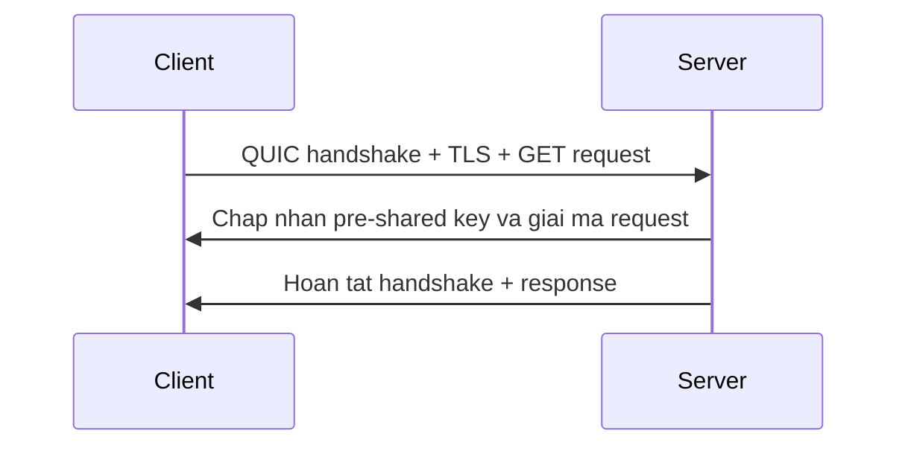

# 🥇 HTTPS over QUIC với 0-RTT: Cách Nhanh Nhất Có Thể, Và Chỉ Cloudflare Làm Được

> Nguồn: `036-HTTPS-over-QUIC-with-0RTT.txt` · [Udemy](https://ua.udemy.com/course/fundamentals-of-backend-communications-and-protocols/learn/lecture/34630862)

Và đây là bài cuối cùng của section: **HTTPS over QUIC với 0-RTT (gửi dữ liệu ngay vòng đầu)**. Cùng một ý tưởng với TLS 1.3 + 0-RTT, nhưng lần này đặt trên nền QUIC — đây chính là **cách nhanh nhất mà các bạn có thể đi**. Không có cách nào nhanh hơn.

### 🏁 Cùng công thức pre-shared key, nhưng trên nền QUIC

Điều kiện vẫn y hệt: nếu **pre-shared key (khóa chia sẻ trước)** đã được chia sẻ từ trước, và client vẫn còn giữ nó, thì client có thể **gửi thẳng QUIC handshake** — và trong cùng hơi thở đó, gửi luôn phần TLS.

Thực chất, với QUIC thì QUIC handshake và TLS **là một** — nên chỉ tốn đúng một lần gửi. Client dùng pre-shared key để mã hóa, **và gửi luôn GET request trong cùng hơi thở đó**. Đây lại chính là tinh thần **session resumption (tái sử dụng phiên)** được đẩy lên mức cực đoan.

Nếu TLS 1.3 + 0-RTT đã nhanh, thì QUIC + 0-RTT còn đẹp hơn một bậc: ở đây không có chuyến bắt tay riêng rẽ nào để chờ, vì QUIC handshake đã bao gồm luôn cả TLS.

Sơ đồ lượt đầu tiên trông như thế này:

---

### 📨 Server xử lý hết trong một lần nhận

Phía server, giả sử mọi thứ diễn ra suôn sẻ (good case):

1. Server **chấp thuận pre-shared key**.
2. Nó **giải mã GET request** ngay.
3. Nó **hoàn tất QUIC handshake**.
4. Nó trả về response khi có thể, và khép lại phần handshake còn lại.

Kết quả là **thời gian phản hồi cực thấp** (extreme response time) — thứ mà mọi kỹ sư backend đều mơ ước.

Để ý thứ tự này nhé: server trả lời khi nó sẵn sàng, chứ không bắt client phải chờ handshake xong mới được nhận dữ liệu.

| Tiêu chí | TCP + TLS 1.3 + 0-RTT | QUIC + 0-RTT |
|---|---|---|
| Chuyến bắt tay riêng rẽ | Vẫn có TCP three-way handshake | Không, QUIC handshake đã gồm TLS |
| Gửi request | Trong Client Hello | Ngay vòng đầu của QUIC |
| Xử lý phía server | Đàm phán rồi mới giải mã | Giải mã ngay khi nhận gói đầu |

---

### ☁️ Vì sao chỉ Cloudflare làm được?

Nghe thì đơn giản, nhưng mình phải nói thẳng: **làm được điều này cực kỳ khó**.

Đến thời điểm này, **chỉ có Cloudflare** là xử lý hiệu quả được 0-RTT trên QUIC trong môi trường thực tế của họ. Đây không phải thứ bật một công tắc là xong — nó đòi hỏi cả một hệ thống được tối ưu cực kỳ kỹ lưỡng.

Nghe đơn giản trên giấy, nhưng triển khai được ở quy mô thật lại là câu chuyện hoàn toàn khác.

*Và đó cũng là lý do section này quan trọng: mọi cải tiến round trip đều nghe rất đơn giản trên giấy, cho tới khi các bạn thử làm nó ở quy mô thật.*

---

### 🚀 Hết section HTTPS — hẹn gặp ở Backend Execution

Vậy là chúng ta đã đi hết hành trình "Many Ways to HTTPS": từ TLS 1.2 cồng kềnh, TLS 1.3 gọn hơn, QUIC gộp tất cả, TFO lý thuyết, cho tới 0-RTT — nơi độ trễ gần như bằng không.

Điểm chung lặp đi lặp lại suốt cả section: cắt round trip, tái sử dụng phiên, và không chờ đợi. Đó chính là nghệ thuật của backend.

### 🎯 Tự kiểm tra nhanh

**Câu 1:** Vì sao QUIC + 0-RTT là cách nhanh nhất có thể?

<b>Xem đáp án</b>

**Đáp án:** Vì QUIC handshake và TLS là một — không có chuyến bắt tay riêng rẽ nào để chờ, dữ liệu được gửi ngay vòng đầu.

Giải thích: Đây là tinh thần session resumption được đẩy lên mức cực đoan.

Tham chiếu: Mục Cùng công thức pre-shared key, nhưng trên nền QUIC.

**Câu 2:** Client gửi gì trong hơi thở đầu tiên?

<b>Xem đáp án</b>

**Đáp án:** QUIC handshake kèm TLS, dùng pre-shared key để mã hóa và gửi luôn GET request.

Giải thích: Chỉ tốn đúng một lần gửi cho cả handshake lẫn dữ liệu.

Tham chiếu: Mục Cùng công thức pre-shared key, nhưng trên nền QUIC.

**Câu 3:** Server xử lý những gì trong một lần nhận?

<b>Xem đáp án</b>

**Đáp án:** Chấp thuận pre-shared key, giải mã GET request, hoàn tất QUIC handshake và trả về response.

Giải thích: Kết quả là extreme response time mà mọi kỹ sư backend đều mơ ước.

Tham chiếu: Mục Server xử lý hết trong một lần nhận.

**Câu 4:** Vì sao chỉ Cloudflare làm được điều này hiệu quả?

<b>Xem đáp án</b>

**Đáp án:** Vì 0-RTT trên QUIC cực kỳ khó, đòi hỏi hệ thống tối ưu rất kỹ ở quy mô thật — không phải bật một công tắc là xong.

Giải thích: Triển khai ở quy mô thật là câu chuyện hoàn toàn khác với trên giấy.

Tham chiếu: Mục Vì sao chỉ Cloudflare làm được?

**Câu 5:** Điểm chung lặp đi lặp lại suốt section Many Ways to HTTPS?

<b>Xem đáp án</b>

**Đáp án:** Cắt round trip, tái sử dụng phiên và không chờ đợi.

Giải thích: Đó chính là nghệ thuật của backend.

Tham chiếu: Mục Hết section HTTPS — hẹn gặp ở Backend Execution.

Section tiếp theo sẽ là một trong những section mình thích nhất: **Backend Execution** — chuyện gì thực sự xảy ra khi backend thực thi? Chúng ta sẽ nói về **process, thread**, và cách **latency (độ trễ) được quan sát ngay ở tầng hệ điều hành**.

Và như mọi khi, hiểu được cái gì xảy ra dưới đường truyền, các bạn sẽ debug và tối ưu được mọi thứ.

Cảm ơn các bạn đã theo dõi, và hẹn gặp lại ở section tiếp theo! 🚀

## Nguồn tham khảo

- [Udemy — HTTPS over QUIC with 0RTT](https://ua.udemy.com/course/fundamentals-of-backend-communications-and-protocols/learn/lecture/34630862)
- [RFC 9001 — Using TLS to Secure QUIC](https://www.rfc-editor.org/rfc/rfc9001)
- [Cloudflare — Even faster connection establishment with QUIC 0-RTT resumption](https://blog.cloudflare.com/even-faster-connection-establishment-with-quic-0-rtt-resumption)
