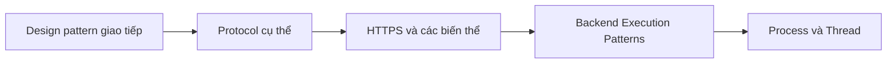

# 🔥 Backend Execution Patterns: Bước vào nơi backend thật sự "chạy"

> Nguồn: `037-Backend-Execution-Patterns-Intro.txt` · [Udemy](https://ua.udemy.com/course/fundamentals-of-backend-communications-and-protocols/learn/lecture/34630868)

Chào các bạn, chúng ta đã đi qua một chặng đường dài từ client tới server, và giờ là lúc mình đưa các bạn vào chính giữa "trận chiến": **bên trong backend**. Đây là section mình thích nhất trong toàn bộ khóa học, vì nó trả lời câu hỏi mà ít ai chịu dạy: khi request đến, backend **accept (chấp nhận), dispatch (điều phối) và execute (thực thi)** nó như thế nào?

Nói thẳng: đây là phần khó tìm tài liệu nhất. Nhưng một khi hiểu, các bạn sẽ debug được những thứ mà người khác chỉ biết... khởi động lại server.

### 🧭 Ôn lại con đường chúng ta đã đi

Trước khi lao vào, mình điểm lại những gì đã học, vì mọi thứ đều nối tiếp nhau:

* Chúng ta bắt đầu với các **design pattern giao tiếp client ↔ backend**: request/response, publish/subscribe, polling, long polling và nhiều pattern khác.
* Rồi mình mổ xẻ cách các protocol cụ thể được xây từ những pattern đó: **TCP, UDP, WebRTC, gRPC, HTTP/1-2-3, WebSocket**...
* Điểm thú vị: hầu hết protocol chỉ khớp một hoặc hai pattern — riêng **gRPC** khớp tất cả, và đó chính là lý do nó được sinh ra.
* Sau đó tụi mình lấy **HTTPS** ra làm ví dụ và chỉ ra tận **7 cách** một giao tiếp HTTPS diễn ra: HTTPS over TLS 1.2, TLS 1.3, zero round-trip, HTTPS over QUIC...

Đó là một biển kiến thức. Theo mình, mọi backend engineer nên có "shallow knowledge" (hiểu bề mặt) về tất cả những thứ này, rồi chọn một lĩnh vực để đào sâu — đó là cách các bạn tạo khác biệt.

---

### 🔍 "Accept connection" — không hề đơn giản như các bạn nghĩ

Nhiều người nói: "Backend thì cứ accept connection thôi, có gì đâu". **Không, nó không hoạt động như vậy.**

* Khi bạn có một **listener (bộ lắng nghe)**, listener nhận connection — nhưng communication giữa **backend application** và **kernel (nhân hệ điều hành)** diễn ra thế nào?
* Đó là một mối quan hệ cộng sinh (symbiotic). Và nó có thể trở nên **độc hại** nếu backend và OS "cãi nhau" quá nhiều.
* Việc cần làm rõ: connection đến thì kernel xử lý gì, backend xử lý gì, và làm sao application accept nhanh hơn?
* Có connection rồi, backend **đọc và ghi** lên nó thế nào?

Tất cả những câu hỏi này quy về một nền tảng: các bạn phải hiểu sự khác biệt giữa **process (tiến trình)** và **thread (luồng)** — đó là bài học ngay tiếp theo.

---

### 📚 Kiến thức "under the wire" mà không trường lớp nào dạy

Mình nói thật lòng: rất khó để biết backend thật sự được thực thi như thế nào. Để hiểu, bạn phải đọc rất nhiều paper và xem chính các developer của những hệ thống lớn nói chuyện.

* Các chi tiết kiến trúc bên trong **Envoy**, **Memcached** hay **Nginx** — những cái tên mình sẽ lấy làm ví dụ — gần như không được thảo luận đại chúng.
* Các "architectural building blocks" (khối kiến trúc nền tảng) về cách một backend thực thi công việc rất khó tìm.
* Nhưng về mặt kỹ thuật, đây lại là **một trong những thứ quan trọng nhất**.

*Đây chính là lý do mình làm section này — hiểu under the wire, không chấp nhận hộp đen.*

---

### 🧩 Section này sẽ mổ xẻ những gì?

Đây là một trong những section quan trọng nhất của khóa học, và mình sẽ không giảng suông. Cụ thể:

1. **Process vs Thread** — khác nhau ở đâu và vì sao phải có hình ảnh rõ ràng trong đầu.
2. **Kiến trúc thực thi**: multi-process vs multithreading vs single-threaded, và cả ứng dụng single-thread làm mọi thứ.
3. **Đọc/ghi trên connection** — backend đọc nội dung và ghi lên connection như thế nào.
4. **Idempotency (tính bất biến khi lặp)** — vì sao nó cực kỳ quan trọng với backend.
5. **Điển cứu thực tế**: mình sẽ "mở nắp" một số backend application phổ biến để xem chúng quản lý execution ra sao — và ít nhất một lần, chúng ta sẽ chạm tới cả kernel.

### 🎯 Tự kiểm tra nhanh

**Câu 1:** Vì sao phải nắm process vs thread trước khi học các execution pattern?

<b>Xem đáp án</b>

**Đáp án:** Vì accept, dispatch và execute request đều xoay quanh process và thread.

Giải thích: Không có hình ảnh rõ ràng về hai khái niệm này thì mọi kiến trúc phía sau sẽ rối.

Tham chiếu: Đoạn mở bài và mục "Accept connection".

**Câu 2:** "Accept connection" có đơn giản như nhiều người nghĩ?

<b>Xem đáp án</b>

**Đáp án:** Không. Đó là quan hệ cộng sinh giữa backend application và kernel, có thể trở nên độc hại nếu hai bên "cãi nhau" quá nhiều.

Giải thích: Connection đến thì kernel xử lý gì, backend xử lý gì là câu hỏi trung tâm của section.

Tham chiếu: Mục "Accept connection".

**Câu 3:** Vì sao kiến thức "under the wire" khó tìm?

<b>Xem đáp án</b>

**Đáp án:** Vì chi tiết kiến trúc bên trong các hệ thống lớn như Envoy, Memcached, Nginx gần như không được thảo luận đại chúng; phải đọc paper và nghe chính developer kể.

Giải thích: Đó là lý do mình làm section này.

Tham chiếu: Mục "Kiến thức under the wire".

**Câu 4:** Section này sẽ mổ xẻ những nội dung nào?

<b>Xem đáp án</b>

**Đáp án:** Process vs thread, các kiến trúc thực thi, đọc/ghi connection, idempotency, và điển cứu backend thật — có chạm tới cả kernel.

Giải thích: Đây là một trong những section quan trọng nhất khóa học.

Tham chiếu: Mục "Section này sẽ mổ xẻ những gì".

**Câu 5:** Triết lý xuyên suốt của section là gì?

<b>Xem đáp án</b>

**Đáp án:** Hiểu under the wire, không chấp nhận hộp đen — hiểu cơ chế để debug thay vì chỉ biết khởi động lại server.

Giải thích: Đây cũng là tinh thần của cả khóa học.

Tham chiếu: Đoạn mở bài và mục "Kiến thức under the wire".

Nếu các bạn tò mò muốn thấy backend vận hành thật sự bên dưới lớp vỏ, hãy theo mình vào section này. Sẽ rất vui! Hẹn gặp các bạn ở bài tiếp theo, nơi tụi mình mổ xẻ process vs thread. 🚀

## Nguồn tham khảo

- [Udemy — Backend Execution Patterns Intro](https://ua.udemy.com/course/fundamentals-of-backend-communications-and-protocols/learn/lecture/34630868)
