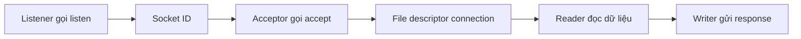

# 🎭 Listener, Acceptor và Reader: Bộ Ba Vai Diễn Không Thể Tách Rời Trong Backend

> Nguồn: `041-The-Listener-The-Acceptor-and-the-Reader.txt` · [Udemy](https://ua.udemy.com/course/fundamentals-of-backend-communications-and-protocols/learn/lecture/34676732)

Sau khi đã hiểu kernel đọc/ghi và accept connection như thế nào, đã đến lúc mình bàn cách backend được kiến trúc ra sao để tận dụng tất cả những cơ chế đó. Trước hết phải gọi tên ba vai: người listen, người accept, người read — vì trên thực tế **ba vai này không nhất thiết là một**. Hiểu rõ chúng là nền tảng cho mọi execution pattern sắp tới.

Điểm hay là ba vai này **không bắt buộc thuộc về cùng một bên**. Chúng có thể nằm gọn trong một process "ôm" hết, hoặc bị tách ra cho nhiều thread, nhiều process khác nhau. Chính cách các bạn sắp xếp ba vai này là thứ quyết định execution pattern của backend — từ Node.js đơn luồng cho tới những kiến trúc nhiều listener phức tạp.

### 📡 Listener (bộ lắng nghe): người gọi listen

Listener là **thread hoặc process** gọi `listen`, truyền vào port và address, rồi nhận về **socket ID (số hiệu socket)**. Nhiệm vụ của listener đúng nghĩa đen: **chỉ lắng nghe**.

* Memory location (vùng nhớ) nơi socket tồn tại nằm ngay tại đó — listener tạo ra "cửa" cho connection bước vào.
* Listener không đọc, không xử lý request. Nó chỉ lo phần "mở cửa" mà thôi.
* Từ lúc này, socket sống ngay tại đó và sẵn sàng cho những connection mới — kernel lo phần queue và dữ liệu đến, listener không phải làm gì thêm.

---

### 🤝 Acceptor (bộ chấp nhận kết nối): người gọi accept

Acceptor là **bất kỳ ai có quyền truy cập socket ID** và gọi `accept` trên socket đó để nhận về **file descriptor (bộ mô tả file)** trỏ tới connection.

* Có connection trong tay rồi thì mới có chuyện để nói tiếp.
* Nhiệm vụ của acceptor: lấy connection ra khỏi hàng đợi và biến nó thành thứ mà phần còn lại của backend có thể đọc được.
* Điểm hay: acceptor **không nhất thiết phải là listener** — hai vai có thể nằm ở hai thread hoặc hai process khác nhau.

---

### 📖 Reader: người thật sự đọc connection

Khi đã có connection, vai tiếp theo là **reader** — người **đọc dữ liệu từ connection**. Người viết response (writer) có thể là cùng một bên, cũng có thể là bên khác.

* Trong khóa này mình tập trung vào **reader** nhiều hơn, vì backend cần đọc request trước khi có thể trả lời.
* Đọc đủ dữ liệu rồi thì mới parse và hiểu được khách hàng đang yêu cầu gì.
* Reader và writer có thể là hai bên khác nhau: một người chuyên đọc request, một người chuyên ghi response — tùy thiết kế của bạn.

---

### 🧵 Một process làm cả ba — hay tách vai bằng multithreading?

Trong mọi thứ đã trình bày, cả ba bên đều có thể **do cùng một backend process đảm nhiệm**. Nhưng các bạn hoàn toàn có quyền **tách trách nhiệm ra**:

* **Một listener** — chỉ lo listen.
* **Một acceptor** — hoặc **bảy acceptor**, cũng chẳng sao.
* **Năm reader** — số lượng tùy nhu cầu đọc dữ liệu của bạn.

Các con số này chỉ là ví dụ: bạn được phép "chơi" với cách phân bổ, miễn là hiểu rõ hệ quả. Đây chính là lúc **multithreading (đa luồng)** và **multiple processes (nhiều tiến trình)** bước vào sân khấu. Cách những ứng dụng phổ biến — Node.js, RAMCloud, Nginx, Envoy… — tổ chức các vai này sẽ là nội dung của những bài tiếp theo.

| Vai | Nhiệm vụ | Nhận về | Có thể tách? |
|---|---|---|---|
| Listener | Gọi listen trên address và port | Socket ID | Có |
| Acceptor | Gọi accept trên socket | File descriptor connection | Có |
| Reader | Đọc dữ liệu từ connection | Dữ liệu request | Có |

*Không có công thức nào đúng cho mọi hệ thống — đó chính là lý do chúng ta cần tới các execution pattern.*

*Các bạn để ý nhé: ba vai nghe thì đơn giản, nhưng gần như mọi execution pattern trong section này chỉ là những cách sắp xếp khác nhau của đúng ba vai này.*

### 🎯 Tự kiểm tra nhanh

**Câu 1:** Listener làm gì và nhận về gì?

<b>Xem đáp án</b>

**Đáp án:** Gọi `listen` với port và address, nhận về socket ID — và chỉ lắng nghe, không đọc request.

Giải thích: Listener tạo "cửa" cho connection bước vào.

Tham chiếu: Mục "Listener".

**Câu 2:** Acceptor là ai?

<b>Xem đáp án</b>

**Đáp án:** Là bất kỳ ai có quyền truy cập socket ID và gọi `accept` trên socket đó, nhận về file descriptor của connection.

Giải thích: Acceptor không nhất thiết phải là listener.

Tham chiếu: Mục "Acceptor".

**Câu 3:** Reader làm gì, và writer có bắt buộc là cùng một bên?

<b>Xem đáp án</b>

**Đáp án:** Reader đọc dữ liệu từ connection; writer gửi response có thể cùng bên hoặc khác bên.

Giải thích: Backend cần đọc request trước khi có thể trả lời.

Tham chiếu: Mục "Reader".

**Câu 4:** Ba vai có bắt buộc nằm trong cùng một process/thread?

<b>Xem đáp án</b>

**Đáp án:** Không. Có thể một listener, bảy acceptor, năm reader — tùy nhu cầu.

Giải thích: Cách sắp xếp ba vai chính là execution pattern.

Tham chiếu: Mục "Một process làm cả ba".

**Câu 5:** Vì sao hiểu rõ ba vai này quan trọng?

<b>Xem đáp án</b>

**Đáp án:** Vì gần như mọi execution pattern trong section chỉ là những cách sắp xếp khác nhau của đúng ba vai này.

Giải thích: Ba vai là "từ vựng" để bàn về kiến trúc backend.

Tham chiếu: Đoạn kết bài.

Vậy là chúng ta đã có đủ "từ vựng" để bàn về kiến trúc. Bài tới, mình bắt đầu với pattern đơn giản nhất: **một listener, một acceptor, một reader** — và vì sao Node.js là ví dụ hoàn hảo cho nó. Hẹn gặp lại! 🚀

## Nguồn tham khảo

- [Udemy — The Listener, The Acceptor and the Reader](https://ua.udemy.com/course/fundamentals-of-backend-communications-and-protocols/learn/lecture/34676732)
- [Linux man page — listen(2)](https://www.man7.org/linux/man-pages/man2/listen.2.html)
- [Linux man page — socket(2)](https://www.man7.org/linux/man-pages/man2/socket.2.html)
