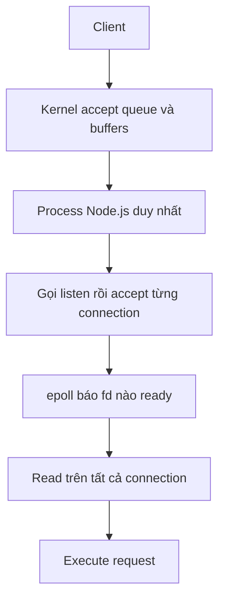

# 🧵 Single Listener, Acceptor and Reader: Kiến Trúc Một Thread "Cân" Mọi Connection Của Node.js

> Nguồn: `042-Single-Listener-Acceptor-and-Reader-Thread-Execution-Pattern.txt` · [Udemy](https://ua.udemy.com/course/fundamentals-of-backend-communications-and-protocols/learn/lecture/34647890)

Pattern đầu tiên, đơn giản nhất, cũng là pattern làm nên tên tuổi của Node.js: **một listener, một acceptor, và cũng chính nó là reader**. Nghe có vẻ liều lĩnh, nhưng nó hoạt động tốt đến mức cả một hệ sinh thái xây trên nó. Cùng mình mổ xẻ nhé.

### 🟢 Node.js: một process làm cả ba vai

Node.js là ví dụ hoàn hảo: **single listener, single acceptor, và cùng là reader** — tất cả trong **một process duy nhất**, thực chất là **single-threaded (đơn luồng)**.

Diễn biến trong kiến trúc đó:

* Backend application là **một process duy nhất**; phía trước vẫn là client, kernel và các queue mà chúng ta đã bàn.
* Process này gọi listen — kernel tạo **accept queue** và các buffer (bộ đệm) cho nó, rồi nó ngồi lắng nghe.
* Khi một connection tới, **cũng chính process này accept** — mấy "chấm xanh" trong sơ đồ của mình chính là các connection.
* Cũng chính process này **read từ tất cả các connection** — read, read, read liên tục.
* Nhờ vậy nó **quản lý được rất nhiều connection** mà kiến trúc vẫn chỉ là một process làm cả ba việc.

Làm sao một thread đọc nổi hàng tá connection? Nhờ **epoll** — mô hình asynchronous socket reading chúng ta đã bàn: "Đây là một loạt file descriptor, hãy báo cho tôi khi có cái nào ready". Trong Node.js, điều này xảy ra **hoàn toàn phía sau hậu trường** — backend developer viết Node không phải tự tay làm, mọi thứ diễn ra tự động.

---

### 😬 Vấn đề: một thread không thể "chiều" quá nhiều connection cùng lúc

Kiến trúc đẹp ở độ đơn giản, nhưng có cái giá:

* Khi số connection tăng, process này trở nên **chatty (nói chuyện quá nhiều)** — nó phải quay sang tiếp chuyện với từng connection.
* Việc đọc từ tất cả connection **không thật sự fair (công bằng)** — connection này có thể được phục vụ nhanh, connection khác phải chờ.
* Hệ quả là **OS bị ứ**: cả **receive queue lẫn accept queue đều có thể đầy**, vì một thread đơn độc không thể theo kịp tốc độ dữ liệu đổ về.
* Nói cách khác: càng nhiều connection, process này càng dễ trở thành **nút thắt cổ chai** ngay bên trong lòng OS.

*Biểu hiện ra ngoài của tất cả những điều này rất đơn giản: app chậm, request chờ lâu — trong khi CPU của bạn vẫn... nhàn rỗi. Đó là kiểu vấn đề khó đoán nhất.*

*Nghe có vẻ nghiêm trọng, nhưng cộng đồng Node.js có một câu trả lời cực kỳ thanh lịch.*

---

### 🚀 Cách "scale" đặc sản của Node.js: spin thêm process

Giải pháp không nằm ở việc thêm thread phức tạp, mà là: **spin up thêm Node process**.

* Bạn có thể chạy **5 process Node**, mỗi process vẫn **single-thread** như cũ.
* Mỗi process tự listen/accept/read độc lập — không phải đấu tranh với mutex hay multi-threading rối rắm.
* Nhờ vậy bạn vẫn khai thác được **nhiều core của CPU**, và toàn bộ OS là tài nguyên chung để các process chia nhau.
* Mỗi process vẫn giữ nguyên "bộ não" đơn giản của mình — không mutex, không chia sẻ state phức tạp giữa các thread.

| Tiêu chí | Một process Node.js | Nhiều process Node.js |
|---|---|---|
| Mô hình | Một thread làm listener, acceptor, reader | Mỗi process vẫn single-thread, độc lập |
| Khai thác CPU | Chỉ một core | Nhiều core |
| Đồng bộ | Không cần mutex | Không chia sẻ state giữa các process |
| Hệ quả | Nghẽn khi connection tăng | Mỗi connection thuộc đúng một process |

Triết lý ở đây rất rõ: **giữ mọi thứ đơn giản, nhân bản thay vì làm phức tạp**. *Đó là lý do mình rất thích Node.js — nó khiến bài toán khó trở nên dễ suy luận.*

*Một điều thú vị: giải pháp cho vấn đề "một thread quá tải" hóa ra không phải là làm thread đó thông minh hơn, mà là... chạy thêm vài bản sao của nó. Đôi khi cách giải quyết đơn giản nhất lại là cách hiệu quả nhất.*

Đổi lại, mỗi connection thuộc về đúng một process, và các process không chia sẻ connection với nhau — chi tiết này rất quan trọng khi ta bước sang các pattern tiếp theo.

### 🎯 Tự kiểm tra nhanh

**Câu 1:** Kiến trúc của Node.js trong bài gồm mấy process và mấy thread?

<b>Xem đáp án</b>

**Đáp án:** Một process duy nhất, thực chất là single-threaded — một thread làm cả listener, acceptor và reader.

Giải thích: Tất cả nằm gọn trong một process.

Tham chiếu: Mục "Node.js: một process làm cả ba vai".

**Câu 2:** Nhờ đâu một thread đọc nổi hàng tá connection?

<b>Xem đáp án</b>

**Đáp án:** Nhờ epoll — mô hình async socket reading báo cho biết fd nào ready.

Giải thích: Trong Node.js điều này diễn ra hoàn toàn phía sau hậu trường.

Tham chiếu: Mục "Node.js: một process làm cả ba vai".

**Câu 3:** Khi số connection tăng, vấn đề gì xuất hiện?

<b>Xem đáp án</b>

**Đáp án:** Process trở nên chatty, việc đọc không thật sự fair, cả receive queue lẫn accept queue đều có thể đầy.

Giải thích: Một thread đơn độc không theo kịp tốc độ dữ liệu đổ về; app chậm trong khi CPU vẫn nhàn rỗi.

Tham chiếu: Mục "Vấn đề: một thread không thể chiều quá nhiều connection".

**Câu 4:** Node.js "scale" bằng cách nào?

<b>Xem đáp án</b>

**Đáp án:** Spin thêm nhiều process Node single-thread, mỗi process tự listen/accept/read độc lập.

Giải thích: Nhân bản thay vì làm phức tạp — không mutex, không chia sẻ state.

Tham chiếu: Mục "Cách scale đặc sản của Node.js".

**Câu 5:** Các process Node.js có chia sẻ connection với nhau không?

<b>Xem đáp án</b>

**Đáp án:** Không. Mỗi connection thuộc về đúng một process.

Giải thích: Chi tiết này rất quan trọng khi bước sang các pattern tiếp theo.

Tham chiếu: Đoạn kết mục "Cách scale".

Pattern "một thread cho tất cả" đã rõ. Nhưng nếu thay vì nhân bản process, ta **nhân bản reader bên trong process** thì sao? Đó là nội dung bài tiếp theo — **single listener, acceptor với nhiều reader**. Hẹn gặp lại! 🚀

## Nguồn tham khảo

- [Udemy — Single Listener, Acceptor and Reader Thread Execution Pattern](https://ua.udemy.com/course/fundamentals-of-backend-communications-and-protocols/learn/lecture/34647890)
- [Node.js Docs — Cluster](https://nodejs.org/docs/latest/api/cluster.html)
- [Linux man page — epoll(7)](https://www.man7.org/linux/man-pages/man7/epoll.7.html)
