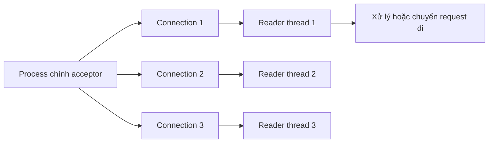

# 👥 Single Listener, Acceptor và Multiple Readers: Chia Việc Đọc Cho Nhiều Thread

> Nguồn: `043-Single-Listener-Acceptor-and-Multiple-Readers-Thread-Executi.txt` · [Udemy](https://ua.udemy.com/course/fundamentals-of-backend-communications-and-protocols/learn/lecture/34647976)

Pattern này mình rất thích: vẫn **một listener, một acceptor**, nhưng thay vì một reader đơn độc, ta **spin nhiều thread reader** và phân phối connection cho chúng. Nghe hợp lý hơn hẳn — nhưng đừng vội mừng, có một cái bẫy fairness (công bằng) đang chờ các bạn ở cuối bài.

### 🧩 Kiến trúc: máy accept chạy vòng lặp, thread con gánh việc đọc

Cách nó hoạt động:

1. Process chính đóng vai **listener + acceptor**: nó giữ socket và chạy **vòng lặp accept vô hạn** — accept, accept, accept không ngừng nghỉ.
2. Process này **spin sẵn một lượng thread**. Mặc định thường **bằng số processor/core của máy** — cứ 8 core thì 8 thread.
3. Mỗi khi accept được một connection từ queue, process chính **đưa connection đó cho một thread** — còn nó thì không làm gì khác ngoài accept.
4. Các thread được giao trách nhiệm **read từ connection của mình**.
5. Toàn bộ việc phân phối nằm ở **process chính** — các reader không cần biết gì về connection của người khác.

Đây là chỗ **load balancing (cân bằng tải)** thật sự diễn ra: "máy accept" điều phối, các reader cắm đầu đọc dữ liệu. Điều thú vị: **ai xử lý request sau khi đọc xong thì chưa được vẽ ra trong sơ đồ** — có thể chính thread đó, cũng có thể một thread khác. Kiến trúc này rất đáng để tùy biến theo hệ thống của các bạn.

* Các reader làm việc độc lập trên connection riêng của mình — chúng không chia sẻ file descriptor cho nhau.
* Mọi thứ vẫn nằm trong **một process duy nhất** — không có process thứ hai nào tham gia vào việc đọc.

---

### 🔍 Đọc xong rồi ai xử lý? — chỗ này kiến trúc "mở" cho bạn sáng tạo

Đây là phần mình thích nhất ở pattern này: **ranh giới giữa "đọc" và "xử lý" được tách hẳn ra**:

* Thread reader có thể **tự xử lý request luôn** sau khi đọc.
* Hoặc đọc xong, nó **chuyển request sang thread khác** chuyên làm việc nặng (query database, gọi service khác...).
* Hoặc tách hẳn một nhóm thread chuyên **execute request**, còn nhóm reader chỉ đọc và chuyển việc đi.

Khả năng "vẽ" các mảnh ghép theo ý muốn khiến mô hình này linh hoạt. Đây cũng là ví dụ tiêu biểu của một **multi-threaded application (ứng dụng đa luồng)**. *Điểm cốt lõi cần nhớ: người đọc không nhất thiết là người xử lý.*

---

### ⚖️ Cái bẫy: cân bằng theo connection không hề công bằng

Nghe thì ngon, nhưng đây là vấn đề chí mạng:

* Giả sử acceptor chia cho **thread A 1 connection** và **thread B 7 connection** — về số lượng cũng gọi là "cân bằng", nhưng **một connection có thể cực kỳ "tham ăn"**.
* Ví dụ: một connection là **HTTP/2 với hàng nghìn stream và giao tiếp hai chiều** — mỗi request là một stream, dữ liệu đổ về liên tục. Thread phụ trách connection này gánh cả một núi việc.
* Trong khi đó, thread khác chỉ có **một connection HTTP/1.1 nhẹ tênh, thậm chí chưa mã hóa** — client "hát líu lo" mà chẳng gửi gì đáng kể.
* Và nhớ nhé: **chia đều số connection không có nghĩa là chia đều khối lượng công việc** — vì bản chất mỗi connection một khác.

| Góc nhìn | Acceptor chia | Thực tế công việc |
|---|---|---|
| Thread A | 1 connection | HTTP/2 hàng nghìn stream — rất nặng |
| Thread B | 7 connection | HTTP/1.1 nhẹ — rất nhàn |
| Kết luận | Chia đều số lượng | Không đều khối lượng |

Kết quả: **thread gánh nặng thì kiệt sức, thread còn lại ngồi chơi bên bình nước**. *Đó chính là "load balancing trên giấy" — cân bằng hình thức nhưng không cân bằng công việc thật — và là gốc rễ của đủ loại vấn đề latency trong production.*

*Bao giờ mới hết cảnh một thread làm quần quật còn thread khác ngồi không? Đó chính là câu hỏi mà pattern tiếp theo sinh ra để trả lời.*

Mình vẫn thường nhắc học viên: hành trình hiểu backend là **một hành trình liên tục** — mình cũng học thêm mỗi ngày khi mổ xẻ những kiến trúc như thế này. Mỗi pattern là một mảnh ghép giúp các bạn tư duy chuẩn hơn.

*Đây là lý do mình luôn nói: đừng thiết kế hệ thống dựa trên giả định — hãy dựa trên cơ chế thật. Connection "im lặng" hôm nay có thể là connection "nặng" nhất ngày mai.*

### 🎯 Tự kiểm tra nhanh

**Câu 1:** Pattern này có bao nhiêu listener và acceptor?

<b>Xem đáp án</b>

**Đáp án:** Một listener, một acceptor — cả hai nằm ở process chính.

Giải thích: Process chính giữ socket và chạy vòng lặp accept vô hạn.

Tham chiếu: Mục "Kiến trúc".

**Câu 2:** Process chính làm gì sau khi accept được connection?

<b>Xem đáp án</b>

**Đáp án:** Giao connection đó cho một thread reader — còn nó thì không làm gì khác ngoài accept.

Giải thích: Số thread reader mặc định thường bằng số processor/core.

Tham chiếu: Mục "Kiến trúc".

**Câu 3:** Các reader thread có chia sẻ file descriptor cho nhau không?

<b>Xem đáp án</b>

**Đáp án:** Không. Mỗi thread đọc trên connection riêng của mình, độc lập.

Giải thích: Toàn bộ việc phân phối nằm ở process chính.

Tham chiếu: Mục "Kiến trúc".

**Câu 4:** Cái bẫy lớn nhất của pattern này là gì?

<b>Xem đáp án</b>

**Đáp án:** Cân bằng theo số connection không công bằng: một connection HTTP/2 nhiều stream có thể nặng hơn hàng loạt connection HTTP/1.1 nhẹ.

Giải thích: Chia đều số connection không có nghĩa là chia đều khối lượng công việc.

Tham chiếu: Mục "Cái bẫy".

**Câu 5:** Sau khi reader đọc xong, ai xử lý request?

<b>Xem đáp án</b>

**Đáp án:** Tùy thiết kế: chính thread đó, hoặc chuyển sang thread khác chuyên execute.

Giải thích: Người đọc không nhất thiết là người xử lý — đây là chỗ kiến trúc mở cho sáng tạo.

Tham chiếu: Mục "Đọc xong rồi ai xử lý?".

Vậy làm sao để cân bằng tải **theo message/công việc** thay vì theo connection? Đó là ý tưởng đỉnh cao mà **RAMCloud** theo đuổi — và cũng là nội dung bài tiếp theo. Hẹn gặp lại! 🚀

## Nguồn tham khảo

- [Udemy — Single Listener, Acceptor and Multiple Readers Thread Execution Pattern](https://ua.udemy.com/course/fundamentals-of-backend-communications-and-protocols/learn/lecture/34647976)
- [Node.js Docs — Cluster](https://nodejs.org/docs/latest/api/cluster.html)
- [Linux man page — listen(2)](https://www.man7.org/linux/man-pages/man2/listen.2.html)
