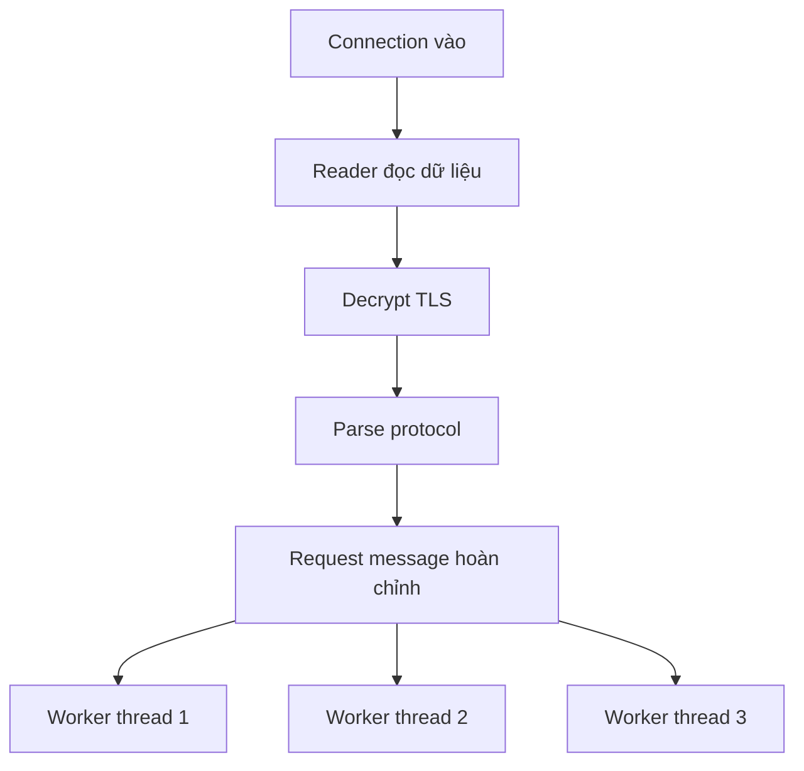

# 📨 Message Load Balancing: Kiến Trúc "Công Bằng Thật Sự" Của RAMCloud

> Nguồn: `044-Single-Listener-Acceptor-Reader-with-Message-Load-Balancing-.txt` · [Udemy](https://ua.udemy.com/course/fundamentals-of-backend-communications-and-protocols/learn/lecture/34647980)

Pattern trước để lại một câu hỏi: nếu cân bằng theo connection là không công bằng, thì cân bằng **theo message** thì sao? Đó chính xác là điều **RAMCloud** — hệ thống storage siêu tốc cho data center — đang làm. Mình rất thích kiến trúc này, và đây là lần hiếm hoi trong khóa học mình mổ xẻ một hệ thống thật để rút ra bài học.

### 🏗️ RAMCloud: single listener, single acceptor, nhưng tất cả trong một process

Giới thiệu qua về nhân vật chính: **RAMCloud là một lớp storage siêu tốc độ cho các ứng dụng data center quy mô lớn** — về bản chất là một **storage system (hệ thống lưu trữ)**, khá giống database. Nó được thiết kế để giải đúng bài toán chúng ta đang bàn.

*Và như các bạn sẽ thấy, nó chọn một triết lý đơn giản nhưng cực kỳ hiệu quả: đừng bắt worker phải bận tâm chuyện "hậu cần".*

Mô hình của nó:

* **Một listener duy nhất, một acceptor duy nhất** — mọi thứ nằm trong **cùng một process**.
* Trong process đó có **nhiều thread**, tất cả cùng tham gia vào công việc.
* Các reader cũng ở trong cùng process đó luôn — không tách ra ngoài.
* Đây vẫn là mô hình **listener → acceptor → reader** quen thuộc, chỉ khác là "đội hình" đông hơn và cùng chung một mái nhà.
* Vì tất cả nằm trong một process, việc điều phối giữa các thread trở nên tập trung và rõ ràng hơn.

---

### ✉️ Bước ngoặt: biến connection thành "message" hoàn chỉnh rồi mới giao việc

Điểm khác biệt nằm ở đây:

* Các thread **không nhận raw connection (connection thô)** để xử lý từ đầu, mà nhận **request đã sẵn sàng để execute**.
* Nghĩa là: nơi nào đọc dữ liệu, nơi đó **decrypt, parse và dựng request hoàn chỉnh**, rồi đóng gói thành **một message logic gọn gàng**.
* Message đó mới được gửi cho một thread khác: "Việc này đến lượt bạn, execute đi".
* Điểm mấu chốt: **đơn vị được cân bằng giờ là request**, không còn là connection nữa.
* Nhờ đó, thread nào nhận việc chỉ tập trung vào đúng một câu hỏi: execute request này thế nào cho đúng và nhanh.

Kết quả là mô hình **clean worker threads (các luồng thợ sạch việc)**: worker chỉ việc execute, không phải bận tâm connection nào, dữ liệu đến từ đâu, request đã decrypt hay chưa. *Đây là true load balancing (cân bằng tải thật sự) — công bằng theo từng request chứ không theo từng connection.*

| Tiêu chí | Cân bằng theo connection | Cân bằng theo message |
|---|---|---|
| Đơn vị chia | Connection | Request đã decrypt và parse |
| Công bằng | Hình thức, dễ lệch tải | Theo khối lượng công việc thật |
| Worker nhận gì | Raw connection | Message sẵn sàng execute |
| Chi phí triển khai | Thấp | Cần protocol-aware, C/Rust |

*Các bạn thấy đấy — cùng một đám thread, nhưng chỉ cần thay đổi "cái được chia" từ connection sang message là tính công bằng thay đổi hoàn toàn. Đó là sức mạnh của việc hiểu rõ bản chất công việc.*

---

### ⚠️ Cái giá phải trả: single point và yêu cầu "protocol aware"

Kiến trúc hay nào cũng có nhưng, và pattern này cũng vậy:

* **Single point (điểm chết đơn lẻ):** process ôm listener/acceptor có thể thành nút thắt nếu tải quá lớn.
* Tin vui: chuyện này **không khó giải quyết** — bạn chỉ cần spin thêm nhiều process. Và sẽ có một "trick" cực hay là **listen trên cùng một port bằng nhiều process** — mình sẽ bật mí trong các bài tới.
* Yêu cầu khó nhằn: bên đọc **phải protocol-aware (hiểu giao thức)** — phải parse và hiểu HTTP, gRPC... ở tầng thấp để biến chúng thành message.
* Để làm được điều đó, bạn gần như phải **làm chủ toàn bộ stack**, và viết bằng ngôn ngữ low-level như **C hay Rust**. Không phải ai cũng làm được, và cũng không hề dễ.
* Nói ngắn gọn: muốn có sự công bằng "xịn" này, bạn phải trả giá bằng **độ phức tạp triển khai** — không phải đội ngũ nào cũng sẵn sàng trả.
* Và đừng quên: chính vì bước đọc/decrypt/parse diễn ra trước khi phân việc, nên "công bằng" ở đây không hề miễn phí — nó là kết quả của cả một pipeline rõ ràng.

Tóm lại: kiến trúc clean worker cho bạn sự công bằng gần như tuyệt đối — đổi lại là độ phức tạp, và một sự thật không dễ chịu: **muốn xử lý ở tầng thấp, bạn phải thật sự hiểu tầng đó**.

### 🎯 Tự kiểm tra nhanh

**Câu 1:** RAMCloud là gì?

<b>Xem đáp án</b>

**Đáp án:** Một lớp storage siêu tốc cho data center quy mô lớn — về bản chất là storage system, khá giống database.

Giải thích: Đây là hệ thống thật hiếm hoi được mổ xẻ trong khóa.

Tham chiếu: Mục "RAMCloud".

**Câu 2:** Khác biệt cốt lõi so với pattern trước là gì?

<b>Xem đáp án</b>

**Đáp án:** Worker không nhận raw connection mà nhận request đã hoàn chỉnh để execute.

Giải thích: Đơn vị được cân bằng giờ là request thay vì connection.

Tham chiếu: Mục "Bước ngoặt".

**Câu 3:** Ai decrypt và parse request trước khi phân việc?

<b>Xem đáp án</b>

**Đáp án:** Nơi đọc dữ liệu — reader decrypt, parse protocol rồi đóng gói thành message logic.

Giải thích: Nhờ đó worker chỉ tập trung execute.

Tham chiếu: Mục "Bước ngoặt".

**Câu 4:** Cái giá phải trả của kiến trúc này là gì?

<b>Xem đáp án</b>

**Đáp án:** Single point ở process listener/acceptor, và yêu cầu protocol-aware — gần như phải làm chủ toàn bộ stack, viết bằng C hay Rust.

Giải thích: Muốn công bằng "xịn" thì phải trả giá bằng độ phức tạp triển khai.

Tham chiếu: Mục "Cái giá phải trả".

**Câu 5:** Vì sao gọi đây là true load balancing?

<b>Xem đáp án</b>

**Đáp án:** Vì công bằng theo từng request chứ không theo từng connection.

Giải thích: Worker không phải bận tâm connection nào, dữ liệu từ đâu, đã decrypt hay chưa.

Tham chiếu: Mục "Bước ngoặt".

Mô hình này để lộ ra một ý tưởng hấp dẫn: nếu một process là single point, tại sao không cho **nhiều process cùng listen trên một port**? Nghe như vi phạm quy tắc — nhưng hóa ra lại làm được. Mình hẹn các bạn ở bài tiếp theo! 🚀

## Nguồn tham khảo

- [Udemy — Single Listener, Acceptor, Reader with Message Load Balancing](https://ua.udemy.com/course/fundamentals-of-backend-communications-and-protocols/learn/lecture/34647980)
- [The RAMCloud Storage System — ACM TOCS 2015 (PDF)](https://stanford.edu/~ouster/cgi-bin/papers/ramcloud-tocs.pdf)
- [RAMCloud Project — Stanford](https://ramcloud.atlassian.net/wiki/spaces/RAM/overview)
