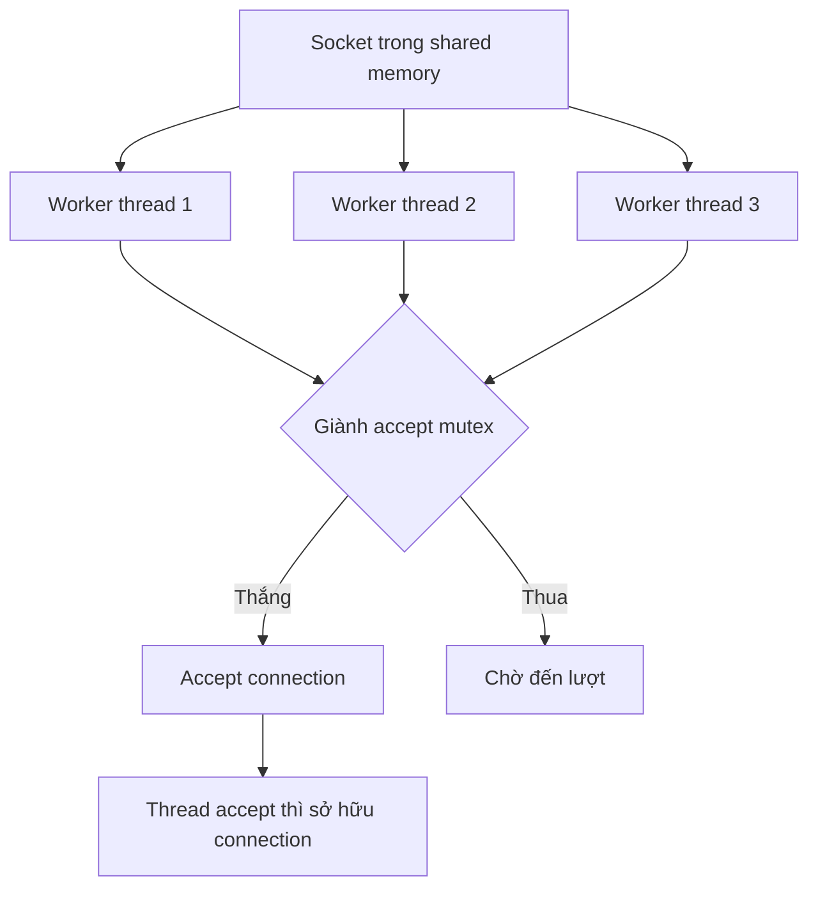

# 🔒 Multiple Accepter Threads Trên Một Socket: Nginx Và Nghệ Thuật Accept Mutex

> Nguồn: `045-Multiple-Accepter-Threads-on-a-Single-Socket-Execution-Patte.txt` · [Udemy](https://ua.udemy.com/course/fundamentals-of-backend-communications-and-protocols/learn/lecture/34647986)

Nếu một thread accept chưa đủ nhanh, tại sao không để **nhiều thread cùng accept**? Nginx — reverse proxy nổi tiếng — từng làm đúng như vậy theo mặc định, và đến giờ vẫn giữ nó như một lựa chọn cấu hình. Nhưng khi hai thread cùng gọi accept trên một socket, chuyện gì xảy ra? Cùng mình mổ xẻ.

### ⚙️ Mô hình: một socket, nhiều accepter dùng chung

Nginx là ví dụ kinh điển cho pattern này:

* **Main worker process giữ listener** — socket (ổ cắm mạng) sống ngay tại đó.
* Nhờ **shared memory (bộ nhớ chia sẻ)** của process chính, các worker thread đều có **quyền truy cập cùng một socket object**.
* Mỗi thread đều có thể gọi `accept` trên **cùng một object** — nghĩa là cả đám cùng "rút" connection từ queue.
* Đây là điểm khác biệt cốt lõi so với Node.js đơn luồng: trách nhiệm accept được **chia cho nhiều thread** thay vì dồn vào một người.

*Các bạn lưu ý: đây không còn là mặc định của Nginx nữa, nhưng trước kia nó là default, và đến giờ vẫn là một cấu hình được nhiều người dùng.*

---

### 🔐 Vấn đề: hai thread không thể accept cùng lúc — accept mutex xuất hiện

Nếu nhiều thread cùng gọi accept trên một socket mà không kiểm soát, chúng sẽ **giẫm lên chân nhau**:

1. Đây bản chất là **mutex problem (bài toán khóa loại trừ lẫn nhau)** — bạn **không thể có hai thread accept trên cùng một socket tại cùng một thời điểm**.
2. Nginx giải quyết bằng **accept mutex (khóa accept)**: thread nào muốn accept phải giành khóa, xong việc thì nhả ra.
3. Kết quả: vẫn có **locking/unlocking (khóa/mở khóa)** liên tục, nhưng không còn xung đột.
4. Nhờ vậy, dù nhiều thread cùng làm việc trên một socket, **tại mỗi thời điểm chỉ có đúng một thread accept** — an toàn tuyệt đối.

---

### 📬 Khi nào mô hình này thật sự thắng?

Vậy có đáng dùng không? Có — trong đúng bối cảnh của nó:

* Khi lượng connection đổ vào **rất lớn và nằm chờ trong accept queue**, việc có nhiều accepter là **ý tưởng tốt**, vì chúng rút connection ra song song.
* Nhược điểm duy nhất (và khá nhẹ): các thread **cạnh tranh nhau trên accept queue** để giành connection.

| Tiêu chí | Một accepter | Nhiều accepter trên một socket |
|---|---|---|
| Khi phù hợp | Tải vừa phải | Accept queue dài, connection vào rất lớn |
| Đồng bộ | Không cần khóa | Cần accept mutex, lock/unlock liên tục |
| Hạn chế | Một thread có thể nghẽn | Các thread cạnh tranh trên queue |
| Sở hữu connection | Chính thread accept | Thread nào accept thì sở hữu |

Vậy là bạn có thêm một lựa chọn: nếu accept queue dài dằng dặc connection chờ, thay vì một thread "rút" từng cái một, hãy huy động cả đội. *Hiệu quả luôn nằm ở việc hiểu rõ công cụ mình đang dùng — chứ không phải cứ thêm thread là nhanh hơn.*

---

### 🧩 Ai accept thì sở hữu connection

Một quy tắc vàng của pattern này: **thread nào accept connection thì sở hữu connection đó**.

* Không có chuyện chuyển connection qua lại cho thread khác.
* Nhờ vậy tránh hoàn toàn việc chia sẻ connection giữa các thread — giảm bug, giảm khóa, dễ suy luận về hiệu năng.

---

### 🔗 Đặt trong bức tranh lớn

Chúng ta đang đi theo một lộ trình rất rõ:

1. **Một thread làm tất cả** — kiểu Node.js.
2. **Nhiều reader thread** chia nhau đọc, nhưng vẫn một người accept.
3. **Nhiều accepter thread** cùng chia việc accept trên một socket — chính là bài này.

### 🎯 Tự kiểm tra nhanh

**Câu 1:** Nginx cho nhiều worker thread dùng chung thứ gì?

<b>Xem đáp án</b>

**Đáp án:** Cùng một socket object, nhờ shared memory của process chính.

Giải thích: Mỗi thread đều có thể gọi accept trên cùng object đó.

Tham chiếu: Mục "Mô hình: một socket, nhiều accepter".

**Câu 2:** Vì sao cần accept mutex?

<b>Xem đáp án</b>

**Đáp án:** Vì không thể có hai thread accept trên cùng một socket tại cùng một thời điểm.

Giải thích: Nginx dùng khóa để serialize việc accept giữa các worker.

Tham chiếu: Mục "Hai thread không thể accept cùng lúc".

**Câu 3:** Khi nào mô hình nhiều accepter thật sự thắng?

<b>Xem đáp án</b>

**Đáp án:** Khi lượng connection đổ vào rất lớn và nằm chờ trong accept queue — nhiều accepter rút connection ra song song.

Giải thích: Đây không còn là mặc định của Nginx nhưng vẫn là một cấu hình được dùng.

Tham chiếu: Mục "Khi nào mô hình này thật sự thắng?".

**Câu 4:** Nhược điểm của mô hình này là gì?

<b>Xem đáp án</b>

**Đáp án:** Các thread cạnh tranh nhau trên accept queue để giành connection — nhưng đây là nhược điểm khá nhẹ.

Giải thích: Hiệu quả nằm ở việc hiểu rõ công cụ, không phải cứ thêm thread là nhanh hơn.

Tham chiếu: Mục "Khi nào mô hình này thật sự thắng?".

**Câu 5:** Quy tắc vàng về quyền sở hữu connection là gì?

<b>Xem đáp án</b>

**Đáp án:** Thread nào accept connection thì sở hữu connection đó — không chuyển qua lại.

Giải thích: Nhờ vậy tránh chia sẻ connection giữa các thread, giảm bug và dễ suy luận về hiệu năng.

Tham chiếu: Mục "Ai accept thì sở hữu connection".

Mỗi bước đều mở rộng "đội hình" nhưng vẫn vướng một giới hạn: **tất cả cùng chia sẻ một socket**. Vậy nếu ta cho **mỗi process một socket riêng mà vẫn cùng một port** thì sao? Nghe như phép thuật — nhưng hoàn toàn làm được, và nó là một trong những kỹ thuật được dùng nhiều nhất trong các proxy hiện đại. Hẹn gặp các bạn ở bài tiếp theo! 🚀

## Nguồn tham khảo

- [Udemy — Multiple Accepter Threads on a Single Socket Execution Pattern](https://ua.udemy.com/course/fundamentals-of-backend-communications-and-protocols/learn/lecture/34647986)
- [Nginx Docs — Core functionality (accept_mutex)](https://nginx.org/en/docs/ngx_core_module.html)
- [Linux man page — socket(7) (SO_REUSEPORT)](https://www.man7.org/linux/man-pages/man7/socket.7.html)
