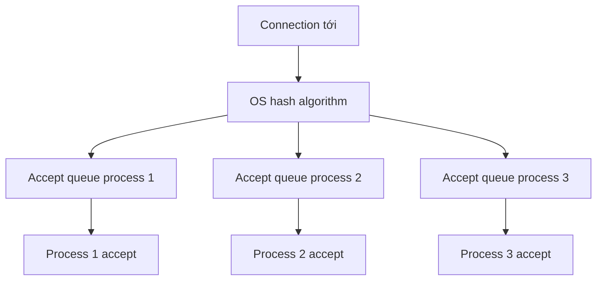

# 🧷 Socket Sharding: Nhiều Listener Cùng Một Port Và Cú Trick Đẹp Của Linux Kernel

> Nguồn: `046-Multiple-Listeners-Acceptors-and-Readers-with-Socket-Shardin.txt` · [Udemy](https://ua.udemy.com/course/fundamentals-of-backend-communications-and-protocols/learn/lecture/34648004)

Thử tưởng tượng bạn chạy hai process cùng listen trên `127.0.0.1:8080` — Node.js sẽ từ chối thẳng thừng với lỗi "address in use". Ấy vậy mà các proxy lớn như Nginx, Envoy lại làm điều tương tự như một thói quen. Bí mật nằm ở **socket reuse port** và kỹ thuật có tên **socket sharding (chia cổng theo luồng)**. Đây là pattern mình thích nhất trong cả section — cùng xem vì sao nhé.

### 🚫 Vì sao listen trùng port thường thất bại?

Quy tắc nền tảng của mọi backend:

* Bạn **có thể** listen trên `127.0.0.1:8080` và `192.168.1.105:8080` cùng lúc — khác địa chỉ thì không conflict (xung đột).
* Nhưng **hai process cùng listen trên một địa chỉ và một port** thì bị từ chối — đó là lỗi "address in use" mà chắc hẳn các bạn đã từng thấy.

---

### ✨ SO_REUSEPORT: nhiều process, một port, OS chia hộ

Đây là ngoại lệ đẹp đẽ: tùy chọn **socket reuse / reuse port** cho phép **chia sẻ socket giữa nhiều process**. Cơ chế bên dưới:

1. OS tạo **một accept queue cho mỗi process** — mỗi bên có **socket ID riêng** và bộ queue riêng.
2. Connection tới được OS **phân phối xuống các queue khác nhau**, dựa trên **hash algorithm (thuật toán băm)** — kiểu gần như round robin: queue 1 lấy cái này, queue 2 lấy cái kia.
3. Mỗi process/thread gọi `accept` trên socket của mình **mà không tranh giành với ai** — bạn là người duy nhất nhìn thấy socket đó.

Đó chính là **socket sharding (chia cổng theo luồng)**: bạn "shard" socket ra nhiều process, tất cả cùng listen trên một address, một port — miễn là bật option đó. Kết quả: **không ai giẫm chân ai**, OS lo phần phân phối. *Trong Nginx, Envoy và hầu hết proxy hiện đại, đây gần như là mặc định — chẳng có lý do gì để không bật nó.*

| Tiêu chí | Nhiều thread chung một socket | Socket sharding |
|---|---|---|
| Socket | Một socket chung | Mỗi process một socket riêng |
| Accept queue | Chung một queue | Mỗi process một queue |
| Đồng bộ | Cần accept mutex | Không tranh giành, OS lo phân phối |
| Bảo mật | Không đổi | Cần special key chống port hijacking |
| Ví dụ | Nginx thời accept_mutex | Nginx, Envoy hiện đại |

Lưu ý: trong các ngôn ngữ bậc cao như JavaScript/Node, bạn **có thể không tìm thấy option này**; nhưng với C/C++, bạn hoàn toàn có thể tự làm chủ và bật nó.

---

### 🛡️ Bảo mật: chống kẻ xấu hijack port

Một câu hỏi tinh tế: nếu ai cũng bật reuse port được, vậy **một process độc hại hay một container xấu** cứ listen cùng port rồi hút hết connection của bạn thì sao?

* Linux kernel biết chuyện này và có cơ chế chống **port hijacking (chiếm đoạt cổng)**.
* Khi listen với option này, bạn phải chỉ định **một special key (khóa đặc biệt)** — chỉ những process biết key mới được chia sẻ port đó.
* Process lạ không có key sẽ không được kernel phân phối gì cả — "đồ xấu thì đừng hòng".

Kernel thực sự là một thế giới của riêng nó, và đây là ví dụ đẹp cho việc nó âm thầm bảo vệ bạn.

---

### ⚖️ Nhưng khoan — bài toán load balancing vẫn quay lại!

Đừng tưởng socket sharding giải quyết hết. Vấn đề "công bằng" vẫn còn nguyên:

* Trong cùng một process, một thread có thể gánh **connection HTTP/1.1 nhẹ tênh**, trong khi thread khác gánh **connection HTTP/3/QUIC nặng trịch** — và QUIC còn phức tạp hơn nữa.
* Với QUIC, phía OS chỉ thấy **UDP datagram (gói dữ liệu UDP)** — kernel không hiểu gì về QUIC, nó **chỉ chuyển tiếp lên app**. Mọi logic như SYN, acknowledgement phải làm trong **userspace**.
* Đến thời điểm quay bài, **QUIC vẫn chưa nằm trong kernel** (khác TCP — thứ có sẵn đủ queue trong kernel). Nếu một ngày QUIC xuống kernel, app sẽ "mỏng" hơn — nhưng hiện tại mọi thứ vẫn ở userspace.

Giải pháp quen thuộc: tạo **thêm một tầng worker thread** chuyên đọc và hiểu request, rồi chuyển tiếp request cho các thread khác execute. Kiến trúc sẽ phức tạp hơn hẳn, nhưng hiệu năng thu lại mình tin là xứng đáng.

### 🎯 Tự kiểm tra nhanh

**Câu 1:** Vì sao hai process cùng listen một địa chỉ và một port thường thất bại?

<b>Xem đáp án</b>

**Đáp án:** Vì đó là xung đột "address in use" — trừ khi bật socket reuse/reuse port.

Giải thích: Khác address cùng port thì không conflict.

Tham chiếu: Mục "Vì sao listen trùng port thường thất bại?".

**Câu 2:** SO_REUSEPORT hoạt động thế nào?

<b>Xem đáp án</b>

**Đáp án:** OS tạo một accept queue cho mỗi process, mỗi bên có socket ID riêng, và phân phối connection xuống các queue bằng hash algorithm.

Giải thích: Mỗi process accept trên socket của mình mà không tranh giành với ai.

Tham chiếu: Mục "SO_REUSEPORT".

**Câu 3:** Vì sao socket sharding không cần accept mutex?

<b>Xem đáp án</b>

**Đáp án:** Vì mỗi process có socket và queue riêng — không ai giẫm chân ai, OS lo phần phân phối.

Giải thích: Trong Nginx, Envoy và hầu hết proxy hiện đại đây gần như là mặc định.

Tham chiếu: Mục "SO_REUSEPORT".

**Câu 4:** Linux kernel chống kẻ xấu hijack port như thế nào?

<b>Xem đáp án</b>

**Đáp án:** Khi listen với option này, process phải chỉ định một special key — chỉ process biết key mới được chia sẻ port.

Giải thích: Process lạ không có key sẽ không được kernel phân phối gì cả.

Tham chiếu: Mục "Bảo mật: chống kẻ xấu hijack port".

**Câu 5:** Vì sao bài toán load balancing vẫn quay lại sau khi dùng socket sharding?

<b>Xem đáp án</b>

**Đáp án:** Vì các connection nặng nhẹ khác nhau — ví dụ HTTP/1.1 nhẹ so với HTTP/3/QUIC nặng, và QUIC nằm userspace nên kernel chỉ thấy UDP datagram.

Giải thích: Giải pháp là thêm tầng worker thread đọc hiểu request rồi chuyển tiếp.

Tham chiếu: Mục "Nhưng khoan — bài toán load balancing vẫn quay lại!".

Đó là pattern cuối cùng hiện tại của section này — và mình sẽ còn bổ sung thêm khi cập nhật khóa học. Còn giờ, hãy chuyển sang một chủ đề mà mọi backend engineer phải "thuộc lòng": **idempotency (tính bất biến khi lặp)** — hẹn gặp ở bài tiếp theo! 🚀

## Nguồn tham khảo

- [Udemy — Multiple Listeners, Acceptors and Readers with Socket Sharding](https://ua.udemy.com/course/fundamentals-of-backend-communications-and-protocols/learn/lecture/34648004)
- [Linux man page — socket(7) (SO_REUSEPORT)](https://www.man7.org/linux/man-pages/man7/socket.7.html)
- [Nginx Docs — ngx_http_core_module (reuseport)](https://nginx.org/en/docs/http/ngx_http_core_module.html)
- [Envoy Docs — Listener configuration (enable_reuse_port)](https://www.envoyproxy.io/docs/envoy/latest/api-v3/config/listener/v3/listener.proto)
