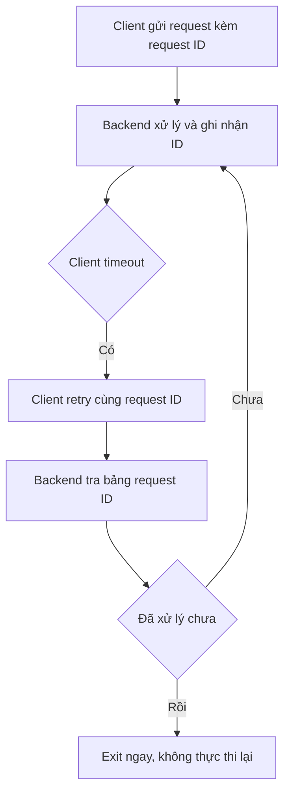

# ♻️ Backend Idempotency: Vì Sao Một Cú Retry Có Thể Khiến Bạn Bị Tính Tiền Hai Lần

> Nguồn: `047-Backend-Idempotency.txt` · [Udemy](https://ua.udemy.com/course/fundamentals-of-backend-communications-and-protocols/learn/lecture/34648006)

Chúng ta đã đi qua toàn bộ hành trình từ accept connection, đọc/ghi dữ liệu, đến các execution pattern. Giờ là câu hỏi hậu trường quan trọng nhất: **điều gì xảy ra nếu request bị thực thi lại lần hai?** Với một số hệ thống, retry là chuyện nhỏ; với hệ thống tài chính, nó là thảm họa. Chào mừng các bạn đến với **idempotency (tính bất biến khi lặp)**.

### 🎯 Idempotency là gì? Ví dụ từ... ô comment YouTube

**Idempotency là ý tưởng một request có thể lặp lại mà không làm thay đổi state (trạng thái) của backend** — không gây ra rắc rối mới.

Ví dụ đời thường mình hay kể:

1. Bạn đang gõ comment trên YouTube, bấm gửi — nhưng **client timeout và mất kết nối**.
2. Thực ra request **đã tới server và đã được xử lý thành công** — chỉ là client không hề biết.
3. Client hiện nút "thử lại", bạn bấm. Một request mới lại chạy qua đúng kiến trúc thread chúng ta vừa học, tới thẳng backend.
4. Backend vui vẻ honor (chấp nhận) nó: "Ồ, comment mới hả? Ghi vào bảng!" — và bạn có **hai comment giống hệt nhau**.

Với comment thì chỉ hơi khó chịu. Nhưng tưởng tượng đó là **thanh toán**: retry một cái là **bay tiền hai lần**. Không độ.

*Chưa kể một kẻ đáng sợ hơn: L7 proxy có thể tự retry request hộ bạn mà bạn không hề hay biết. Lúc đó bạn mất luôn quyền kiểm soát "ở giữa" — nên backend phải tự bảo vệ mình.*

---

### 🧾 Cách chống: request ID và bảng tra cứu

Cách implement dễ nhất:

1. Mỗi request client gửi đi, đính kèm **request ID (mã định danh request)** — thường là **UUID**.
2. Backend xử lý request như bình thường và **ghi nhận ID đó**.
3. Nếu request với ID ấy **xuất hiện lại**, backend chỉ cần kiểm tra đã xử lý chưa → nếu rồi thì **exit ngay**, không thực thi lại.

Cách này hiệu quả, nhưng có cái giá: mỗi lần kiểm tra là **một lần lookup (tra cứu) trong bảng** — tốn kém hơn một chút, và bạn phải lo chuyện lưu trữ request ID.

---

### 🧠 Trick thông minh hơn: upsert

Ngoài request ID, bạn có thể áp dụng **upsert (insert nếu chưa có, update nếu đã có)**:

* Thử **insert** dữ liệu; nếu đã tồn tại thì **update**.
* Nếu thiết kế mọi thao tác theo kiểu upsert, backend sẽ ít bị ảnh hưởng bởi retry và **tự nhiên idempotent** hơn.

Tựu chung lại, có đủ loại trick để làm backend idempotent — nhưng thứ quan trọng nhất vẫn là **hiểu rõ state của mình**, và đảm bảo mọi thao tác đều có thể kiểm chứng được là đã hoàn tất hay chưa.

---

### 🌐 GET và POST: cặp đôi idempotent và không idempotent

Đây là kiến thức nền tảng mà mình muốn mọi backend engineer khắc cốt ghi tâm:

* **GET là idempotent:** đọc bao nhiêu lần cũng được, không thay đổi backend. Browsers và proxies **mặc định coi GET là idempotent** — chúng có thể **tự retry GET** bất cứ lúc nào, thậm chí **gửi GET mà bạn không hề hay biết** (ví dụ bạn chỉ hover chuột qua một thứ gì đó).
* **POST thì không:** POST thay đổi state, nên bạn **phải cực kỳ cẩn thận** với retry của nó.

| Tiêu chí | GET | POST |
|---|---|---|
| Idempotent | Có | Không |
| Thay đổi state | Không, chỉ đọc | Có |
| Browser/proxy tự retry | Có, mặc định | Không an toàn |
| Dùng để ghi dữ liệu | Tuyệt đối không | Đúng vai trò |

Từ đó suy ra nguyên tắc tối thượng:

* **Tuyệt đối không bao giờ dùng GET để ghi dữ liệu vào backend.** Không có ngoại lệ.
* Bạn **có thể** dùng GET để logging — nhưng đừng bao giờ lấy những log đó làm nguồn sự thật, vì GET rất dễ bị retry.
* Các **CDN như Cloudflare hay Fastly** là reverse proxy, chúng nói chuyện với backend liên tục — chúng **có thể retry** hoặc **cache** request của bạn. Vì vậy hãy chắc chắn GET của bạn thật sự vô hại.
* Khi GET đã idempotent nghĩa là khi đọc, nó **không có side effect (tác dụng phụ)** — đừng insert gì đó vào bảng rồi làm bảng phình to, rồi lại phụ thuộc vào bảng đó để làm việc khác.

*Đừng bao giờ để một chú GET ngây thơ có side effect — đó là cách nhanh nhất để biến dữ liệu của bạn thành mớ hỗn độn.*

### 🎯 Tự kiểm tra nhanh

**Câu 1:** Idempotency là gì?

<b>Xem đáp án</b>

**Đáp án:** Là ý tưởng một request có thể lặp lại mà không làm thay đổi state của backend.

Giải thích: Không gây ra rắc rối mới khi bị thực thi lại.

Tham chiếu: Mục "Idempotency là gì?".

**Câu 2:** Ví dụ comment YouTube minh họa điều gì?

<b>Xem đáp án</b>

**Đáp án:** Client timeout rồi retry trong khi request gốc đã xử lý thành công — kết quả là hai comment giống hệt nhau.

Giải thích: Với thanh toán, retry nghĩa là bay tiền hai lần.

Tham chiếu: Mục "Idempotency là gì?".

**Câu 3:** Cách chống bằng request ID hoạt động ra sao?

<b>Xem đáp án</b>

**Đáp án:** Client đính kèm request ID (thường là UUID); backend ghi nhận, nếu ID xuất hiện lại thì exit ngay, không thực thi lại.

Giải thích: Cái giá là mỗi lần kiểm tra tốn một lookup và phải lo lưu trữ request ID.

Tham chiếu: Mục "Cách chống: request ID và bảng tra cứu".

**Câu 4:** Upsert giúp ích gì?

<b>Xem đáp án</b>

**Đáp án:** Thử insert, nếu đã tồn tại thì update — nhờ vậy thao tác ít bị ảnh hưởng bởi retry và tự nhiên idempotent hơn.

Giải thích: Điều quan trọng nhất vẫn là hiểu rõ state của mình.

Tham chiếu: Mục "Trick thông minh hơn: upsert".

**Câu 5:** Vì sao tuyệt đối không dùng GET để ghi dữ liệu?

<b>Xem đáp án</b>

**Đáp án:** Vì browser, proxy và CDN mặc định coi GET là idempotent — chúng có thể tự retry hoặc cache mà bạn không hề hay biết.

Giải thích: Một chú GET có side effect là cách nhanh nhất biến dữ liệu thành mớ hỗn độn.

Tham chiếu: Mục "GET và POST".

Và như vậy là chúng ta khép lại section **Backend Execution Patterns** — từ kernel, socket, thread cho đến idempotency. Mình rất vui khi làm section này, hy vọng các bạn cũng thấy thú vị. Hẹn gặp lại ở bài tiếp theo! 🚀

## Nguồn tham khảo

- [Udemy — Backend Idempotency](https://ua.udemy.com/course/fundamentals-of-backend-communications-and-protocols/learn/lecture/34648006)
- [MDN — HTTP request methods](https://developer.mozilla.org/en-US/docs/Web/HTTP/Reference/Methods)
- [MDN Glossary — Idempotent](https://developer.mozilla.org/en-US/docs/Glossary/Idempotent)
