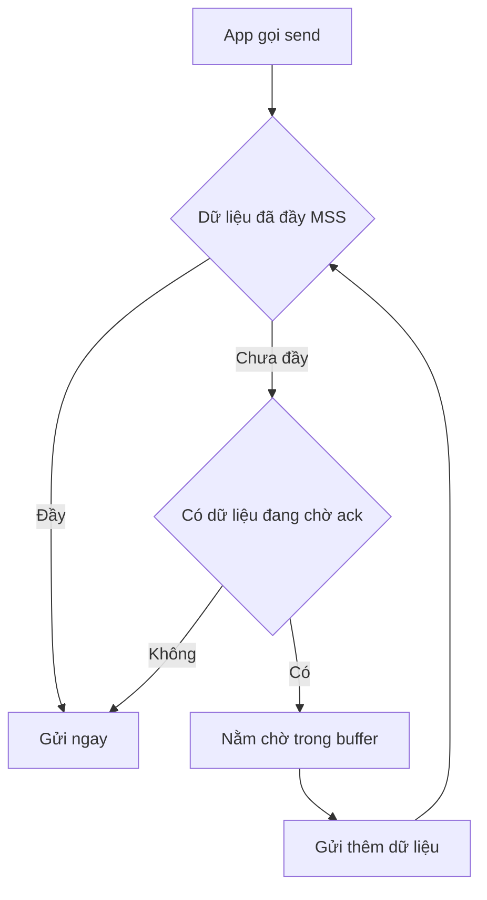

# 🐢 Nagle's Algorithm: Thủ Phạm Của Những Độ Trễ "Không Có Lý Do" Trong App

> Nguồn: `048-Nagles-Algorithm.txt` · [Udemy](https://ua.udemy.com/course/fundamentals-of-backend-communications-and-protocols/learn/lecture/34676506)

Nếu bạn từng thấy app của mình **chậm một cách khó hiểu** — mạng tốt, mọi thứ đều ổn, nhưng packet cứ tới trễ một cách ngẫu nhiên, không đoán trước được — thì rất có thể bạn đã gặp **Nagle's algorithm (thuật toán gộp gói tin)**. Nhiều người gặp nó theo cách không vui chút nào. Hôm nay mình sẽ kể các bạn nghe nó từ đâu tới, nó chờ cái gì, và vì sao gần như cả thế giới đã tắt nó.

### 🕰️ Nguồn gốc: từ thời Telnet và nỗi đau 40 byte

Câu chuyện bắt nguồn từ **overhead (chi phí phụ trội) của TCP**:

* Mỗi TCP segment mang **20 byte TCP header**, cộng thêm **20 byte IP header** — tổng cộng **40 byte overhead**.
* Thời **Telnet**, bạn gõ một ký tự là gửi một byte; gõ space thêm một byte; Enter thêm một byte nữa. Gửi một byte kèm 40 byte overhead đúng là **lãng phí khủng khiếp** — nó "giết chết" băng thông.
* Từ đó nảy ra ý tưởng: **sao không chờ cho segment đầy dữ liệu tới mức tối đa rồi mới gửi?** Cứ để người dùng gõ `ls`, Enter, gõ lệnh thoải mái — đến khi segment đầy thì mới đẩy đi. Đó chính là Nagle's algorithm.

Nghe rất hợp lý với người tiết kiệm băng thông — nhưng khoan, cái giá nằm ở chữ "chờ".

---

### ⚙️ Cơ chế: chờ đầy MSS — và cái giá là latency (độ trễ)

Ý tưởng cốt lõi: **chỉ gửi segment khi nó đã được lấp đầy tới MSS (maximum segment size, kích thước segment tối đa)**. Và ai phải chờ? Chính người gửi.

Ví dụ cụ thể với MSS mặc định **1460 byte**:

1. Ứng dụng gọi API send để gửi **500 byte**. Nó nói với OS: "Gửi hộ 500 byte này" — và OS **không gửi**.
2. Vì 500 < 1460, dữ liệu nằm chờ trong buffer. Nagle nói: "Đợi thêm đã".
3. Ứng dụng gửi thêm **960 byte** nữa — và thật tình cờ (theo ví dụ của mình), 500 + 960 = **1460**, vừa khít một MSS. Segment được gửi đi ngay.

Vậy là có **một khoảng delay** ở giữa — nhưng chờ bao lâu? *Không xác định được.* Tùy lượng dữ liệu và tùy mạng.

Và đây là chi tiết quan trọng nhiều người hiểu sai: **Nagle chỉ "chờ" khi có dữ liệu chưa được acknowledge**. Nếu không có gì đang trên đường cần ack, dữ liệu sẽ được **gửi ngay lập tức** — thuật toán này không đến mức cực đoan như người ta tưởng. Nó vẫn cho bạn một sự "khoan hồng" nhất định.

---

### 📉 Gửi dữ liệu lớn: bài toán 5000 byte và segment 620 byte "đi sau"

Đây là ví dụ cho thấy Nagle đau đầu cỡ nào với dữ liệu lớn:

* Bạn muốn gửi **5000 byte** trên MSS 1460.
* 3 segment đầy (3 × 1460 = 4380 byte) được gửi ngay vì đã "full", còn dư **620 byte**.
* Segment 620 byte cuối cùng thì... **không được gửi vội** — vì đang chờ acknowledgement của các segment trước.
* Chỉ khi ACK quay về, "không còn gì cần ack nữa", segment 620 byte mới được đẩy đi.

Kết quả là một khoảng delay lộ ra với người dùng — và **càng nhiều latency giữa A và B, delay càng dài**, vì phải chờ ack đi một vòng. Bạn có 2 cách xử lý: **tắt Nagle's algorithm**, hoặc **lấp đầy segment thật khéo** — điều gần như bất khả thi trong thực tế.

*Đây là một trong những lý do mình luôn nhấn mạnh: hiểu cơ chế bên dưới thì mới debug được những độ trễ "trên trời rơi xuống" như thế này.*

---

### 🔧 TCP_NODELAY: tắt Nagle — và quyết định lịch sử của curl năm 2016

Cách tắt Nagle rất đơn giản: option **TCP_NODELAY**.

* Điểm cực kỳ quan trọng: đây là thay đổi ở **phía gửi** — ai gửi dữ liệu thì tắt. Bạn tưởng chỉ client cần? Không đâu — **server cũng gửi dữ liệu, nên server cũng đóng vai trò client**, và cũng cần tắt luôn.
* Người ta thường băn khoăn: "Tắt Nagle thì mất lợi ích băng thông?" — *Với những người chọn latency, băng thông không còn là ưu tiên nữa. Gửi 620 byte chưa đầy segment? Cứ gửi.*

Và đây là giai thoại mình rất thích: **năm 2016, curl chính thức tắt hẳn Nagle's algorithm mặc định**. Commit đó kể rằng: sau nhiều giờ "săn" nguyên nhân app chậm trong **TLS handshake**, hóa ra thủ phạm là **TCP_NODELAY không được bật**. Tác giả — **Daniel Stenberg** — kết luận đã có đủ động lực để **đổi mặc định**: từ đó curl bật TCP_NODELAY mặc định, và cho phép ứng dụng tự tắt nếu muốn. Nghịch lý thú vị: muốn bật lại Nagle, bạn phải chỉ định option "tắt no-delay" — đọc lên khá rối não, đúng kiểu "phủ định của phủ định".

---

### 🧠 Tóm tắt: Nagle chờ gì và khi nào gửi ngay?

Chốt lại cho các bạn dễ nhớ:

1. Nagle's algorithm được thiết kế để **chờ đầy một MSS** trước khi gửi — muốn hiểu nó, bạn phải thật sự hiểu MSS là gì.
2. Nó **chỉ chờ khi có dữ liệu chưa được acknowledge**. Không có gì đang chờ ack → gửi ngay.
3. Nếu bạn vừa gửi một segment và giờ chỉ còn **3 byte** muốn gửi thêm — chúng sẽ phải nằm chờ. Đó là cảm giác của latency.
4. Ví dụ đau nhất phía server: server đang trả kết quả **query SQL** — gửi rồi gửi thêm, còn đúng một byte cuối mà không đẩy đi được vì phải chờ acknowledgement.

| Tình huống | Nagle làm gì |
|---|---|
| Segment đã đầy MSS | Gửi ngay |
| Chưa đầy MSS, không có gì chờ ack | Gửi ngay |
| Chưa đầy MSS, có dữ liệu chờ ack | Chờ gộp thêm rồi mới gửi |
| Gửi 5000 byte, dư 620 byte | 620 byte chờ ACK của segment trước |

Vì vậy hãy bật **TCP_NODELAY** ở cả backend lẫn client — đây là cấu hình cực kỳ quan trọng nếu bạn muốn sản phẩm của mình nhanh hơn, với chi phí gần như bằng không. Đánh đổi băng thông để lấy latency là lựa chọn của bạn — nhưng phần lớn chúng ta sẽ chọn **không chờ đợi vô ích**.

### 🎯 Tự kiểm tra nhanh

**Câu 1:** Nagle's algorithm sinh ra để giải quyết vấn đề gì?

<b>Xem đáp án</b>

**Đáp án:** Overhead 40 byte (20 byte TCP header + 20 byte IP header) khi gửi lượng dữ liệu nhỏ, điển hình là Telnet gõ từng ký tự.

Giải thích: Gửi một byte kèm 40 byte overhead là lãng phí băng thông khủng khiếp.

Tham chiếu: Mục "Nguồn gốc: từ thời Telnet".

**Câu 2:** Khi nào Nagle gửi dữ liệu ngay lập tức?

<b>Xem đáp án</b>

**Đáp án:** Khi segment đã đầy MSS, hoặc khi không có dữ liệu nào đang trên đường cần ack.

Giải thích: Nagle chỉ "chờ" khi có dữ liệu chưa được acknowledge.

Tham chiếu: Mục "Cơ chế: chờ đầy MSS".

**Câu 3:** Vì sao segment 620 byte cuối cùng trong ví dụ 5000 byte bị delay?

<b>Xem đáp án</b>

**Đáp án:** Vì nó chưa đầy MSS và phải chờ acknowledgement của các segment trước — chỉ khi ACK quay về mới được đẩy đi.

Giải thích: Càng nhiều latency giữa A và B thì delay càng dài.

Tham chiếu: Mục "Gửi dữ liệu lớn".

**Câu 4:** Delay của Nagle phụ thuộc vào gì?

<b>Xem đáp án</b>

**Đáp án:** Lượng dữ liệu và mạng — không xác định được chính xác; mạng càng xa thì chờ ack một vòng càng lâu.

Giải thích: Có 2 cách xử lý: tắt Nagle hoặc lấp đầy segment thật khéo — cách sau gần như bất khả thi.

Tham chiếu: Mục "Cơ chế" và "Gửi dữ liệu lớn".

**Câu 5:** Vì sao curl tắt Nagle's algorithm mặc định từ năm 2016?

<b>Xem đáp án</b>

**Đáp án:** Sau nhiều giờ truy tìm nguyên nhân TLS handshake chậm, hóa ra thủ phạm là TCP_NODELAY không được bật — Daniel Stenberg đổi mặc định và cho phép ứng dụng tự tắt.

Giải thích: Đây là thay đổi ở phía gửi, và server cũng gửi dữ liệu nên cũng cần bật.

Tham chiếu: Mục "TCP_NODELAY".

*Còn mình, mình chọn tắt Nagle: thà tốn thêm vài byte còn hơn để người dùng nhìn màn hình quay. Hẹn gặp các bạn ở bài tiếp theo!* 🚀

## Nguồn tham khảo

- [Udemy — Nagle's Algorithm](https://ua.udemy.com/course/fundamentals-of-backend-communications-and-protocols/learn/lecture/34676506)
- [RFC 896 — Congestion Control in IP/TCP Internetworks](https://www.rfc-editor.org/info/rfc896/)
- [curl commit — CURLOPT_TCP_NODELAY now enabled by default (2016)](https://github.com/curl/curl/commit/4732ca5724072f132876f520c8f02c7c5b654d95)
- [Linux man page — tcp(7) (TCP_NODELAY)](https://www.man7.org/linux/man-pages/man7/tcp.7.html)
