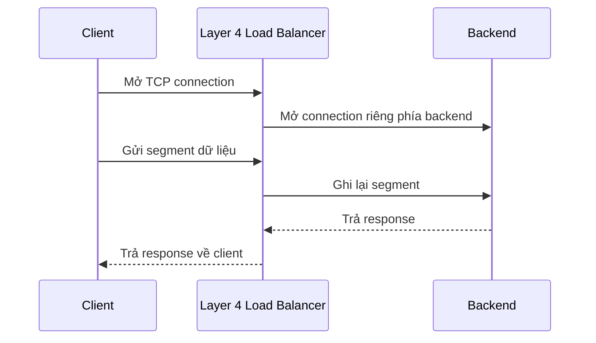

# ⚖️ Layer 4 vs Layer 7 Load Balancer: Hiểu sai một tầng là trả giá cả hệ thống

> Nguồn: `050-Layer-4-vs-Layer-7-Load-Balancers.txt` · [Udemy](https://ua.udemy.com/course/fundamentals-of-backend-communications-and-protocols/learn/lecture/34648576)

Ở bài trước chúng ta đã nói về **proxy** và **reverse proxy** — chuyện gì xảy ra khi bạn dùng proxy, kết nối nào được tạo ra, ai đang nói chuyện với ai. Nắm được điều đó là cực kỳ quan trọng với backend engineer, đặc biệt nếu các bạn dùng nó mỗi ngày. Nhưng còn một khái niệm quan trọng không kém: **layer 4 và layer 7 proxy / reverse proxy / load balancer**.

Các bạn có thể thay chữ "load balancer" bằng "reverse proxy" trong gần như toàn bộ bài này và mọi thứ vẫn đúng. Nhưng khác biệt giữa hai tầng thì không thể xem nhẹ. Cùng đi vào chi tiết.

---

### 🧭 Ôn nhanh: load balancer chính là một reverse proxy

Mô hình OSI có đủ các tầng: physical, data link, networking, transport, session, presentation, application. Là backend engineer, thứ chúng ta quan tâm nhất là **layer 7 (application)** và **layer 4 (transport)**:

* Phần lớn chúng ta "chơi" ở layer 7 và layer 4.
* Một số người quản lý **file descriptor**, làm việc với session, xem một connection đã nhận bao nhiêu segment, bao nhiêu byte... Những thông tin này được lưu **stateful ở layer 5 (session layer)**.

Vậy **load balancer (bộ cân bằng tải)** là gì trong bức tranh này? Nó là một **hệ thống chịu lỗi (fault tolerant)**: bạn, với vai trò client, gửi request tới load balancer và không cần quan tâm phía sau có một hay một trăm backend — đó chính là vẻ đẹp của reverse proxy.

Và đây là định nghĩa mình muốn các bạn khắc cốt ghi tâm:

* **Mọi load balancer đều là reverse proxy.**
* **Nhưng không phải reverse proxy nào cũng là load balancer** — reverse proxy chỉ cần gửi request tới backend giúp bạn, chưa chắc có logic cân bằng tải.
* Còn **proxy** thuần túy thì không liên quan tới câu chuyện này.

---

### ⚙️ Layer 4 load balancer vận hành như thế nào?

Khi bạn cấu hình một layer 4 load balancer với danh sách địa chỉ IP backend, ngay lúc khởi động nó đã **làm nóng (warm up)**:

* Nó mở sẵn nhiều **kết nối TCP** tới backend — có thể là 10 kết nối cho mỗi backend, không nhất thiết chỉ 1.
* Giữ chúng "nóng" để các request sau không phải trả giá cho quá trình **handshake SYN/ACK** (bắt tay) mỗi lần. Kết nối đã sẵn sàng, chỉ việc gửi segment đi.

Khi client kết nối tới load balancer, connection đó được lưu **stateful** và **gắn (tag) vào một và chỉ một** connection phía backend. Đó là một dạng "khế ước", bởi layer 4 chỉ làm việc với **port, địa chỉ IP và segment** — nó không được phép parse dữ liệu.

Hệ quả: mọi segment của client **bắt buộc** đi trên cùng một connection. Nếu rải segment sang connection khác, sequence sẽ lệch nhau và dữ liệu hỏng — TCP là giao thức stateful, không thể đùa.

Ví dụ cụ thể các bạn hay thấy:

1. Client gửi gói tin tới địa chỉ của load balancer (giả sử `4.4.1.2`). Với client, đây chính là đích cuối — một reverse proxy.
2. Dữ liệu được lấy ra và **ghi lại thành một kết nối TCP hoàn toàn mới** tới backend (ví dụ `4.4.1.3`). Lúc này source chính là load balancer. Client **không hề hay biết**.
3. Backend xử lý (app đọc từ socket, gRPC, database... tùy hệ thống), rồi trả lời. Đích lúc này quay về load balancer; nó dựa vào bảng mapping để trả tiếp về đúng connection của client.

Một chế độ khác là **NAT mode**: mọi thứ gộp thành **một kết nối TCP duy nhất**. Khi đó load balancer đóng vai gateway của client, hành xử gần như một router — chỉ đổi địa chỉ IP đích (và có thể cả port) sang backend.

Một điều thú vị: layer 4 load balancer **không đọc** dữ liệu, nó chỉ **read rồi write**. Một số bản "thông minh" có buffer để tận dụng MTU lớn hơn (ví dụ bên này 1500, bên kia 9000), đọc một loạt rồi ghi lại thành các segment phù hợp — nhưng đó là câu chuyện **hiệu năng**, và chúng ta luôn cố vắt kiệt hiệu năng.

Mỗi khi client mở một connection mới, logic cân bằng tải mới được kích hoạt: round robin, least connections (ai ít bị "ngập" nhất thì chọn), vân vân. Còn bản thân nó **không cần biết** bên trong là gRPC, protocol buffers, MySQL hay Postgres — với nó, tất cả chỉ là những segment TCP.

---

### 📊 Ưu và nhược điểm của Layer 4 load balancer

**Ưu điểm:**

* Cân bằng tải đơn giản vì **không can thiệp vào dữ liệu**: không đọc protocol, không cần hiểu nội dung layer 7.
* Rất hiệu quả, không có bước "lookup" dữ liệu; hầu như chỉ chuyển segment sang backend.
* **Bảo mật hơn trong một số tình huống**: không cần giải mã nội dung. Nếu load balancer là của bên thứ ba, đây là điểm cộng lớn.
* **Agnostic với mọi giao thức**: HTTP, gRPC, WebSocket, database gì cũng chạy, vì "dữ liệu nào cũng chỉ là segment".
* NAT mode: một TCP connection xuyên suốt, chỉ đổi IP đích (và có thể cả port) — thuần NAT.

**Nhược điểm:**

* **Không có smart load balancing**: vì không nhìn vào dữ liệu nên không thể ra quyết định thông minh. Ví dụ bạn biết đường dẫn `/analyze` cực kỳ nặng, muốn đẩy sang server khỏe hơn — layer 4 không làm được.
* Chỉ có thể "chơi trò" với nhiều IP hoặc nhiều port (vì port là thứ layer 4 nhìn thấy), nhưng **không phù hợp cho microservices**.
* **Sticky theo connection**: mọi segment của một connection luôn đi tới đúng một server; không có cân bằng tải ở cấp request.
* **Không cache được**: nó không biết segment nghĩa là gì. Cùng một giá trị hash có thể mang ý nghĩa hoàn toàn khác ở giao thức khác — nên không thể suy diễn.
* Điểm đáng lưu ý: khi connection được nâng cấp lên **WebSocket bằng upgrade handshake (bắt tay nâng cấp giao thức)**, load balancer layer 7 thường phải "hạ cấp" xuống layer 4 để tunnel. Và khi đã ở layer 4, **mọi rule layer 7 biến mất**: không còn chặn user, không còn chặn header, không còn kiểm tra kiểu authentication — tất cả đều được cho qua. Đó chính là vấn đề.

---

### 🧠 Layer 7 load balancer — hiểu giao thức để "cân" cho thông minh

Layer 7 cũng **làm nóng** các kết nối TCP tới backend, mở sẵn bao nhiêu tùy cấu hình. Nhưng khác biệt cốt lõi nằm ở chữ **protocol specific**:

* Khi client kết nối vào, nó phải **nói cho load balancer biết nó là gì**. Bạn không thể gửi "rác" — load balancer phải hiểu mọi thứ bạn gửi.
* Mọi **logical request** sẽ được **buffer** lại, đọc cho hiểu, rồi mới quyết định chuyển tiếp tới backend.

Ví dụ với HTTP request: nó bắt đầu bằng method và đường dẫn, kèm version, rồi tới các header, và kết thúc bằng một loạt dòng trống (newline). **Đó là thời điểm load balancer ra quyết định**: "được rồi, request đã trọn vẹn, giờ chọn backend để ghi nó sang".

Một request có thể gồm 1 segment, 2 segment, hay 100 segment — load balancer phải **đọc, đọc, đọc và buffer**. Và nếu dữ liệu đã mã hóa, nó **phải giải mã**:

* Muốn giải mã, phải có kết nối bảo mật với server.
* Nghĩa là **certificate phải sống trong layer 7 load balancer**, và cả **private key** nữa. Rất nhiều người không thích điều này.
* Load balancer phải "đóng vai" chính website của bạn — vì với client, nó là đích cuối cùng. Không có cert thì làm sao "giả danh" được website?
* Đây là lý do khái niệm **TLS termination (kết thúc TLS tại proxy)** gắn chặt với layer 7: nó luôn terminate TLS rồi mở các TCP connection riêng tới backend. Người ta thường gọi nó là **TLS Terminator**.

Một ví dụ đáng nhớ: ba segment hợp thành một request `GET` — cả ba phải đi cùng một backend. Nhưng request kế tiếp trên cùng connection đó lại là **một request độc lập**; layer 7 đọc hiểu và ở cấp request nó **stateless**, nên có thể chọn server khác. Chính xác nơi đây cũng là "đất sống" của phần lớn lỗ hổng **HTTP smuggling**: khi load balancer và backend **không thống nhất** với nhau về chỗ request bắt đầu và kết thúc, chuyện xấu sẽ xảy ra.

---

### 💡 Ưu nhược Layer 7 và lời khuyên của mình

**Ưu điểm:**

* **Smart load balancing thật sự** — có logic cân bằng tải đúng nghĩa.
* Dùng connection backend hiệu quả, cân bằng tốt hơn hẳn layer 4.
* **Cache được** vì đã đọc và giải mã nội dung.
* Route theo đường dẫn: `/pictures` đi server này, `/comments` đi server kia, `/post-comment` (ghi nặng) đi server có database thiết kế riêng cho workload đó; phần phân tích đi tới **column store** như SAP HANA, Postgres hay MariaDB.
* Cực kỳ hợp cho **microservices và API gateway**: authentication, mọi logic gateway đều có thể diễn ra ngay tại đây, và kết quả có thể được cache.

**Nhược điểm:**

* **Đắt hơn**: nó buffer, đọc, giải mã — làm nhiều việc hơn thì tốn kém hơn.
* **Phải giữ certificate và private key** — nhiều người, nhiều tổ chức không thoải mái với điều này.
* Buffer khiến backend phải chờ; nếu buffer quá nhiều request cùng lúc, load balancer có thể trở thành **nút thắt cổ chai (bottleneck)**.
* **Phải hiểu giao thức**. Đó là lý do bạn thấy mọi người liên tục hỏi: "nginx ơi support WebSocket đi", "support gRPC đi", "support Postgres đi"... Bởi vì không hiểu giao thức thì **không thể** làm layer 7 load balancing.

| Tiêu chí | Layer 4 | Layer 7 |
|---|---|---|
| Dữ liệu nhìn thấy | IP, port, segment | Toàn bộ nội dung ứng dụng |
| Cân bằng tải | Theo connection | Theo từng request, theo path |
| TLS | Không cần giải mã | Phải terminate TLS, giữ cert + key |
| Cache | Không | Có, vì đã đọc nội dung |
| Hợp với | Mọi giao thức, workload đơn giản | Microservices, API gateway |

---

### 🎯 Tự kiểm tra nhanh

**Câu 1:** Layer 4 load balancer dựa vào thông tin gì để cân bằng tải?

<b>Xem đáp án</b>

**Đáp án:** Port, địa chỉ IP và segment — nó không được phép parse dữ liệu.

Giải thích: Mọi thứ bên trong gói tin đều là hộp đen với layer 4.

Tham chiếu: Mục Layer 4 load balancer vận hành như thế nào.

**Câu 2:** Vì sao mọi segment của một connection phải đi trên cùng một connection backend?

<b>Xem đáp án</b>

**Đáp án:** Vì TCP là giao thức stateful — rải segment sang connection khác sẽ làm sequence lệch và dữ liệu hỏng.

Giải thích: Layer 4 gắn connection vào đúng một connection backend như một "khế ước".

Tham chiếu: Mục Layer 4 load balancer vận hành như thế nào.

**Câu 3:** Vì sao layer 7 load balancer phải giữ certificate và private key?

<b>Xem đáp án</b>

**Đáp án:** Vì nó phải terminate TLS để đọc nội dung, và phải "đóng vai" chính website của bạn với client.

Giải thích: Không có cert thì không thể giả danh website để giải mã.

Tham chiếu: Mục Layer 7 load balancer.

**Câu 4:** Khi một connection HTTP được nâng cấp lên WebSocket qua layer 7, điều gì xảy ra với các rule layer 7?

<b>Xem đáp án</b>

**Đáp án:** Load balancer thường hạ cấp xuống layer 4 để tunnel, và mọi rule layer 7 biến mất — không chặn user, không kiểm tra header hay authentication.

Giải thích: Một khi đã tunnel ở layer 4, nó không còn nhìn thấy nội dung nữa.

Tham chiếu: Mục Ưu và nhược điểm của Layer 4 load balancer.

**Câu 5:** Vì sao layer 7 load balancer có thể route `/pictures` và `/comments` tới các server khác nhau?

<b>Xem đáp án</b>

**Đáp án:** Vì nó đọc và hiểu protocol — nhìn được method, đường dẫn, header sau khi buffer và giải mã request.

Giải thích: Layer 4 không bao giờ làm được vì không được phép nhìn vào dữ liệu.

Tham chiếu: Mục Ưu nhược Layer 7 và lời khuyên của mình.

Tóm lại, chúng ta đã đi qua: load balancer là gì, layer 4 hoạt động ra sao với ưu nhược điểm, và layer 7 thông minh hơn nhưng cũng đắt hơn như thế nào. *Không có đúng sai tuyệt đối — mỗi loại load balancer đều có chỗ đứng của nó, tùy bài toán.*

Bài tiếp theo sẽ rất thú vị: chúng ta sẽ áp dụng tất cả những gì vừa học vào **WebSocket proxying** — nơi layer 4 và layer 7 thể hiện khác biệt rõ rệt nhất. Hẹn gặp lại các bạn! 🚀

## Nguồn tham khảo

- [Udemy — Layer 4 vs Layer 7 Load Balancers](https://ua.udemy.com/course/fundamentals-of-backend-communications-and-protocols/learn/lecture/34648576)
- [NGINX Docs — HTTP Load Balancing](https://docs.nginx.com/nginx/admin-guide/load-balancer/http-load-balancer)
- [NGINX Docs — TCP and UDP Load Balancing](https://docs.nginx.com/nginx/admin-guide/load-balancer/tcp-udp-load-balancer)
