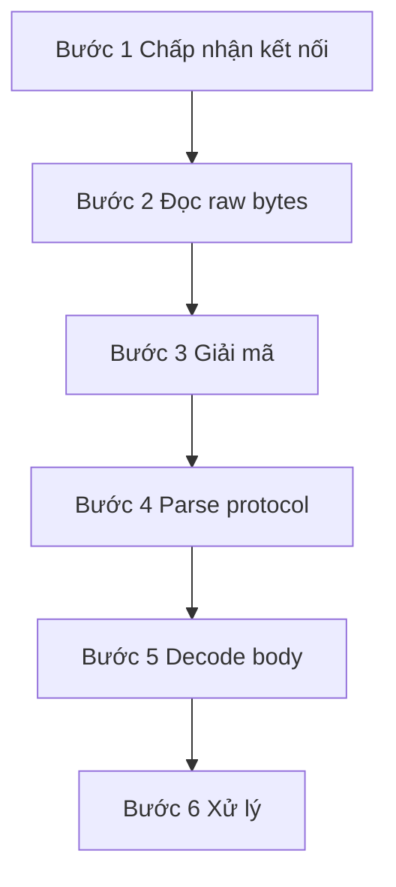

# 🚀 Hành trình của một request từ Front-end tới Back-end: 6 bước mà không ai nghĩ là phải trả giá

> Nguồn: `053-The-Journey-of-a-Request-to-the-Backend-Video.txt` · [Udemy](https://ua.udemy.com/course/fundamentals-of-backend-communications-and-protocols/learn/lecture/42286998)

Hôm nay mình muốn đưa các bạn đi trọn một hành trình: từ khoảnh khắc một **request (yêu cầu)** được sinh ra ở front-end cho tới lúc nó "đáp" xuống một process hay thread ở backend. Có rất nhiều bước ở giữa mà chúng ta thường gộp chung vào một chữ — "handle" — và chính vì gộp chung như vậy nên chúng ta không bao giờ trả lời nổi câu hỏi muôn thuở: *backend của bạn chịu được bao nhiêu request mỗi giây?*

Hiểu được từng bước này, các bạn sẽ nhìn ra ngay những chi phí ẩn đang ngốn latency và performance của hệ thống, và biết chính xác cần tối ưu ở đâu.

---

### 🎯 "Handle" nghĩa là gì? — câu hỏi tưởng dễ mà cực khó trả lời

Trong bài viết "The Journey of a Request to the Backend" mà mình từng đăng trên Medium (kèm một graphic mình tự vẽ), mình chia hành trình này thành **6 bước**. Đây là cách trừu tượng hóa của riêng mình — các bạn hoàn toàn có thể tách một bước thành nhiều sub-step, hoặc gộp chúng lại, tùy cách nhìn.

Vấn đề nằm ở chữ **handle**: khi ai đó hỏi "backend mày handle được bao nhiêu request mỗi giây?", họ thường muốn nói tới bước xử lý cuối cùng. Nhưng sự thật là còn bao nhiêu công đoạn phía trước mà chúng ta không hề tính đến, và cái gì cũng có giá của nó. *Không có gì miễn phí cả — và nhiệm vụ của mình là chỉ thẳng vào những khoản phí ẩn đó.*

---

### 🔌 Bước 1 — Chấp nhận kết nối (connection acceptance)

Bạn không thể ném request "willy nilly" thẳng vào backend. Muốn gửi request, bạn cần một đường ống, và đường ống đó gọi là **connection (kết nối)**. Phương tiện chuyên chở bên trong đường ống là **transport protocol (giao thức truyền tải)** — thường được nhắc tới trong mô hình OSI như **tầng 4 (layer 4)**.

* *Từ "need" ở đây nên được hiểu theo nghĩa tương đối*: về lý thuyết bạn có thể xây mọi thứ trực tiếp trên raw sockets, nhưng đó không phải cách thế giới này đang vận hành.
* Kể cả khi bạn chọn UDP, bạn vẫn cần một đường pipe để gửi dữ liệu qua — không có pipe thì không có gì hết.
* Để có connection, nó phải được **chấp nhận**. Đây không phải việc tầm thường: **connection acceptance chính là cơm áo gạo tiền** của các proxy và web server.
* Bạn có thể có 1 process đứng ra accept, hoặc 10,000 process cùng accept — mình hơi phóng đại một chút, nhưng các bạn hiểu ý mình rồi đấy.

---

### 📥 Bước 2 & 3 — Đọc raw bytes và giải mã

Đây là chỗ nhiều người bị bất ngờ nhất. Khi connection đã được accept, thứ chảy tới bạn là một đống **raw bytes (byte thô)**.

* Trong networking, chúng ta **chỉ gửi bytes**. Ở tầng thấp, **không hề có HTTP, không hề có JWT** — chúng không tồn tại ở đó, tất cả chỉ là một chuỗi byte.
* Vì vậy khi đọc, bạn chưa hề đọc "request": bạn chỉ đang **đọc dữ liệu**, và hoàn toàn chưa biết request là gì.
* Đọc xong, bạn gần như chắc chắn phải **giải mã (decrypt)** — vì nếu dùng HTTPS thì bạn đang dùng TLS, và mọi thứ đều bị mã hóa. *Đây là khoản phí thứ hai, ngay sau khoản phí đọc dữ liệu.*

---

### 🧠 Bước 4 — Parse protocol và dựng request object

Chỉ sau khi giải mã, backend và front-end mới có thể "đồng thuận" về một thứ mà cả hai gọi là request.

* Bạn bắt đầu **parse (phân tích)** chuỗi byte: thấy `GET`, thấy `/about`, thấy phiên bản protocol... và dần dần hiểu ra đây là một **logical request (request logic)**.
* Parse phức tạp hay đơn giản phụ thuộc vào protocol: **HTTP/1.1 là text thuần**, còn **HTTP/2 và HTTP/3 là binary**, có stream, có đủ thứ chuyện ở tầng giao thức — parse vất vả hơn hẳn.
* Khi "hiểu" được request, thư viện ngôn ngữ của bạn mới **tạo ra một request object** — trong Node.js, C++, hay C# đều vậy: cấp phát object trên heap, nhét vào đó address family, thông tin client, địa chỉ IP... Tất cả đều có chi phí.
* *Và đây là phần đáng sợ nhất: bước này bị trừu tượng hóa hoàn toàn, bạn không nhìn thấy nó, không ai nói với bạn về nó.* Mọi thứ diễn ra như một vụ nổ âm thầm phía sau sân khấu.

---

### 🧩 Bước 5 & 6 — Decode body và xử lý

Request đã thành hình, nhưng chưa xong. Một request có thể có **headers**, và nếu là **POST** thì có **body** — body có thể là JSON, nhưng request object **không tự parse JSON cho bạn** ở bước này.

* Đó là lý do bạn phải cài **body parser** (ví dụ `express.json()` trong Express): một hàm chạy để biến đống byte gắn liền với body thành JSON object dùng được. **Serialization/deserialization không hề rẻ** — JavaScript còn đỡ, chứ mình từng thấy những thư viện C++ "khổ sở" ra sao với JSON.
* Đừng quên **UTF-8 so với ASCII**: cùng là text, nhưng bạn cần biết text đang được mã hóa kiểu nào vì **biểu diễn byte khác nhau hoàn toàn**. Chuyện này cũng nằm trong phần parse.
* Bước cuối cùng — **process** — phần lớn là code của bạn: nhận request, kết nối tới **Postgres**, gửi SQL, chờ bất đồng bộ (async). *Và đây là điểm mình cực kỳ tâm đắc:* trong lúc chờ, **một thread duy nhất vẫn có thể quay vòng** accept connection mới, đọc, giải mã, parse — thành ra backend single-thread làm việc bất đồng bộ có thể "cày" một khối lượng khổng lồ.
* Còn nếu bước xử lý này **ngốn CPU**, bạn có thể tách nó ra thread hoặc process riêng để thread chính rảnh tay đón các request khác.

---

### 🎯 Tự kiểm tra nhanh

**Câu 1:** 6 bước trong hành trình của một request là gì?

<b>Xem đáp án</b>

**Đáp án:** Accept, read, decrypt, parse, decode, process.

Giải thích: Đây là cách trừu tượng hóa của mình — có thể tách hoặc gộp tùy cách nhìn.

Tham chiếu: Mục Handle nghĩa là gì.

**Câu 2:** Vì sao connection acceptance là "cơm áo gạo tiền" của proxy và web server?

<b>Xem đáp án</b>

**Đáp án:** Vì muốn gửi request phải có đường ống, và đường ống phải được chấp nhận — có thể cần tới hàng nghìn process cùng accept.

Giải thích: Không có connection thì không có gì để xử lý.

Tham chiếu: Mục Bước 1.

**Câu 3:** Vì sao đọc raw bytes chưa phải là đọc request?

<b>Xem đáp án</b>

**Đáp án:** Ở tầng thấp chỉ có byte — không HTTP, không JWT; phải parse và (thường là) giải mã mới hiểu được request.

Giải thích: Giải mã là khoản phí thứ hai ngay sau khoản phí đọc dữ liệu.

Tham chiếu: Mục Bước 2 và 3.

**Câu 4:** Parse protocol khác nhau thế nào giữa các phiên bản HTTP?

<b>Xem đáp án</b>

**Đáp án:** HTTP/1.1 là text thuần, còn HTTP/2 và HTTP/3 là binary, có stream — parse vất vả hơn hẳn.

Giải thích: Khi "hiểu" request, thư viện mới tạo request object trên heap — cũng có chi phí.

Tham chiếu: Mục Bước 4.

**Câu 5:** Trong lúc chờ database trả lời, vì sao backend single-thread vẫn "cày" được khối lượng lớn?

<b>Xem đáp án</b>

**Đáp án:** Vì trong lúc chờ bất đồng bộ, thread duy nhất vẫn quay vòng accept, đọc, giải mã, parse request mới.

Giải thích: Nếu bước xử lý ngốn CPU thì mới cần tách ra thread hoặc process riêng.

Tham chiếu: Mục Bước 5 và 6.

Nhìn lại 6 bước — accept, read, decrypt, parse, decode, process — các bạn sẽ thấy mỗi bước đều có cái giá của nó, và cả 6 bước đều có thể trở thành nút thắt cổ chai. Trả lời được câu hỏi "handle là handle cái gì" chính là bước đầu tiên để nhìn thấu latency của hệ thống. *Mỗi bước xứng đáng có một video riêng, và mình hứa sẽ đào sâu từng bước ở những video sau.* Hẹn gặp lại các bạn! 🚀

## Nguồn tham khảo

- [Udemy — The Journey of a Request to the Backend](https://ua.udemy.com/course/fundamentals-of-backend-communications-and-protocols/learn/lecture/42286998)
- [Medium — The Journey of a Request to the Backend (Hussein Nasser)](https://medium.com/@hnasr/the-journey-of-a-request-to-the-backend-c3de704de223)
- [HAProxy — Anatomy of a Request: Beyond backend processing](https://www.haproxy.com/user-spotlight-series/anatomy-of-a-request-beyond-backend-processing)
