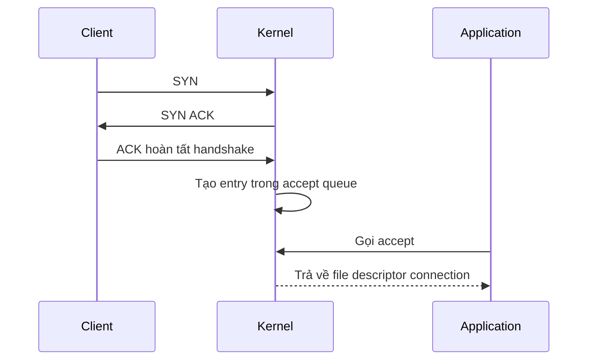

# 🧠 Kernel quản lý connection backend như thế nào? Mổ xẻ SYN queue và accept queue

> Nguồn: `056-How-does-the-Kernel-manage-backend-connections.txt` · [Udemy](https://ua.udemy.com/course/fundamentals-of-backend-communications-and-protocols/learn/lecture/39231782)

Các bạn có bao giờ tự hỏi khi một process tạo listening socket, kernel giữ **một hàng đợi chung** hay **mỗi process một hàng đợi riêng** cho việc nhận connection chưa? Đây là câu hỏi rất hay của một bạn học viên gửi cho mình, và nó chạm đúng vào phần "under the wire" mà mình luôn muốn các bạn hiểu tường tận, không chấp nhận hộp đen.

Hôm nay mình sẽ kể lại hành trình của một connection từ lúc SYN bay tới cho đến lúc ứng dụng gọi `accept`, và trả lời luôn câu hỏi phụ: các hàng đợi này có hoạt động theo kiểu FIFO đơn giản không?

### 🔌 Listening socket và hai hàng đợi được tạo ra

Khi chúng ta tạo một **listening socket** trong process, việc đầu tiên là khai báo địa chỉ: **IP address** và **port**. Kết quả trả về chính là listening socket — và vì trong Linux *mọi thứ đều là file*, nên thực chất nó là một **file descriptor**.

Ngay khi đó, **kernel sẽ tạo hai hàng đợi** gắn liền với listening socket:

* **SYN queue** — nơi chứa các yêu cầu kết nối vừa mới đến.
* **Accept queue** — nơi chứa các connection đã hoàn tất bắt tay (handshake), sẵn sàng để ứng dụng lấy đi.

| Tiêu chí | SYN queue | Accept queue |
|---|---|---|
| Chứa gì | Yêu cầu kết nối vừa mới đến | Connection đã hoàn tất handshake |
| Entry được thêm khi | SYN tới listener | ACK cuối cùng được nhận |
| Entry bị pop khi | Handshake hoàn tất | Ứng dụng gọi `accept` |
| Trạng thái | Chưa thực sự có connection | Sẵn sàng để ứng dụng lấy đi |

Điểm mấu chốt: giống như mọi file khác, socket này **không bị trói buộc vào một process cụ thể**. Cùng một socket có thể chia sẻ cho 10 process — cả 10 process đều đọc và `accept` connection từ nó được.

---

### ⚙️ Hành trình của một connection: từ SYN đến accept queue

Diễn biến khi một connection gõ cửa listener:

1. Một **SYN request** bay tới với địa chỉ IP đích và port đích khớp 100% với listener. Entry SYN này được thêm vào **SYN queue** — hàng đợi dành riêng cho listener đó.
2. Kernel **lập tức trả lời SYN/ACK** kiểu "OK, mình ổn", và client nhận được SYN/ACK.
3. Client gửi tiếp **ACK** để hoàn tất TCP handshake. Khi kernel nhận ACK khớp với SYN đang nằm trong SYN queue, lúc này mới có một **connection hoàn chỉnh**.
4. Chỉ đến bước này, một entry mới được tạo trong **accept queue**. Trước đó thì *chưa thực sự có connection* — mới chỉ là một connection "sẵn sàng để được accept".
5. Ứng dụng backend gọi system call `accept` trên listener, **pop entry ra khỏi accept queue** và nhận về một file — chính là connection.

Để ý một chi tiết: khi connection đã hình thành, entry SYN trong SYN queue cũng đã được pop ra, nên **SYN queue lúc này trống**.

---

### 🧩 Nhiều process cùng accept: lợi thì có mà đau đầu cũng có

Vì bất kỳ process nào có **pointer trỏ tới socket listener** đều gọi được `accept`, chúng ta có thể cho nhiều process cùng giành nhau accept connection. Lý do rất thực tế: **một process đơn lẻ có thể không đủ nhanh để accept một lượng lớn connection**.

Cách làm là spin up nhiều process chia sẻ chung một socket và để chúng cạnh tranh nhau. Nhưng mô hình này có cái giá của nó:

* **Contention (tranh chấp)** xảy ra vì đây là một hàng đợi.
* Muốn pop hay push vào queue, bạn phải **lock nó lại** — tức phải dựng một **mutex**.
* Trong môi trường đa luồng hoặc đa vi xử lý, việc lock này dẫn tới tranh chấp giữa các process đang giành nhau accept.

*Nên nhớ: "thêm process để accept cho nhanh" không hề miễn phí — đó là lý do mình luôn muốn các bạn hiểu cơ chế trước khi tối ưu.*

---

### 💡 Vậy các hàng đợi có phải FIFO đơn giản?

Câu trả lời của mình: **về cơ bản là đúng, nó theo nguyên tắc FIFO (vào trước, ra trước)**. Mình không tự nhận là chuyên gia về cách Linux kernel implement chi tiết bên trong, nhưng theo mình hiểu thì nó là thứ đơn giản như vậy.

Có một ngoại lệ đáng chú ý — không phải ở accept queue mà ở **receive queue**: khi kernel thấy rất nhiều packet được nhận về, nó sẽ **gộp các packet vào một chỗ**, kết hợp chúng lại và **loại bỏ header** để gộp thành ngày càng ít packet hơn. Đây là một cơ chế tối ưu ở tầng kernel, khác với hàng đợi accept thuần túy.

### 🎯 Tự kiểm tra nhanh

**Câu 1:** Khi tạo một listening socket, kernel tạo ra những hàng đợi nào?

<b>Xem đáp án</b>

**Đáp án:** Hai hàng đợi — SYN queue và accept queue — gắn liền với listening socket đó.

Giải thích: Listening socket thực chất là một file descriptor, và kernel gắn hai queue vào nó.

Tham chiếu: Mục Listening socket và hai hàng đợi được tạo ra.

**Câu 2:** Một entry được thêm vào accept queue ở thời điểm nào?

<b>Xem đáp án</b>

**Đáp án:** Khi kernel nhận ACK cuối cùng khớp với SYN đang nằm trong SYN queue — lúc đó mới có connection hoàn chỉnh.

Giải thích: Trước bước này chỉ là kết nối "sẵn sàng để được accept", chưa thực sự có connection.

Tham chiếu: Mục Hành trình của một connection.

**Câu 3:** Vì sao nhiều process có thể cùng accept trên một listening socket?

<b>Xem đáp án</b>

**Đáp án:** Vì socket không bị trói buộc vào một process cụ thể — bất kỳ process nào có pointer tới socket listener đều gọi `accept` được.

Giải thích: Cách này tăng tốc độ accept nhưng sinh contention vì phải lock queue.

Tham chiếu: Mục Nhiều process cùng accept.

**Câu 4:** Các hàng đợi này có phải FIFO đơn giản không?

<b>Xem đáp án</b>

**Đáp án:** Về cơ bản là đúng — nó theo nguyên tắc vào trước ra trước.

Giải thích: Đây là hiểu biết của mình về cách Linux kernel implement, không tự nhận là chuyên gia chi tiết bên trong.

Tham chiếu: Mục Vậy các hàng đợi có phải FIFO đơn giản.

**Câu 5:** Ngoại lệ không thuộc accept queue là gì?

<b>Xem đáp án</b>

**Đáp án:** Receive queue — khi nhận nhiều packet, kernel gộp chúng lại và loại bỏ header thành ngày càng ít packet hơn.

Giải thích: Đây là cơ chế tối ưu ở tầng kernel, khác với hàng đợi accept thuần túy.

Tham chiếu: Mục Vậy các hàng đợi có phải FIFO đơn giản.

Hy vọng câu trả lời này giúp các bạn hình dung rõ hơn cách kernel vận hành connection phía sau lưng ứng dụng. Mình thấy đây là câu hỏi hay đến mức sẽ còn nhiều bài Q&A kiểu này nữa — vì chỉ khi hiểu tới tận đáy, các bạn mới debug và tuning backend một cách tự tin. Hẹn gặp lại ở bài tiếp theo! 🚀

## Nguồn tham khảo

- [Udemy — How does the Kernel manage backend connections?](https://ua.udemy.com/course/fundamentals-of-backend-communications-and-protocols/learn/lecture/39231782)
- [Linux man-pages — listen(2)](https://www.man7.org/linux/man-pages/man2/listen.2.html)
- [Linux man-pages — accept(2)](https://man7.org/linux/man-pages/man2/accept.2.html)
