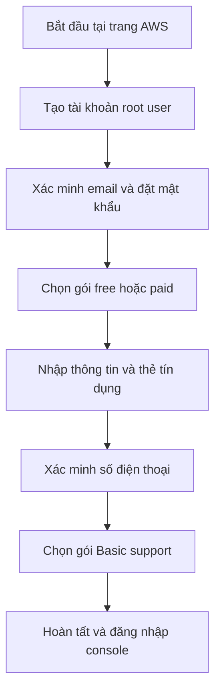

# 🧱 Tạo tài khoản AWS đầu tiên của bạn (Hướng dẫn từng bước)

> Nguồn: `002-Creating-an-AWS-Account.txt` · [Udemy](https://ua.udemy.com/course/aws-certified-cloud-practitioner-new/learn/lecture/20053442)

Được rồi, chúng ta cùng bắt đầu bằng việc quan trọng nhất: **tạo tài khoản AWS**. Các bạn hãy mở trang web của AWS và bấm **Create account**, rồi làm theo mình từng bước nhé.

*Đừng lo nếu bạn chưa từng dùng AWS bao giờ* — quy trình này khá đơn giản, mình sẽ đi cùng các bạn.

---

### 📝 Bước 1: Đăng ký email root user và mật khẩu

Sau khi bấm **Create account**, các bạn được đưa tới trang thiết lập tài khoản:

1. **Email address** — đây là email **root user (người dùng gốc)** của tài khoản, đồng thời là email đăng nhập của các bạn.
2. **Account name** — tên tài khoản AWS.
3. Xác minh email, sau đó đặt **mật khẩu**.

Mật khẩu có ràng buộc cụ thể: **dài 8 ký tự** và phải có **ít nhất 3 trong 4 nhóm** sau:

* Chữ in hoa (uppercase)
* Chữ in thường (lowercase)
* Chữ số (numbers)
* Ký tự đặc biệt (non-alphanumeric)

Và lời khuyên quan trọng nhất: **tuyệt đối đừng làm mất mật khẩu** — hãy lưu nó ở nơi an toàn.

---

### 💳 Bước 2: Chọn gói tài khoản — Free hay Paid?

Tiếp theo là phần **account plan**. Có 2 lựa chọn: **free** hoặc **paid**. Điểm chung là ở cả hai gói, các bạn đều sẽ tiêu tiền trên AWS, và đều bắt đầu với **khoảng 100 USD credit**, có thể nhận **tổng cộng lên tới 200 USD**.

| Tiêu chí | Gói Free | Gói Paid |
|---|---|---|
| Thẻ tín dụng | Không cần đặt | Bắt buộc đặt |
| Workload production | Không phù hợp | Sẵn sàng cho production |
| Hết credit | Tài khoản tự động đóng | Bị tính phí vào thẻ |

Vì mục tiêu của chúng ta là **học AWS an toàn**, mình chọn **gói free** — và như vậy là quá đủ cho khóa học này. Nếu sau này bạn cần làm gì đó phải trả phí, AWS sẽ nhắc bạn thêm thẻ tín dụng mới, và bạn hoàn toàn chủ động lựa chọn.

---

### 🔐 Bước 3: Thông tin liên hệ, thẻ tín dụng và xác minh

Điền **thông tin liên hệ** cho AWS (mình chọn loại tài khoản "personal project" và điền họ tên đầy đủ).

Ở đây các bạn phải nhập **số thẻ tín dụng**, kể cả khi dùng gói free. Lý do là AWS muốn **xác minh danh tính và chống gian lận**. Hai điều các bạn cần ghi nhớ:

* Với gói free, **bạn sẽ không bị tính phí** cho đến khi thực sự nâng cấp lên gói paid.
* Chỉ **1 USD** được dùng cho quá trình xác minh, và số tiền này **sẽ được hoàn lại ngay lập tức**.

Sau đó, xác nhận danh tính bằng **số điện thoại**. Các bạn có thể được hỏi về **support plan** — mình chọn **Basic support (miễn phí)** rồi hoàn tất đăng ký.

---

### 🖥️ Bước 4: Đăng nhập vào AWS Console

Tài khoản của bạn đang được kích hoạt, và các bạn sẽ nhận **email thông báo khi hoàn tất**. Sau đó, các bạn đăng nhập vào giao diện AWS (UI).

Nếu lỡ không thấy trang này, chỉ cần **sign out** rồi bấm **Sign in to console**. Tại đây, chọn **Sign in using root user email** — hiện AWS đã có giao diện đăng nhập cải tiến:

1. Chọn **root user**.
2. Nhập email đã dùng khi đăng ký.
3. Bạn có thể gặp một màn hình nhắc nhở nữa — *đừng lo, chúng ta sẽ xử lý chuyện đó trong khóa học, cứ bỏ qua lúc này.*

Và thế là các bạn đã trở lại **AWS console**, sẵn sàng bắt đầu. Chúc mừng các bạn đã tạo thành công tài khoản AWS! 🎉

---

Vậy là bước chuẩn bị quan trọng nhất đã xong. Từ bài tiếp theo, chúng ta sẽ bắt đầu tìm hiểu những khái niệm đầu tiên về cloud.

Hẹn gặp các bạn ở bài sau! 🚀
