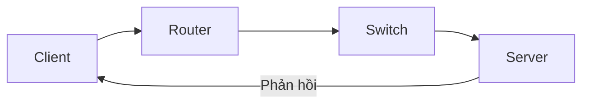

# 🏠 Traditional IT: Khi server còn nằm trong garage nhà bạn

> Nguồn: `005-Traditional-IT-Overview.txt` · [Udemy](https://ua.udemy.com/course/aws-certified-cloud-practitioner-new/learn/lecture/20054238)

Chào mừng các bạn đến với **section đầu tiên** của khóa học — nơi mình giới thiệu về **Cloud** và **Cloud Computing**. Section này không hands-on, chủ yếu là lý thuyết nhẹ nhàng, nhưng sẽ đặt nền bối cảnh để các bạn hiểu vì sao cloud hữu ích và nó vận hành ra sao.

*Đừng lo nếu bạn chưa có nền tảng IT* — chúng ta sẽ bắt đầu từ những điều cơ bản nhất.

---

### 🌐 Website vận hành như thế nào?

Hãy quay về câu hỏi đơn giản nhất: **website hoạt động ra sao?**

* Có một **server (máy chủ)** được đặt ở đâu đó.
* Các bạn — với vai trò **web browser (trình duyệt)** — muốn truy cập server để xem website.
* Client dùng **network (mạng)** để tìm và định tuyến các **packet (gói dữ liệu)** đến server; server phản hồi lại, bạn nhận response và xem được website.

Để client tìm được server và ngược lại, cả hai cần có **IP address (địa chỉ IP)**. Khi có IP, bạn có thể gửi request đến server mong muốn, và server biết đường tìm lại bạn.

Mình ví chuyện này giống như **gửi thư cho một người bạn**:

* Lá thư chính là **data**, người gửi là **client**.
* Bỏ thư vào hòm thư — bưu điện chính là **network**.
* Địa chỉ trên phong bì giúp định tuyến thư đến **server**.
* Muốn hồi âm, người nhận dùng địa chỉ ở mặt sau phong bì để gửi thư về cho bạn.

*Server cũng giống như hệ thống bưu chính của bạn vậy.*

---

### 🧠 Bên trong một server có gì?

Một server được cấu thành từ những thành phần sau:

* **CPU** — bộ phận thực hiện các phép tính, giúp tính toán và tìm ra kết quả.
* **RAM (memory)** — bộ nhớ cực nhanh, cho phép lưu và truy xuất thông tin tức thì. *Ghép CPU với RAM lại, các bạn có một bộ não: vừa tính toán, vừa ghi nhớ.*
* **Storage (lưu trữ dài hạn)** — nơi lưu file; muốn lưu dữ liệu có cấu trúc để tìm kiếm, truy vấn dễ dàng thì dùng **database (cơ sở dữ liệu)**.
* **Networking** — gồm **routers, switch, DNS servers** (những thuật ngữ này sẽ gặp lại trong khóa học).

Tóm lại, server có **compute, memory, storage** và **networking**. Tất cả sẽ cực kỳ quan trọng về sau, vì **cloud sẽ cung cấp những thứ này cho chúng ta theo nhu cầu (on demand)**.

---

### 🧭 Vài thuật ngữ IT cần biết trước

* **Network** — tập hợp cáp, router và server được kết nối với nhau.
* **Router** — thiết bị chuyển tiếp gói dữ liệu giữa các máy tính trong mạng; biết đường gửi packet trên Internet, giống như dịch vụ giao thư.
* **Switch** — khi packet đến đích, switch gửi packet đến đúng client trong mạng của bạn.

Luồng dữ liệu đi từ client đến server sẽ như sau:

---

### 🏠 Traditional IT — câu chuyện từ garage đến data center

Ngày trước, người ta làm website hoặc mở công ty ngay tại nhà hay garage:

1. Ra cửa hàng **mua một server** và đặt tại nhà. *Google nổi tiếng là khởi đầu trong garage đấy!*
2. Website lớn dần → mua thêm server → nhà cửa dần chật kín server.
3. Công ty phát triển, có tiền → chuyển đến văn phòng riêng và dành một phòng đặc biệt gọi là **data center (trung tâm dữ liệu)**.
4. Mở rộng bằng cách mua và lắp thêm server mới.

Cách làm này hiệu quả trong nhiều năm, nhưng có **5 vấn đề lớn**:

* **Chi phí vận hành**: tiền thuê mặt bằng, nguồn điện, hệ thống làm mát và bảo trì (server chạy tốn điện, tỏa nhiệt và đôi khi hỏng hóc).
* **Mở rộng tốn thời gian**: thêm hoặc thay server phải đặt hàng rồi lắp đặt — rất chậm.
* **Scaling bị giới hạn**: nếu ngày mai lượng truy cập tăng 10 lần, bạn cần gấp 10 lần server — không phải lúc nào cũng có đủ thời gian và không gian để làm.
* **Cần đội ngũ trực 24/7** để giám sát hạ tầng phòng khi có sự cố.
* **Thảm họa khó lường**: động đất, mất điện, thậm chí hỏa hoạn — mọi thứ có thể đổ sập.

Vậy có cách nào **thuê ngoài (externalize)** toàn bộ những thứ này không? Câu trả lời là **có — đó chính là cloud**.

---

### 🎯 Tự kiểm tra nhanh

**Câu 1:** Client và server cần gì để tìm thấy nhau?

<b>Xem đáp án</b>

**Đáp án:** IP address (địa chỉ IP).

Giải thích: Client gửi request đến IP của server, và server dùng IP của client để phản hồi lại.

Tham chiếu: Mục Website vận hành như thế nào.

**Câu 2:** CPU kết hợp với RAM được ví như bộ phận gì của con người?

<b>Xem đáp án</b>

**Đáp án:** Bộ não.

Giải thích: CPU thực hiện tính toán, RAM lưu và truy xuất thông tin rất nhanh — giống như suy nghĩ và ghi nhớ.

Tham chiếu: Mục Bên trong một server có gì.

**Câu 3:** Router khác switch ở điểm nào?

<b>Xem đáp án</b>

**Đáp án:** Router chuyển tiếp gói dữ liệu giữa các máy tính trong mạng và định tuyến trên Internet; switch gửi packet đến đúng client trong mạng của bạn.

Giải thích: Router giống dịch vụ giao thư, còn switch là người phân phát đến đúng địa chỉ nội bộ.

Tham chiếu: Mục Vài thuật ngữ IT cần biết trước.

**Câu 4:** Phòng đặc biệt trong công ty dùng để chứa server gọi là gì?

<b>Xem đáp án</b>

**Đáp án:** Data center (trung tâm dữ liệu).

Giải thích: Khi công ty lớn lên, người ta chuyển từ nhà/garage sang văn phòng và dành một phòng riêng làm data center.

Tham chiếu: Mục Traditional IT — câu chuyện từ garage đến data center.

**Câu 5:** Kể tên ít nhất ba vấn đề của traditional IT?

<b>Xem đáp án</b>

**Đáp án:** Chi phí thuê mặt bằng, điện, làm mát, bảo trì; mở rộng tốn thời gian; scaling bị giới hạn; cần đội ngũ trực 24/7; thảm họa như động đất, mất điện, hỏa hoạn.

Giải thích: Đây chính là động lực ra đời của cloud — externalize toàn bộ hạ tầng.

Tham chiếu: Mục Traditional IT — câu chuyện từ garage đến data center.

---

Vậy là các bạn đã nắm được bức tranh trước khi cloud xuất hiện: server, IP, network và những nỗi đau của data center tự vận hành. *Chưa cần nhớ hết thuật ngữ đâu — mình sẽ nhắc lại nhiều lần.*

Ở bài tiếp theo, chúng ta sẽ trả lời câu hỏi lớn: **Cloud Computing là gì?** Hẹn gặp các bạn ở đó! 🚀
