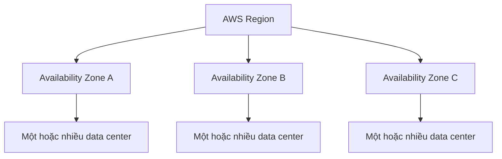

# 🌍 AWS Cloud Overview: Lịch sử, vị thế và hạ tầng toàn cầu

> Nguồn: `008-AWS-Cloud-Overview.txt` · [Udemy](https://ua.udemy.com/course/aws-certified-cloud-practitioner-new/learn/lecture/20054392)

Sau khi đã hiểu cloud computing là gì, chúng ta cùng nhìn vào **AWS**: lịch sử hình thành, vị thế hiện tại và đặc biệt là **hạ tầng toàn cầu** — Region, Availability Zone, Edge Location. Đây là nền tảng cho gần như mọi bài học sau trong khóa.

---

### 📜 Từ ý tưởng nội bộ Amazon đến đế chế cloud

* **2002** — AWS ra đời **nội bộ bên trong amazon.com**: Amazon nhận ra các phòng IT có thể được **externalize (thuê ngoài)**, và hạ tầng của họ là một thế mạnh cốt lõi. Họ tự hỏi: *"Biết đâu mình có thể làm IT cho người khác?"*
* **2004** — dịch vụ công khai đầu tiên được ra mắt: **SQS**.
* **2006** — mở rộng danh mục và tái ra mắt với **SQS, S3 và EC2**.
* Sau đó AWS vượt khỏi nước Mỹ và mở rộng sang **châu Âu**.
* Ngày nay, vô số ứng dụng chạy trên AWS: **Dropbox, Netflix, Airbnb, thậm chí cả NASA**.

**AWS hôm nay mạnh cỡ nào?**

* Là **leader** trên **Magic Quadrant của Gartner** suốt nhiều năm.
* Doanh thu **90 tỷ USD** tính đến năm **2023**.
* Chiếm khoảng **31% thị phần** trong **Q1 2024**; Microsoft xếp thứ hai với **25%**.
* Là **pioneer (người tiên phong)** và dẫn đầu thị trường **13 năm liên tiếp**.
* Có **hơn 1 triệu người dùng đang hoạt động (active users)**.

*Học AWS thực sự là khoản đầu tư cho thành công của các bạn trong thế giới cloud.*

---

### 🏗️ Bạn có thể xây dựng gì trên AWS?

Gần như **mọi thứ**: các ứng dụng **tinh vi và có khả năng mở rộng (sophisticated and scalable)**, áp dụng cho vô vàn ngành nghề — *mọi công ty đều có use case cho cloud*. **Netflix, McDonald's, 21st Century Fox, Activision** đều đang dùng cloud.

Các use case phổ biến:

* Chuyển đổi enterprise IT lên cloud
* **Backup và storage**
* **Big data analytics**
* Host website
* Backend cho ứng dụng mobile và social
* Chạy toàn bộ **gaming servers** trên cloud

---

### 🌍 Region — và 4 tiêu chí chọn Region khi thi

**Region (vùng)** là khái niệm quan trọng đầu tiên:

* Các region nằm rải khắp thế giới, có tên và mã, ví dụ **US-east-1**, **EU-West-3**; bạn xem được ánh xạ tên → mã ngay trên console.
* Mỗi region là một **cluster của nhiều data center** (Ohio, Singapore, Sydney, Tokyo...).
* **Hầu hết dịch vụ AWS được scope theo region (region-scoped)** — dùng dịch vụ ở region này rồi sang region khác thì giống như **dùng lần đầu từ đầu**.

Câu hỏi rất dễ gặp trong đề: **làm sao chọn region?** Câu trả lời là "còn tùy", nhưng có 4 yếu tố:

1. **Compliance (tuân thủ)** — chính phủ có thể yêu cầu dữ liệu phải nằm trong nước. Ví dụ: dữ liệu ở Pháp phải ở lại Pháp → chọn region Pháp.
2. **Latency (độ trễ)** — đặt ứng dụng gần người dùng nhất. Phần lớn người dùng ở Mỹ → deploy ở Mỹ; deploy ở Úc cho người dùng Mỹ thì sẽ lag rất nhiều.
3. **Service availability** — **không phải region nào cũng có đủ dịch vụ**; phải chắc region bạn chọn có dịch vụ mình cần.
4. **Pricing** — giá **khác nhau giữa các region**; hãy tra trang pricing của dịch vụ để so sánh.

---

### 🧩 Availability Zones — sinh ra để chống thảm họa

Mỗi region chứa nhiều **Availability Zone (AZ — vùng sẵn sàng)**:

* Thông thường **3 AZ**, tối thiểu **3**, tối đa **6**.
* Ví dụ Sydney — mã region **ap-southeast-2**, có các AZ **ap-southeast-2A, ap-southeast-2B, ap-southeast-2C**.
* Mỗi AZ là **một hoặc nhiều data center** riêng biệt, có **redundant power, networking và connectivity (điện, mạng, kết nối dự phòng)**. Số data center trong một AZ có thể là 1, 2, 3 hoặc 4 — AWS không công bố.
* Các AZ **tách biệt nhau để cô lập thảm họa**: nếu 2A gặp sự cố, thiết kế đảm bảo **không lan sang (cascade)** 2B hay 2C.
* Các AZ liên kết với nhau bằng mạng **high bandwidth, ultra-low latency (băng thông cao, độ trễ cực thấp)** và cùng tạo nên một region.

---

### 📍 Edge locations — đưa nội dung đến gần người dùng

* **Points of presence (PoP) / edge locations** là mảnh ghép cuối của hạ tầng toàn cầu.
* AWS có **hơn 400 điểm hiện diện tại 90 thành phố, thuộc 40 quốc gia** — giúp phân phối nội dung đến người dùng cuối với **độ trễ thấp nhất có thể**.
* Chi tiết sẽ được học ở phần **global** vào khoảng giữa khóa học.

Cuối bài, một lưu ý quan trọng: AWS có **global services** như **IAM, Route 53, CloudFront và WAF**, nhưng **đa số dịch vụ là region-scoped** như **Amazon EC2, Elastic Beanstalk, Lambda và Rekognition**. Muốn biết dịch vụ có mặt ở region của mình không, hãy tra **region table** của AWS.

---

### 🎯 Tự kiểm tra nhanh

**Câu 1:** Dịch vụ công khai đầu tiên của AWS (năm 2004) là gì?

<b>Xem đáp án</b>

**Đáp án:** SQS.

Giải thích: Năm 2006, AWS mở rộng và tái ra mắt với SQS, S3 và EC2.

Tham chiếu: Mục Từ ý tưởng nội bộ Amazon đến đế chế cloud.

**Câu 2:** Thị phần của AWS trong Q1 2024 là bao nhiêu?

<b>Xem đáp án</b>

**Đáp án:** Khoảng 31%, Microsoft đứng thứ hai với 25%.

Giải thích: AWS cũng đạt doanh thu 90 tỷ USD tính đến năm 2023.

Tham chiếu: Mục AWS hôm nay mạnh cỡ nào.

**Câu 3:** Bốn yếu tố ảnh hưởng đến việc chọn AWS region là gì?

<b>Xem đáp án</b>

**Đáp án:** Compliance, latency, service availability và pricing.

Giải thích: Đây là câu hỏi rất dễ gặp trong đề thi.

Tham chiếu: Mục Region — và 4 tiêu chí chọn Region khi thi.

**Câu 4:** Một region thường có bao nhiêu Availability Zone?

<b>Xem đáp án</b>

**Đáp án:** Thông thường 3 AZ; tối thiểu 3, tối đa 6.

Giải thích: Ví dụ Sydney có ap-southeast-2A, 2B, 2C.

Tham chiếu: Mục Availability Zones — sinh ra để chống thảm họa.

**Câu 5:** Availability Zone được thiết kế để làm gì khi có thảm họa?

<b>Xem đáp án</b>

**Đáp án:** Cô lập thảm họa — sự cố ở AZ này không cascade sang AZ khác; các AZ liên kết bằng mạng high bandwidth, ultra-low latency.

Giải thích: Nhờ đó region vẫn hoạt động khi một AZ gặp vấn đề.

Tham chiếu: Mục Availability Zones — sinh ra để chống thảm họa.

---

Vậy là các bạn đã có bức tranh toàn cảnh về AWS: từ lịch sử, vị thế dẫn đầu, đến bộ ba **Region → Availability Zone → Data center** và các **edge location**. *Đây là những khái niệm sẽ theo các bạn suốt khóa học, nên hãy nắm thật chắc nhé.*

Tiếp theo, chúng ta sẽ cùng nhau **dạo một vòng quanh AWS Console**. Hẹn gặp các bạn ở đó! 🚀
