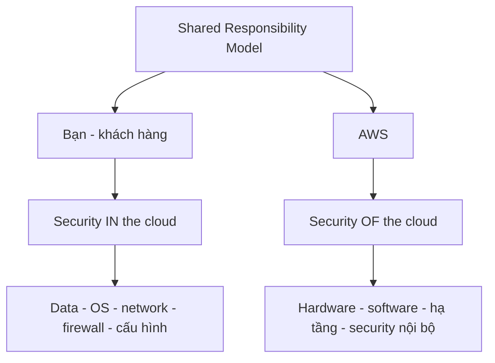

# 🛡️ Shared Responsibility Model: Bạn và AWS, ai chịu trách nhiệm gì?

> Nguồn: `011-Shared-Responsibility-Model-AWS-Acceptable-Policy.txt` · [Udemy](https://ua.udemy.com/course/aws-certified-cloud-practitioner-new/learn/lecture/20263094)

Trước khi chính thức bắt đầu, mình muốn giới thiệu **Shared Responsibility Model (Mô hình trách nhiệm chung)** — mô hình mà mình sẽ nhắc đi nhắc lại rất nhiều trong khóa học. Đây là kiến thức **chắc chắn có trong đề thi CLF-C02**, nên các bạn đừng bỏ qua nhé!

---

### 🛡️ Shared Responsibility Model là gì?

Mô hình này định nghĩa **đâu là trách nhiệm của bạn** và **đâu là trách nhiệm của AWS** khi dùng cloud — trách nhiệm được **chia sẻ (shared)** giữa hai bên. Các bạn sẽ gặp lại **diagram (sơ đồ)** này ở cuối khóa học.

---

### 👤 Trách nhiệm của BẠN — security IN the cloud

Là **khách hàng (customer)**, bạn chịu trách nhiệm về **security IN the cloud (bảo mật bên trong cloud)**:

* Mọi thứ bạn dùng trên cloud và **cách bạn cấu hình nó** đều là trách nhiệm của bạn.
* Cụ thể gồm: **security (bảo mật)**, **data (dữ liệu)**, **operating system (hệ điều hành)**, **network và firewall configuration (cấu hình mạng, tường lửa)**... và nhiều thứ khác nữa.

*Nghe có vẻ nhiều, nhưng từ từ rồi chúng ta sẽ đi qua từng phần — mình sẽ giải thích mọi thứ.*

---

### ☁️ Trách nhiệm của AWS — security OF the cloud

AWS chịu trách nhiệm về **security OF the cloud (bảo mật của chính cloud)**:

* Toàn bộ **infrastructure (hạ tầng)**.
* Toàn bộ **hardware (phần cứng)**.
* Toàn bộ **software (phần mềm)**.
* Cùng **internal security (bảo mật nội bộ)** của chính AWS.

Chính vì hai bên cùng gánh vác nên mới gọi là **shared responsibility** — trách nhiệm chung.

Trong đề **Certified Cloud Practitioner**, các bạn sẽ gặp những câu hỏi yêu cầu xác định **việc nào là trách nhiệm của bạn, việc nào là của AWS**. *Vì vậy mình sẽ nhắc lại mô hình này ở nhiều section để các bạn quen dần.*

---

### 📜 Acceptable Use Policy — những điều tuyệt đối không được làm

Khi dùng AWS, bạn **đồng ý với Acceptable Use Policy (chính sách sử dụng hợp lệ)** của AWS. Cụ thể, bạn **không được**:

* Sử dụng cho mục đích **bất hợp pháp, gây hại hoặc xúc phạm**, hoặc tạo nội dung như vậy.
* Thực hiện **security violation (vi phạm bảo mật)**.
* **Abuse network (lạm dụng mạng)**.
* **Lạm dụng email** hoặc các loại tin nhắn khác.

*Nghe thì hiển nhiên, nhưng AWS nói rõ để tất cả cùng tuân thủ.*

---

### 🎯 Tự kiểm tra nhanh

**Câu 1:** Khách hàng chịu trách nhiệm về những gì?

<b>Xem đáp án</b>

**Đáp án:** Security IN the cloud — bảo mật, data, operating system, cấu hình network và firewall, cùng cách bạn cấu hình mọi thứ mình dùng.

Giải thích: Mọi thứ bạn dùng trên cloud và cách cấu hình nó là trách nhiệm của bạn.

Tham chiếu: Mục Trách nhiệm của BẠN.

**Câu 2:** AWS chịu trách nhiệm về những gì?

<b>Xem đáp án</b>

**Đáp án:** Security OF the cloud — infrastructure, hardware, software và internal security của AWS.

Giải thích: AWS lo phần "của chính cloud", bạn lo phần "bên trong cloud".

Tham chiếu: Mục Trách nhiệm của AWS.

**Câu 3:** Vì sao gọi là "shared responsibility"?

<b>Xem đáp án</b>

**Đáp án:** Vì trách nhiệm bảo mật được chia sẻ giữa khách hàng và AWS.

Giải thích: Bạn lo security in the cloud, AWS lo security of the cloud.

Tham chiếu: Mục Shared Responsibility Model là gì.

**Câu 4:** Acceptable Use Policy cấm những hành vi nào?

<b>Xem đáp án</b>

**Đáp án:** Sử dụng bất hợp pháp, gây hại, xúc phạm hoặc tạo nội dung như vậy; vi phạm bảo mật; lạm dụng mạng; lạm dụng email hoặc các loại tin nhắn.

Giải thích: Bạn đồng ý với chính sách này khi sử dụng AWS.

Tham chiếu: Mục Acceptable Use Policy.

**Câu 5:** Trong đề Certified Cloud Practitioner, dạng câu hỏi về mô hình này thường yêu cầu gì?

<b>Xem đáp án</b>

**Đáp án:** Xác định việc nào là trách nhiệm của bạn và việc nào là trách nhiệm của AWS.

Giải thích: Đây là lý do mô hình này được nhắc lại xuyên suốt khóa học.

Tham chiếu: Mục Trách nhiệm của AWS.

---

Vậy là các bạn đã nắm được **Shared Responsibility Model** và **Acceptable Use Policy** — hai nội dung nền tảng cho toàn bộ phần bảo mật sau này. *Các bạn cứ yên tâm, mình sẽ còn nhắc lại mô hình này rất nhiều lần.*

Giờ thì mình rất hào hứng — chúng ta sắp **chính thức dùng cloud** rồi! Hẹn gặp các bạn ở section tiếp theo! 🚀
