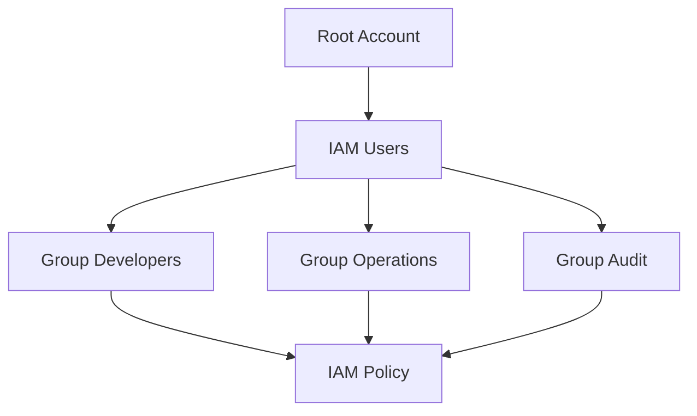

# 🔐 IAM — Xương sống bảo mật của mọi tài khoản AWS

> Nguồn: `012-IAM-Introduction-Users-Groups-Policies.txt` · [Udemy](https://ua.udemy.com/course/aws-certified-cloud-practitioner-new/learn/lecture/20054584)

Chào mừng các bạn đến với **bài deep-dive đầu tiên về một dịch vụ AWS** — và đó chính là **IAM**. Đây là nền tảng bảo mật sẽ theo các bạn suốt khóa học và chắc chắn xuất hiện trong đề thi, nên mình sẽ giải thích thật kỹ từ khái niệm đến ví dụ.

---

### 🧭 IAM là gì và vì sao là dịch vụ toàn cầu?

**IAM (Identity and Access Management — quản lý danh tính và truy cập)** là một **global service (dịch vụ toàn cầu)**, vì tại đây chúng ta tạo **users (người dùng)** rồi gán họ vào **groups (nhóm)**.

Thật ra các bạn **đã dùng IAM mà không hề biết**: khi tạo tài khoản AWS, các bạn đã tạo ra **root account (tài khoản gốc)**, và **root user** được tạo mặc định. Root user **chỉ nên dùng để thiết lập tài khoản ban đầu** — sau đó tuyệt đối **không dùng nữa và không chia sẻ**. Việc nên làm là tạo **IAM users**, trong đó **mỗi user đại diện cho một con người cụ thể** trong tổ chức của bạn.

---

### 👥 Ví dụ với 6 người trong một công ty

Giả sử công ty của bạn có 6 người: **Alice, Bob, Charles, David, Edward và Fred**.

* **Alice, Bob, Charles** cùng làm việc và đều là developer → tạo group **developers** chứa 3 người này.
* **David và Edward** cũng làm chung → tạo group **operations**.
* **Fred** không thuộc group nào — **không phải best practice**, nhưng AWS vẫn cho phép.
* Nếu **Charles và David** cùng tham gia nhóm **audit**, bạn tạo group thứ ba gồm 2 người → **một user có thể thuộc nhiều group**.

⚠️ Quy tắc cực kỳ quan trọng và rất dễ vào đề: **groups chỉ chứa users, không chứa groups khác**.

---

### 📜 Policy — trái tim của IAM

Vì sao phải tạo users và groups? Để họ **được dùng tài khoản AWS** — và muốn vậy, ta phải cấp **permissions (quyền)**. Users hoặc groups sẽ được gán một **JSON document** gọi là **IAM policy**.

*Đừng lo nếu bạn không phải lập trình viên — đây không phải lập trình*, mà chỉ là cách mô tả bằng tiếng Anh đơn giản ai được phép làm gì. Ví dụ trong bài: policy cho phép dùng **EC2** và gọi `describe`, dùng **elastic load balancing** và `describe`, cùng với **CloudWatch**. Qua JSON document này, chúng ta định nghĩa quyền hạn của users.

---

### 🛡️ Nguyên tắc least privilege

Trong AWS, **bạn không cho tất cả mọi người làm mọi thứ** — điều đó sẽ là **thảm họa**, vì một user mới có thể khởi tạo vô số dịch vụ gây **tốn kém** và **mất an toàn**. Vì vậy AWS áp dụng **least privilege principle (nguyên tắc đặc quyền tối thiểu)**:

> Không cấp nhiều quyền hơn mức mà user thực sự cần.

Nếu user chỉ cần truy cập 3 dịch vụ, hãy tạo quyền **đúng 3 dịch vụ đó** mà thôi.

---

### 🎯 Tự kiểm tra nhanh

**Câu 1:** IAM là dịch vụ global hay theo region?

<b>Xem đáp án</b>

**Đáp án:** Global. Giải thích: IAM tạo users và groups dùng được ở mọi nơi, không có region để chọn. Tham chiếu: Mục IAM là gì.

**Câu 2:** Group trong IAM có thể chứa group khác không?

<b>Xem đáp án</b>

**Đáp án:** Không. Giải thích: Groups chỉ chứa users, tuyệt đối không chứa group khác. Tham chiếu: Mục Ví dụ với 6 người.

**Câu 3:** Một user có thể thuộc bao nhiêu group?

<b>Xem đáp án</b>

**Đáp án:** Nhiều group. Giải thích: Ví dụ Charles và David vừa ở nhóm developers/operations vừa ở nhóm audit. Tham chiếu: Mục Ví dụ với 6 người.

**Câu 4:** IAM policy thực chất là gì?

<b>Xem đáp án</b>

**Đáp án:** Một JSON document mô tả quyền hạn, gán cho users hoặc groups. Tham chiếu: Mục Policy.

**Câu 5:** Least privilege principle yêu cầu điều gì?

<b>Xem đáp án</b>

**Đáp án:** Chỉ cấp cho user đúng lượng quyền mà họ cần, không cấp dư. Tham chiếu: Mục Nguyên tắc least privilege.

---

Vậy là các bạn đã nắm được bức tranh tổng thể của IAM: users, groups, policies và nguyên tắc vàng **least privilege**. *Đừng lo nếu mọi thứ còn mới mẻ — mình sẽ nhắc lại nhiều lần.*

Ở bài tiếp theo, chúng ta sẽ vào AWS console và **tự tay tạo IAM user đầu tiên**. Hẹn gặp các bạn ở đó! 🚀
