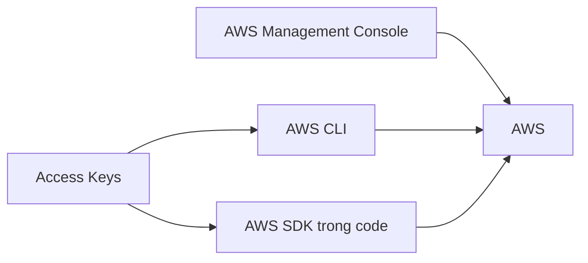

# 🔑 Ba cách truy cập AWS — Access Keys, CLI và SDK

> Nguồn: `019-AWS-Access-Keys-CLI-and-SDK.txt` · [Udemy](https://ua.udemy.com/course/aws-certified-cloud-practitioner-new/learn/lecture/20208128)

Từ đầu khóa đến giờ, chúng ta chỉ dùng **AWS Management Console** — giao diện web. Nhưng thật ra AWS có **3 cách truy cập**, và bài này sẽ giúp các bạn phân biệt rõ **Console, CLI và SDK** cùng **access keys** — chủ đề rất hay xuất hiện trong đề thi.

---

### 🚪 Ba cách truy cập AWS

| Cách truy cập | Bảo vệ bằng | Dùng khi nào |
|---|---|---|
| **Management Console** | Username, password, MFA | Thao tác trên giao diện web |
| **CLI (Command Line Interface)** | Access keys | Gõ lệnh trong terminal |
| **SDK (Software Development Kit)** | Access keys | Gọi API từ trong code ứng dụng |

---

### 🔑 Access keys — sinh ở đâu, bảo mật thế nào?

Access keys được tạo trong **Management Console**, mỗi user **tự chịu trách nhiệm** với keys của mình:

* **Access key ID** hãy đối xử như **username**.
* **Secret access key** hãy đối xử như **password** — hãy **giữ bí mật tuyệt đối**.
* **Không chia sẻ** với đồng nghiệp — họ hoàn toàn có thể tự tạo keys riêng.
* Khi tạo xong, AWS cho **tải về ngay lập tức** (trong bài có ví dụ access key "giả" để minh họa).

---

### 💻 CLI là gì?

**CLI (Command Line Interface)** là công cụ cho phép bạn **tương tác với các dịch vụ AWS bằng câu lệnh** trong command-line shell. Mọi lệnh đều bắt đầu bằng chữ **aws**, ví dụ `aws s3 cp`.

* Cho **truy cập trực tiếp vào public APIs** của AWS.
* Có thể viết **script** để quản lý tài nguyên và **tự động hóa** công việc.
* Là **open-source**, source code có trên **GitHub**.
* Là **giải pháp thay thế** cho Management console — nhiều người thậm chí **chỉ dùng CLI**.

---

### 📦 SDK là gì?

**SDK (Software Development Kit)** là **tập thư viện theo từng ngôn ngữ lập trình**, giúp bạn truy cập và quản lý AWS **programmatically** — nhưng khác CLI, SDK được **nhúng vào code ứng dụng** của bạn, không dùng trong terminal. SDK hỗ trợ nhiều ngôn ngữ:

* **JavaScript, Python, PHP.NET, Ruby, Java, Go, Node.js, C++**.
* **Mobile SDK** cho Android và iOS.
* **IoT device SDK** — cho các thiết bị như **cảm biến nhiệt** hay **khóa xe đạp kết nối mạng**.

Ví dụ thú vị: **AWS CLI** mà chúng ta sắp cài đặt được xây dựng trên **AWS SDK for Python** — tên là **Boto**.

---

### 🎯 Tự kiểm tra nhanh

**Câu 1:** Ba cách truy cập AWS là gì?

<b>Xem đáp án</b>

**Đáp án:** Management Console, CLI, SDK. Giải thích: Console dùng web, CLI gõ lệnh, SDK nhúng vào code. Tham chiếu: Mục Ba cách truy cập AWS.

**Câu 2:** CLI và SDK được bảo vệ bằng gì?

<b>Xem đáp án</b>

**Đáp án:** Access keys. Giải thích: Access key ID như username, secret access key như password. Tham chiếu: Mục Access keys.

**Câu 3:** Vì sao không được chia sẻ access keys?

<b>Xem đáp án</b>

**Đáp án:** Vì keys là bí mật riêng của mỗi user. Giải thích: Đồng nghiệp có thể tự tạo keys của họ. Tham chiếu: Mục Access keys.

**Câu 4:** CLI khác SDK ở điểm cốt lõi nào?

<b>Xem đáp án</b>

**Đáp án:** CLI dùng trong terminal; SDK được nhúng vào code ứng dụng. Tham chiếu: Mục SDK là gì.

**Câu 5:** AWS CLI được xây dựng trên SDK nào?

<b>Xem đáp án</b>

**Đáp án:** AWS SDK for Python — tên là Boto. Tham chiếu: Mục SDK là gì.

---

Hiểu rõ Console, CLI, SDK cùng access keys là bạn đã nắm một phần rất "được hỏi" trong đề thi. Ở bài tiếp theo, chúng ta bắt đầu **cài đặt AWS CLI trên Windows**. Hẹn gặp các bạn! 🚀
