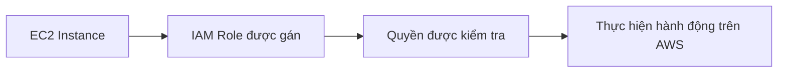

# 🎭 IAM Roles: Khi dịch vụ AWS cũng cần quyền

> Nguồn: `025-IAM-Roles-for-AWS-Services.txt` · [Udemy](https://ua.udemy.com/course/aws-certified-cloud-practitioner-new/learn/lecture/20054638)

Chúng ta đã đi qua users, groups và policies. Giờ là **thành phần cuối cùng của IAM**: **IAM Roles (vai trò)**. Đây là khái niệm rất hay xuất hiện trong đề thi, nên các bạn chú ý nhé.

---

### 🧩 Vì sao cần IAM Roles?

Một số **dịch vụ AWS** mà chúng ta sẽ khởi tạo trong khóa học cần **thực hiện hành động thay mặt chúng ta** trên tài khoản AWS.

Giống như users, các dịch vụ này cũng cần **quyền (permissions)** để làm việc đó. Và để gán quyền cho dịch vụ AWS, chúng ta tạo ra **IAM Role**.

---

### 🤖 Role giống user, nhưng dành cho dịch vụ

Hai điểm mấu chốt cần nhớ:

* IAM Role **giống như một user**.
* Nhưng role **không dành cho người thật**, mà để **các dịch vụ AWS sử dụng**.

Nghe hơi trừu tượng, nên mình lấy ví dụ cụ thể ngay sau đây.

---

### 🖥️ Ví dụ với EC2 Instance

Trong khóa học, chúng ta sẽ tạo một **EC2 Instance** — hiểu đơn giản là một **máy chủ ảo (virtual server)**, và ta sẽ gặp nó ở phần kế tiếp.

EC2 Instance này có thể cần thực hiện vài hành động trên AWS. Để làm được, ta tạo một **IAM Role** gán cho nó: **EC2 Instance và IAM Role hợp thành một thực thể (entity)**. Khi EC2 Instance cần truy cập thông tin từ AWS, nó sẽ dùng IAM Role này. Nếu **quyền gán cho role là đúng**, lệnh gọi đó sẽ được chấp nhận.

---

### 📋 Các loại role thường gặp

* **EC2 Instance roles** — như ví dụ ở trên.
* **Lambda Function roles**.
* **CloudFormation roles**.

Trong bài tiếp theo, chúng ta sẽ tự tay tạo một role — tuy chưa dùng ngay, nhưng nó sẽ phát huy tác dụng ở phần EC2.

---

### 🎯 Tự kiểm tra nhanh

**Câu 1:** IAM Role được thiết kế để ai sử dụng?

<b>Xem đáp án</b>

**Đáp án:** Các dịch vụ AWS, không phải người thật.

Giải thích: Role giống như một user, nhưng dành cho các dịch vụ.

Tham chiếu: Mục Role giống user, nhưng dành cho dịch vụ.

**Câu 2:** Vì sao dịch vụ AWS cần IAM Role?

<b>Xem đáp án</b>

**Đáp án:** Vì dịch vụ cần quyền để thực hiện hành động thay mặt chúng ta trên tài khoản AWS.

Giải thích: Giống users, dịch vụ cũng cần permissions để làm việc.

Tham chiếu: Mục Vì sao cần IAM Roles.

**Câu 3:** EC2 Instance kết hợp với IAM Role tạo thành gì?

<b>Xem đáp án</b>

**Đáp án:** Một thực thể (entity).

Giải thích: Khi EC2 cần truy cập AWS, nó dùng role này; nếu quyền đúng thì lệnh gọi thành công.

Tham chiếu: Mục Ví dụ với EC2 Instance.

**Câu 4:** Kể tên các loại role thường gặp được nhắc trong bài.

<b>Xem đáp án</b>

**Đáp án:** EC2 Instance roles, Lambda Function roles, CloudFormation roles.

Giải thích: Đây là những dịch vụ thường xuyên cần role để hành động trên AWS.

Tham chiếu: Mục Các loại role thường gặp.

**Câu 5:** Điều gì quyết định một lệnh gọi từ EC2 Instance qua role được chấp nhận?

<b>Xem đáp án</b>

**Đáp án:** Quyền được gán cho IAM Role có đúng hay không.

Giải thích: Nếu permission của role chính xác, lệnh gọi sẽ được phép.

Tham chiếu: Mục Ví dụ với EC2 Instance.

---

Vậy là bạn đã nắm được thành phần cuối cùng của IAM. Ở bài tiếp theo, chúng ta sẽ **thực hành tạo role** trên console. Hẹn gặp các bạn ở đó! 🚀
