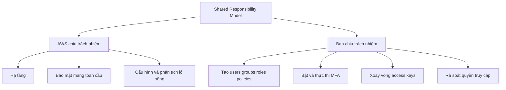

# 🤝 Shared Responsibility Model cho IAM: AWS lo gì, bạn lo gì?

> Nguồn: `030-Shared-Responsibility-Model-for-IAM.txt` · [Udemy](https://ua.udemy.com/course/aws-certified-cloud-practitioner-new/learn/lecture/20054694)

Trong suốt kỳ thi CCP, các bạn sẽ gặp **rất nhiều câu hỏi về Shared Responsibility Model (Mô hình trách nhiệm chung)**. Mục tiêu là bạn phải phân biệt rõ: **AWS chịu trách nhiệm việc gì, và bạn chịu trách nhiệm việc gì**. Bài này mình áp dụng mô hình đó vào IAM.

---

### ☁️ AWS chịu trách nhiệm những gì?

AWS chịu trách nhiệm cho **mọi thứ thuộc về họ**, bao gồm:

* **Hạ tầng (infrastructure)** của AWS.
* **Bảo mật mạng toàn cầu (global network security)**.
* **Cấu hình và phân tích lỗ hổng (vulnerability analysis)** của các dịch vụ họ cung cấp.
* Mọi **yêu cầu tuân thủ (compliance)** thuộc phần họ.

---

### 🧑💻 Với IAM, bạn chịu trách nhiệm rất nhiều thứ

Đây là những việc AWS **không làm thay** bạn:

* Tạo **users, groups, roles, policies** của riêng bạn.
* **Quản lý và giám sát** các policy đó.
* **Bật MFA cho mọi tài khoản và thực thi** việc đó — không phải AWS.
* Đảm bảo **xoay vòng (rotate) access keys thường xuyên**.
* Dùng **các công cụ IAM** để gán đúng quyền.
* **Phân tích mẫu truy cập (access patterns)** và **rà soát quyền** trong tài khoản — cũng không phải AWS.

Nói ngắn gọn: **AWS chịu trách nhiệm cho hạ tầng, còn bạn chịu trách nhiệm cho cách bạn dùng hạ tầng đó.**

---

### 🗺️ Sơ đồ hóa trách nhiệm

---

### 📋 Bảng đối chiếu nhanh

| Hạng mục | AWS | Bạn |
|---|---|---|
| Hạ tầng | ✅ | |
| Bảo mật mạng toàn cầu | ✅ | |
| Phân tích lỗ hổng dịch vụ | ✅ | |
| Users, groups, roles, policies | | ✅ |
| Bật và thực thi MFA | | ✅ |
| Xoay vòng access keys | | ✅ |
| Rà soát quyền và access patterns | | ✅ |

---

### 🎯 Tự kiểm tra nhanh

**Câu 1:** Trong mô hình trách nhiệm chung, AWS chịu trách nhiệm những gì?

<b>Xem đáp án</b>

**Đáp án:** Hạ tầng, bảo mật mạng toàn cầu, cấu hình và phân tích lỗ hổng dịch vụ, cùng các yêu cầu compliance thuộc phần họ.

Giải thích: AWS lo mọi thứ thuộc về họ.

Tham chiếu: Mục AWS chịu trách nhiệm những gì.

**Câu 2:** Ai chịu trách nhiệm bật và thực thi MFA?

<b>Xem đáp án</b>

**Đáp án:** Bạn (khách hàng), không phải AWS.

Giải thích: MFA trên mọi tài khoản là trách nhiệm của bạn.

Tham chiếu: Mục Với IAM, bạn chịu trách nhiệm rất nhiều thứ.

**Câu 3:** Ai tạo và quản lý users, groups, roles, policies?

<b>Xem đáp án</b>

**Đáp án:** Bạn.

Giải thích: Đây là phần trách nhiệm của khách hàng trong IAM.

Tham chiếu: Mục Với IAM, bạn chịu trách nhiệm rất nhiều thứ.

**Câu 4:** Ai đảm bảo access keys được xoay vòng thường xuyên?

<b>Xem đáp án</b>

**Đáp án:** Bạn.

Giải thích: Việc xoay vòng keys là trách nhiệm của khách hàng.

Tham chiếu: Mục Với IAM, bạn chịu trách nhiệm rất nhiều thứ.

**Câu 5:** Câu chốt của bài: AWS chịu trách nhiệm ___, bạn chịu trách nhiệm ___?

<b>Xem đáp án</b>

**Đáp án:** AWS chịu trách nhiệm cho hạ tầng; bạn chịu trách nhiệm cho cách bạn dùng hạ tầng đó.

Giải thích: Đây là tinh thần cốt lõi của Shared Responsibility Model.

Tham chiếu: Mục Với IAM, bạn chịu trách nhiệm rất nhiều thứ.

---

Vậy là bạn đã hiểu cách mô hình trách nhiệm chung áp dụng cho IAM. Ở bài tiếp theo, chúng ta sẽ **tổng kết toàn bộ phần IAM** trước khi sang phần mới. Hẹn gặp các bạn ở đó! 🚀
