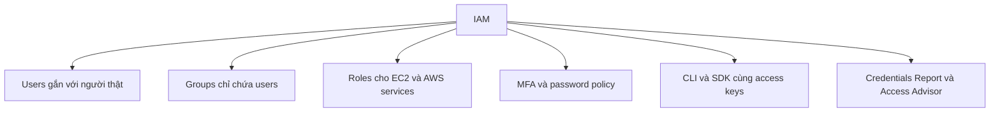

# 📚 IAM Summary: Tổng kết toàn bộ kiến thức IAM

> Nguồn: `031-IAM-Summary.txt` · [Udemy](https://ua.udemy.com/course/aws-certified-cloud-practitioner-new/learn/lecture/26047854)

Chúng ta đã đi hết phần IAM rồi! Bài này mình sẽ **tóm tắt toàn bộ** những gì đã học, để các bạn có một "tấm bản đồ" trong đầu trước khi bước sang phần tiếp theo của khóa học.

---

### 🧱 Bốn khối xây dựng của IAM

* **Users**: gắn với **một người thật** trong công ty; có **mật khẩu** để đăng nhập AWS console.
* **Groups**: nhóm các users lại; lưu ý **groups chỉ chứa users**.
* **Policies**: **tài liệu JSON** mô tả quyền hạn cho users hoặc groups.
* **Roles**: cũng là **danh tính (identity)**, nhưng dành cho **EC2 instances hoặc các dịch vụ AWS** khác.

---

### 🔐 Bảo mật tài khoản

* Bật **MFA (Multi-Factor Authentication — xác thực đa yếu tố)**.
* Thiết lập **password policy (chính sách mật khẩu)** cho người dùng.

---

### 💻 Truy cập AWS bằng lập trình

* **CLI**: quản lý dịch vụ AWS bằng **dòng lệnh**.
* **SDK**: quản lý dịch vụ AWS bằng **ngôn ngữ lập trình**.
* **Access keys**: cần thiết để truy cập AWS qua **CLI hoặc SDK**.

---

### 🔍 Kiểm toán việc dùng IAM

* **IAM Credentials Report**: kiểm tra toàn cảnh credentials trong tài khoản.
* **IAM Access Advisor**: xem user đã dùng quyền gì, khi nào.

---

### 🗺️ Toàn cảnh IAM trong một sơ đồ

---

### 🎯 Tự kiểm tra nhanh

**Câu 1:** IAM user nên tương ứng với gì?

<b>Xem đáp án</b>

**Đáp án:** Một người thật trong công ty; user có password để dùng AWS console.

Giải thích: Mỗi người nên có user riêng, không dùng chung.

Tham chiếu: Mục Bốn khối xây dựng của IAM.

**Câu 2:** Groups có thể chứa những gì?

<b>Xem đáp án</b>

**Đáp án:** Chỉ chứa users.

Giải thích: Group dùng để nhóm users và gán quyền chung.

Tham chiếu: Mục Bốn khối xây dựng của IAM.

**Câu 3:** Policy là gì?

<b>Xem đáp án</b>

**Đáp án:** Tài liệu JSON mô tả quyền hạn cho users hoặc groups.

Giải thích: Policy là cách định nghĩa permission trong IAM.

Tham chiếu: Mục Bốn khối xây dựng của IAM.

**Câu 4:** Roles được tạo ra cho ai?

<b>Xem đáp án</b>

**Đáp án:** Cho EC2 instances và các dịch vụ AWS khác.

Giải thích: Role là danh tính dành cho dịch vụ thay vì người thật.

Tham chiếu: Mục Bốn khối xây dựng của IAM.

**Câu 5:** Hai công cụ dùng để kiểm toán việc sử dụng IAM là gì?

<b>Xem đáp án</b>

**Đáp án:** IAM Credentials Report và IAM Access Advisor.

Giải thích: Hai công cụ này giúp rà soát credentials và quyền đã dùng.

Tham chiếu: Mục Kiểm toán việc dùng IAM.

---

Vậy là các bạn đã nắm trọn phần IAM — từ users, groups, policies, roles đến CLI, SDK và các công cụ bảo mật. *Hãy tự hào vì mình đã đi hết một chặng quan trọng của khóa học!*

Ở bài tiếp theo, chúng ta sẽ tiếp tục hành trình chinh phục AWS với những kiến thức mới. Hẹn gặp các bạn ở đó! 🚀
