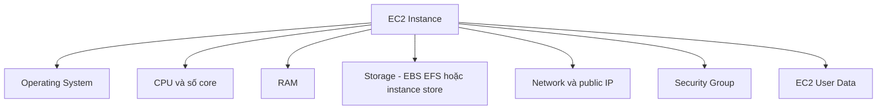

# 🖥️ EC2 là gì? Hiểu đúng "trái tim" của AWS Cloud

> Nguồn: `033-EC2-Basics.txt` · [Udemy](https://ua.udemy.com/course/aws-certified-cloud-practitioner-new/learn/lecture/20055638)

Sau khi đã tạo tài khoản AWS, đã đến lúc chạm vào dịch vụ nổi tiếng nhất của cloud: **Amazon EC2**. Đây cũng là nơi chúng ta sẽ dựng **website đầu tiên** trên AWS. *Đừng lo nếu bạn mới bắt đầu — mình sẽ giải thích mọi thứ từ con số 0.*

---

### 🎯 EC2 — viên gạch nền móng của điện toán đám mây

**EC2** viết tắt của **Elastic Compute Cloud**, là cách AWS cung cấp **Infrastructure as a Service (IaaS — hạ tầng dưới dạng dịch vụ)**. Đây là một trong những dịch vụ phổ biến nhất của AWS và được dùng ở khắp mọi nơi.

Điều quan trọng cần nhớ: **EC2 không chỉ là một dịch vụ đơn lẻ** mà gồm nhiều thành phần:

* **EC2 instances** — các **máy ảo (virtual machine)** bạn thuê từ AWS.
* **EBS volumes** — ổ đĩa ảo để lưu dữ liệu.
* **Elastic Load Balancer (ELB)** — phân phối tải giữa các máy.
* **Auto Scaling Group (ASG)** — tự động mở rộng/thu hẹp dịch vụ.

Biết dùng EC2 là **nền tảng để hiểu cloud vận hành thế nào**, bởi bản chất của cloud chính là **thuê compute theo nhu cầu (on-demand)** — và EC2 làm đúng điều đó.

---

### ⚙️ Bạn được chọn gì cho một EC2 instance?

Khi thuê một máy ảo, các bạn có rất nhiều lựa chọn:

1. **Hệ điều hành (OS):** **Linux** (phổ biến nhất), **Windows**, hoặc **macOS**.
2. **Compute power & số core (CPU):** máy mạnh yếu tùy nhu cầu.
3. **RAM (bộ nhớ trong):** nhiều hay ít.
4. **Storage (lưu trữ):** gắn qua mạng (**EBS** hoặc **EFS**) hay gắn trực tiếp phần cứng (**EC2 instance store**).
5. **Network:** loại card mạng, độ nhanh, và **public IP** mong muốn.
6. **Firewall rules:** chính là **security group**.
7. **Bootstrap script:** chính là **EC2 User Data**.

Về cơ bản, các bạn có thể tùy biến máy ảo **gần như mọi thứ** và thuê nó từ AWS **trong nháy mắt** — đó chính là sức mạnh của cloud. Ở các cấp độ chứng chỉ cao hơn sẽ còn nhiều tùy chọn hơn nữa, nhưng ở mức nền tảng chỉ cần nhớ: EC2 cho bạn toàn quyền quyết định cấu hình máy ảo.

---

### 🚀 EC2 User Data — "bootstrapping" máy ảo của bạn

**Bootstrapping** nghĩa là **chạy các lệnh khi máy khởi động**. Script này có những đặc điểm rất rõ ràng:

* **Chỉ chạy một lần duy nhất**, ở lần khởi động đầu tiên, và **không bao giờ chạy lại** trong toàn bộ vòng đời của instance.
* Mục đích: **tự động hóa các tác vụ lúc boot (boot tasks)** — cài updates, cài software, tải file từ internet... bất cứ thứ gì bạn nghĩ ra.
* Càng nhồi nhiều lệnh vào User Data, **máy càng mất nhiều thời gian khởi động**.
* User Data **chạy với quyền root user**, vì vậy mọi lệnh đều có **quyền sudo**.

---

### 🎯 Tự kiểm tra nhanh

**Câu 1:** EC2 viết tắt của gì?

<b>Xem đáp án</b>

**Đáp án:** Elastic Compute Cloud.

Giải thích: Đây là dịch vụ IaaS của AWS.

Tham chiếu: Mục EC2 — viên gạch nền móng.

**Câu 2:** Bốn thành phần cấu thành nên EC2 là gì?

<b>Xem đáp án</b>

**Đáp án:** EC2 instances, EBS volumes, Elastic Load Balancer (ELB), Auto Scaling Group (ASG).

Giải thích: EC2 không phải một dịch vụ đơn lẻ mà gồm nhiều thành phần.

Tham chiếu: Mục EC2 — viên gạch nền móng.

**Câu 3:** EC2 User Data chạy khi nào và bao nhiêu lần?

<b>Xem đáp án</b>

**Đáp án:** Chạy đúng một lần, ở lần khởi động đầu tiên của instance.

Giải thích: Đây là cơ chế bootstrapping — không bao giờ chạy lại.

Tham chiếu: Mục EC2 User Data.

**Câu 4:** EC2 User Data chạy với quyền gì?

<b>Xem đáp án</b>

**Đáp án:** Quyền root user — mọi lệnh đều có sudo rights.

Giải thích: Nhờ vậy script có thể cài software, update hệ thống.

Tham chiếu: Mục EC2 User Data.

**Câu 5:** Hệ điều hành nào phổ biến nhất cho EC2 instance?

<b>Xem đáp án</b>

**Đáp án:** Linux.

Giải thích: Ba lựa chọn OS là Linux, Windows và macOS.

Tham chiếu: Mục Bạn được chọn gì cho một EC2 instance.

---

Vậy là các bạn đã nắm được bức tranh cơ bản về EC2 và cơ chế User Data. Ở bài tiếp theo, chúng ta sẽ **thực hành ngay**: tự tay tạo một instance và dựng web server đầu tiên trên cloud. Hẹn gặp các bạn! 🚀
