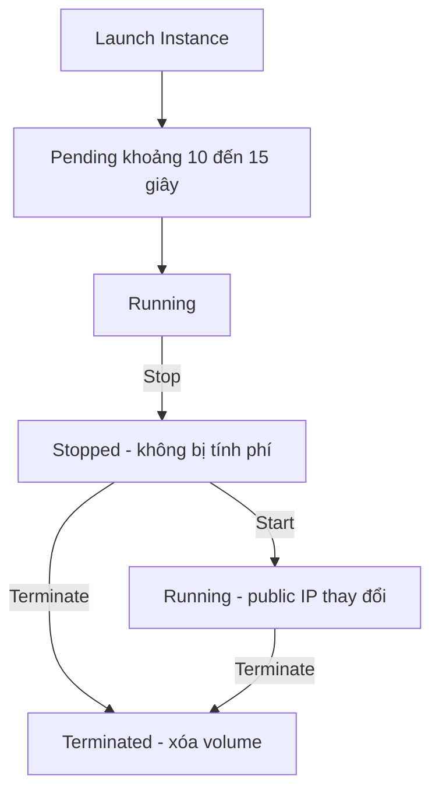

# 🛠️ Thực hành: Tạo EC2 Instance đầu tiên và dựng web server bằng User Data

> Nguồn: `034-Create-an-EC2-Instance-with-EC2-User-Data-to-have-a-Website-.txt` · [Udemy](https://ua.udemy.com/course/aws-certified-cloud-practitioner-new/learn/lecture/20055646)

Đã đến lúc bắt tay vào làm thật! Trong bài này, chúng ta sẽ **launch EC2 instance đầu tiên** chạy **Amazon Linux**, làm quen với các tham số khi tạo instance, rồi **dựng một web server ngay trên máy ảo** bằng **User Data**. Cuối cùng, mình sẽ hướng dẫn cách **start, stop và terminate** instance.

*Các bạn cứ mở AWS console lên và làm theo mình — không cần thuộc lòng gì cả.*

---

### 🎬 Mục tiêu bài thực hành

1. Tạo instance đầu tiên trên **EC2 Console** (đường dẫn: **Instances → Launch Instances**).
2. Làm quen các tham số khi launch (nhưng chỉ tập trung vào những cái quan trọng nhất).
3. Dựng **web server** trực tiếp trên instance bằng một đoạn code gọi là **user data**.
4. Học cách **start, stop, terminate** instance.

---

### 🧭 Chọn AMI và instance type

1. **Name and tags:** đặt tên instance là **My First Instance**. Tag này đủ dùng, không cần thêm tag khác.
2. **Base image (AMI):** chọn từ **Quick Start** → **Amazon Linux 2 AMI** (do AWS cung cấp), kiến trúc **64-bit x86**, và để nguyên vì đây là **free tier eligible**. Sau này các bạn có thể tự tạo AMI riêng, nhưng bây giờ dùng Quick Start là đủ.
3. **Instance type:** các loại instance khác nhau về **số CPU**, **lượng memory** và **giá tiền**. Chọn **t2.micro** — **free tier eligible**, miễn phí cả tháng nếu để chạy. `t1.micro` cũng free tier nhưng là **thế hệ cũ**. Nếu muốn so sánh thêm, có link xem toàn bộ instance types và memory.

---

### 🔑 Key pair, network và storage

1. **Key pair:** cần thiết để dùng **SSH** truy cập instance, nên mình tạo mới với tên **EC2 Tutorial**, loại mã hóa **RSA**.
2. **Định dạng key:**
   * **.pem** — dùng cho **Mac, Linux hoặc Windows 10** trở lên.
   * **.ppk** — dùng cho **Windows 7/8** qua **PuTTY**.
   * *Nhớ quy tắc: không phải Windows 7/8 thì chọn .pem, còn lại dùng .ppk.*
3. **Network settings:** để mặc định, instance sẽ nhận **public IP**. Console tự tạo **security group** đầu tiên tên **launch-wizard-1**, với 2 rule:
   * Cho phép **SSH** từ mọi nơi (port 22) — để kết nối vào máy.
   * Cho phép **HTTP** từ internet (port 80) — vì ta sẽ chạy web server. **HTTPS lúc này chưa cần tick.**
4. **Storage:** giữ nguyên **8 GB gp2 root volume**; **free tier** cho tối đa **30 GB EBS general purpose SSD**. Vào **Advanced** sẽ thấy tùy chọn **delete on termination** — mặc định là **Yes**, nghĩa là volume sẽ bị xóa khi instance bị terminate.

---

### 💻 User Data — dựng web server chỉ với một đoạn script

Trong phần **Advanced details**, mình bỏ qua **spot** và **IAM instance profile** (sẽ học sau), rồi kéo xuống tận cùng tới ô **user data**.

Đây là nơi các bạn dán script sẽ được **executed ở lần launch đầu tiên — và chỉ một lần duy nhất** trong toàn bộ vòng đời instance. Mình copy nguyên đoạn script **EC2 user data** trong phần tài nguyên của khóa (thư mục EC2 fundamentals) và dán vào.

Script này sẽ **update vài thứ**, **cài HTTPD web server** trên máy, rồi **ghi một file HTML** làm nội dung website. *Bạn không cần biết code hay hiểu các lệnh này — nó chỉ để minh họa cho bài học.*

Cuối cùng, review lại phần **summary**: khởi tạo **1 instance**, và bấm **Launch**. Trong free tier, các bạn có **750 giờ t2.micro mỗi tháng trong năm đầu** (đủ chạy liên tục một tháng); nếu region không có t2.micro thì sẽ là **t3.micro**, kèm **30 GB EBS storage**.

---

### 🚦 Instance chạy, web server lên sóng và vòng đời instance

Sau khi launch, instance ở trạng thái **pending** — mất khoảng **10–15 giây** để khởi động. Đây chính là **sức mạnh của cloud**: tạo một instance (hay cả 100 instance) trong **chưa đầy 10 giây** mà không cần sở hữu server nào.

**Kiểm tra instance:**
* **Name** (My First Instance), **Instance ID** (định danh duy nhất), **Public IPv4**, **Private IPv4**, hostname, private DNS.
* Thông tin cấu hình: **t2.micro**, AMI **Amazon Linux 2**, key pair **EC2 Tutorial**.
* Tab **Security**: security group **launch-wizard-1** với **port 22** và **port 80** mở từ mọi nơi, cùng rule outbound cho phép mọi traffic ra ngoài (để instance truy cập internet). *Nếu bạn không thấy giống vậy, hãy làm lại từ đầu vì có thể đã sót bước.*

**Mở web server:** copy **public IPv4** và truy cập bằng **http://** — *nhớ phải là HTTP, nếu dùng HTTPS trang sẽ load vô hạn và không hiện gì*. Các bạn sẽ thấy dòng **"Hello World from"** kèm địa chỉ **private IP 172.31.33.135**. Nếu truy cập quá sớm mà chưa thấy gì, đợi **5 phút** rồi refresh lại.

**Vòng đời instance:**

* **Stop Instance:** vào **Instance State → Stop Instance**. Instance càng chạy lâu càng tốn tiền, nhưng khi **stop thì AWS sẽ không bill** nữa; trạng thái máy vẫn được giữ nhờ volume gắn kèm. Tất nhiên, website sẽ không truy cập được nữa.
* **Terminate Instance:** vào **Instance State → Terminate** — cách "dọn dẹp" instance. Console sẽ hiện **cảnh báo** trước khi bạn xác nhận.
* **Start lại:** sau khi stop, bấm **Start Instance**. Điều thú vị: **public IPv4 có thể thay đổi** (từ `54.x` thành `3.250.x`), còn **private IPv4 thì luôn giữ nguyên**. Vì vậy hãy copy IP mới, dùng **http://** và truy cập lại.

*Trong cloud, việc tạo rồi xóa instance để thử nghiệm là chuyện rất bình thường — cứ thoải mái thực hành.*

---

Vậy là các bạn đã tự tay **launch instance đầu tiên, dựng web server và điều khiển vòng đời máy ảo** — một cột mốc đáng nhớ! Ở bài tiếp theo, chúng ta sẽ tìm hiểu **các loại instance type** để chọn cấu hình phù hợp cho từng nhu cầu. Hẹn gặp lại! 🚀
