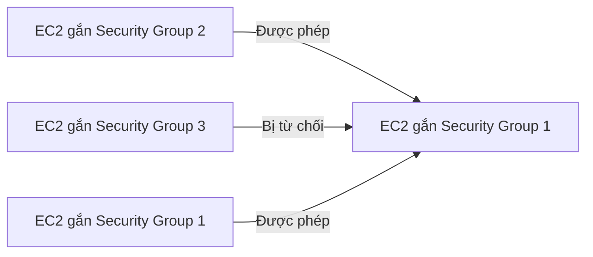

# 🔐 Security Groups và các Port "kinh điển" bạn phải nhớ để thi đỗ

> Nguồn: `036-Security-Groups-Classic-Ports-Overview.txt` · [Udemy](https://ua.udemy.com/course/aws-certified-cloud-practitioner-new/learn/lecture/20055658)

Chúng ta đã chạm vào **security group** ở bài thực hành trước, nhưng đây là chủ đề **cực kỳ quan trọng** — nó là nền tảng của **network security** trên AWS cloud và chắc chắn sẽ xuất hiện trong đề thi. Bài này mình sẽ nói kỹ về cách hoạt động, những điểm hay bị hỏi, và các **port kinh điển** cần nhớ.

---

### 🔥 Security Group — tường lửa quanh EC2 instance

Security group **kiểm soát traffic đi vào và đi ra** EC2 instance của bạn. Điểm dễ nhớ nhất: nó **chỉ có allow rules** — chỉ nói được cái gì **được phép**, chứ không có rule "cấm".

* Rule có thể tham chiếu theo **địa chỉ IP** (máy của bạn từ đâu tới) hoặc theo **security group khác**.
* Mỗi rule gồm: **type**, **protocol** (ví dụ TCP), **port**, và **source** (dải địa chỉ IP).
* **0.0.0.0/0** nghĩa là **mọi nơi**; còn một địa chỉ cụ thể là **đúng một IP**.
* Security group điều chỉnh **quyền truy cập vào port**, xét **authorized IP ranges** trên cả **IPv4 và IPv6** — hai loại IP trên internet.

Ví dụ dễ hiểu: máy của mình nằm trên public internet, kết nối tới EC2 qua **port 22** và vì IP của mình có trong rule nên **đi qua được**. Máy của người khác — không dùng IP của mình — sẽ **bị firewall chặn** và gặp lỗi **timeout**. Chiều còn lại, **outbound traffic mặc định được cho phép tất cả**, nên EC2 có thể thoải mái truy cập website bên ngoài.

---

### 📋 Những điểm "ắt có trong đề" về Security Group

1. **Gắn được cho nhiều instance:** không có quan hệ 1-1 giữa security group và instance; một **instance cũng gắn được nhiều** security group.
2. **Giới hạn theo region/VPC combination:** security group thuộc một region/VPC cụ thể. Đổi sang **region khác**, hoặc tạo **VPC mới**, bạn phải **tạo lại** security group.
3. **Nằm ngoài EC2:** nếu traffic bị chặn, **EC2 instance không hề nhìn thấy nó**. Đây không phải ứng dụng chạy trên máy — mà là **firewall đặt bên ngoài** instance.
4. **Lời khuyên:** hãy tách riêng một security group chỉ cho **SSH access** — SSH thường là thứ phức tạp nhất, cần được cấu hình đúng.
5. **Phân biệt 2 loại lỗi kết nối:**
   * **Timeout** — máy bạn "treo" chờ mãi: gần như chắc chắn là **security group chặn**.
   * **Connection refused** — có phản hồi hẳn hoi: traffic **đã đi qua được**, vấn đề nằm ở **application** (lỗi hoặc chưa chạy).
6. **Mặc định:** mọi **inbound traffic bị chặn**, mọi **outbound traffic được cho phép**.

---

### 🔗 Tham chiếu security group từ security group khác

Đây là tính năng nâng cao mình rất thích, và nó cực kỳ phổ biến khi dùng **load balancer**.

Giả sử **security group 1** có inbound rule cho phép chính **security group 1** và **security group 2**. Khi đó:

* Instance gắn **security group 2** được phép kết nối thẳng vào instance số 1 qua port đã định.
* Instance gắn **security group 1** cũng được phép kết nối tương tự.
* Instance gắn **security group 3** — không được authorize — sẽ **bị từ chối**.

Điểm hay: bạn **không cần bận tâm đến IP** của các instance, vì cứ gắn đúng security group là kết nối được. *Hãy ghi nhớ sơ đồ này, vì khi học load balancer các bạn sẽ gặp lại.*

---

### 🔌 Các port phải nhớ cho kỳ thi

| Port | Giao thức | Dùng để |
|---|---|---|
| 22 | SSH | Đăng nhập vào **Linux** instance |
| 22 | SFTP | Truyền file an toàn qua SSH |
| 21 | FTP | Upload file lên file share |
| 80 | HTTP | Truy cập website **không mã hóa** |
| 443 | HTTPS | Truy cập website **mã hóa** — chuẩn ngày nay |
| 3389 | RDP | Đăng nhập vào **Windows** instance |

Câu chốt cực dễ nhớ: **22 là SSH cho Linux, 3389 là RDP cho Windows**. Đừng quên **SFTP cũng dùng port 22** (vì chạy trên SSH), còn **FTP dùng port 21**.

---

### 🎯 Tự kiểm tra nhanh

**Câu 1:** Security group có loại rule nào?

<b>Xem đáp án</b>

**Đáp án:** Chỉ có allow rules.

Giải thích: Bạn chỉ định nghĩa cái gì được phép đi vào/đi ra.

Tham chiếu: Mục Security Group — tường lửa quanh EC2.

**Câu 2:** Kết nối bị timeout và bị connection refused khác nhau thế nào?

<b>Xem đáp án</b>

**Đáp án:** Timeout = security group chặn; connection refused = traffic đã qua, application lỗi/chưa chạy.

Giải thích: Timeout là máy chờ mãi không kết nối được.

Tham chiếu: Mục Những điểm ắt có trong đề.

**Câu 3:** Một security group gắn được cho bao nhiêu instance?

<b>Xem đáp án</b>

**Đáp án:** Nhiều instance — quan hệ nhiều-nhiều.

Giải thích: Instance cũng có thể gắn nhiều security group.

Tham chiếu: Mục Những điểm ắt có trong đề.

**Câu 4:** Security group thuộc phạm vi nào?

<b>Xem đáp án</b>

**Đáp án:** Một region/VPC combination — đổi region hoặc VPC phải tạo lại.

Giải thích: Security group không dùng chung giữa các region/VPC.

Tham chiếu: Mục Những điểm ắt có trong đề.

**Câu 5:** Port 22, 443 và 3389 tương ứng với gì?

<b>Xem đáp án</b>

**Đáp án:** 22 = SSH (Linux), 443 = HTTPS, 3389 = RDP (Windows).

Giải thích: SFTP cũng dùng port 22; FTP dùng port 21; HTTP dùng port 80.

Tham chiếu: Mục Các port phải nhớ cho kỳ thi.

---

Vậy là các bạn đã nắm chắc security group cùng bộ port quan trọng nhất. Ở bài tiếp theo, chúng ta sẽ **thực hành trực tiếp**: tự tay xóa và thêm rule để thấy lỗi timeout xuất hiện rồi biến mất. Hẹn gặp các bạn! 🚀
