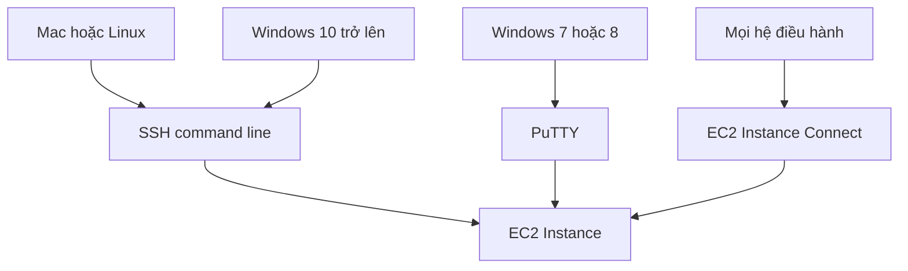

# 🔑 SSH Overview — chọn cách kết nối vào server phù hợp với bạn

> Nguồn: `038-SSH-Overview.txt` · [Udemy](https://ua.udemy.com/course/aws-certified-cloud-practitioner-new/learn/lecture/20055692)

Kết nối vào server trên cloud để **bảo trì và thao tác** là một trong những phần "khó nhằn" nhất khi mới làm quen với AWS. Với **Linux servers**, công cụ chính là **SSH**, nhưng tùy hệ điều hành trên máy bạn mà có cách làm khác nhau. Bài này sẽ giúp bạn chọn đúng "con đường" cho mình.

---

### 🎯 SSH là gì và vì sao cần biết nhiều cách?

**SSH (Secure Shell)** là công cụ **command line (dòng lệnh)** cho phép bạn kết nối an toàn vào server Linux để bảo trì, chạy lệnh, thao tác từ xa.

Tùy vào hệ điều hành trên máy tính của bạn — **Mac, Linux, Windows trước version 10, hay Windows sau version 10** — sẽ có những cách kết nối khác nhau. *Đừng lo, kiểu gì bạn cũng có ít nhất một cách dùng được.*

---

### 🧭 Bốn cách kết nối theo hệ điều hành

1. **SSH (command line utility):** dùng được trên **Mac, Linux và Windows từ version 10 trở lên**.
2. **PuTTY:** dành cho **Windows thấp hơn version 10** (như Windows 7, Windows 8). PuTTY làm **đúng y hệt việc mà SSH làm** — cũng dùng giao thức SSH để kết nối vào EC2 instance — và dùng được cho **mọi phiên bản Windows**. *Khi mình nói "hãy SSH", nếu bạn dùng Windows thì cứ hiểu là dùng PuTTY.*
3. **EC2 Instance Connect:** dùng **web browser** — không cần terminal, cũng không cần PuTTY. Điểm mình thích nhất: **hợp với Mac, Linux, Windows — mọi phiên bản**. Hạn chế duy nhất: hiện tại nó **chỉ hoạt động với Amazon Linux 2** — và đó cũng là lý do mình chọn Amazon Linux 2 cho các bài hướng dẫn.

---

### 📌 Bạn nên xem bài nào tiếp theo?

Tùy máy của bạn, hãy chọn bài thực hành tương ứng:

* **Mac hoặc Linux** → xem bài **SSH trên Mac/Linux**.
* **Windows** → xem bài **PuTTY**, hoặc bài **SSH trên Windows 10** nếu bạn dùng Windows 10.

Còn trong các bài giảng sắp tới, mình sẽ **cá nhân dùng EC2 Instance Connect** — vì nó đơn giản, **không cần cài gì**, cũng không bắt bạn quen với command line. *Nếu chưa quen dòng lệnh, đây là lựa chọn rất đáng thử.*

Một chia sẻ thật lòng: trong kinh nghiệm giảng dạy **hàng trăm nghìn học viên**, **SSH là phần gây nhiều rắc rối nhất** trong khóa học. Nếu gặp lỗi, các bạn hãy:

* Xem lại bài giảng — có thể bạn đã sót **security group rule**, sai **câu lệnh**, hoặc gõ **typo**.
* Tham khảo **troubleshooting guide** mình chuẩn bị sau các bài này.
* Thử **EC2 Instance Connect** — đôi khi nó "chữa" được mọi vấn đề.

Và điều quan trọng nhất: **chỉ cần một phương pháp chạy được là bạn đã ổn** — không cần tất cả cùng hoạt động. *Nếu không cách nào chạy được thì cũng hoàn toàn không sao*: khóa học này chỉ mang tính giới thiệu và sẽ **không dùng SSH nhiều**, các bạn vẫn học tốt bình thường.

---

### 🎯 Tự kiểm tra nhanh

**Câu 1:** Trên Windows thấp hơn version 10, bạn dùng gì để SSH?

<b>Xem đáp án</b>

**Đáp án:** PuTTY.

Giải thích: PuTTY dùng giao thức SSH, hoạt động trên mọi phiên bản Windows.

Tham chiếu: Mục Bốn cách kết nối.

**Câu 2:** EC2 Instance Connect chạy trên nền tảng nào và hỗ trợ OS nào?

<b>Xem đáp án</b>

**Đáp án:** Chạy trên web browser; hiện chỉ hỗ trợ Amazon Linux 2.

Giải thích: Đây là lý do khóa học dùng Amazon Linux 2.

Tham chiếu: Mục Bốn cách kết nối.

**Câu 3:** Cần bao nhiêu phương pháp kết nối hoạt động?

<b>Xem đáp án</b>

**Đáp án:** Chỉ cần một.

Giải thích: Không cần tất cả cùng hoạt động; không cách nào cũng không sao.

Tham chiếu: Mục Bạn nên xem bài nào tiếp theo.

**Câu 4:** SSH là gì?

<b>Xem đáp án</b>

**Đáp án:** Secure Shell — command line utility dùng để điều khiển remote machine/server.

Giải thích: Với Linux server, SSH là cách kết nối chính.

Tham chiếu: Mục SSH là gì và vì sao cần biết nhiều cách.

**Câu 5:** Lỗi SSH thường đến từ đâu?

<b>Xem đáp án</b>

**Đáp án:** Sót security group rule, sai câu lệnh hoặc typo.

Giải thích: Hãy xem lại bài giảng và troubleshooting guide.

Tham chiếu: Mục Bạn nên xem bài nào tiếp theo.

---

Vậy là bạn đã biết mình thuộc "nhóm" nào và nên xem bài thực hành nào. Ở bài tiếp theo, chúng ta sẽ **SSH thực chiến trên Linux/Mac** — từ chuẩn bị key đến sửa từng lỗi thường gặp. Hẹn gặp các bạn! 🚀
