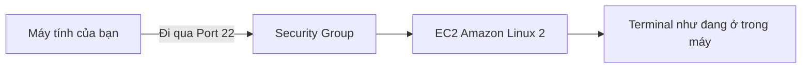

# 💻 Thực hành SSH vào EC2 từ Linux hoặc Mac — từng bước và cách sửa lỗi

> Nguồn: `039-How-to-SSH-using-Linux-or-Mac.txt` · [Udemy](https://ua.udemy.com/course/aws-certified-cloud-practitioner-new/learn/lecture/20055710)

Đây là bài thực hành quan trọng: chúng ta sẽ **SSH vào EC2 instance** từ máy **Linux hoặc Mac**. Nếu bạn từng thắc mắc *"SSH là cái quái gì vậy?"* — thì đơn giản nó là cách **điều khiển một máy từ xa** hoàn toàn bằng **terminal/dòng lệnh** của bạn. *Cứ làm theo từng bước, gặp lỗi cũng không sao — mình sẽ chỉ luôn cách sửa.*

---

### 🎯 SSH hoạt động thế nào?

Chúng ta có một **EC2 machine** chạy **Amazon Linux 2** với một **public IP**. Trên security group, chúng ta đã mở **Port 22 (SSH)**.

Khi bạn chạy lệnh SSH từ laptop, kết nối sẽ đi qua internet vào **Port 22** để tới EC2 machine. Kết quả: **command line của bạn hoạt động y như thể bạn đang ngồi bên trong chính máy đó**.



---

### 🧹 Chuẩn bị file key đúng cách

1. Nhớ file **PEM** đã tải về — tên gốc là **EC2 Tutorial.pem**.
2. **Đổi tên để bỏ khoảng trắng** (áp dụng cả với file PPK): thành **EC2Tutorial.pem**.
3. Đặt file vào một thư mục bạn thích — mình để trong thư mục **aws-course**.
4. Trên console, mở instance và **copy public IPv4 address** — sẽ dùng ở bước sau.
5. Kiểm tra bảo mật của instance: security group phải có rule **Port 22 (SSH) từ `0.0.0.0/0`**. Nếu thiếu, bấm vào security group và **thêm rule**.

---

### 💻 Chạy SSH và xử lý hai lỗi thường gặp

Đầu tiên, thử lệnh SSH cơ bản:

```bash
ssh ec2-user@<public-ip>
```

Lý do dùng user **`ec2-user`**: AMI **Amazon Linux 2** đã tạo sẵn một user tên như vậy. Phần `@` nghĩa là "truy cập user này trên server", theo sau là **public IP** của instance.

Lần này bạn sẽ gặp lỗi **"too many authentication failures"** — hợp lý thôi, vì ta **chưa chỉ định key**. Để sửa, bạn cần đứng **đúng thư mục chứa file key**. Kiểm tra nhanh bằng vài lệnh quen thuộc:

```bash
ls
pwd
cd ..
cd aws-course
```

*`ls` liệt kê file, `pwd` cho biết bạn đang ở đâu, `cd` để di chuyển thư mục. Nếu bạn chưa quen Linux, đừng lo — chỉ cần làm đúng như vậy.*

Khi đã ở đúng thư mục (nhìn thấy `EC2Tutorial.pem` trong `ls`), chạy lệnh đầy đủ:

```bash
ssh -i EC2Tutorial.pem ec2-user@<public-ip>
```

Lần này có thể bạn gặp lỗi **"unprotected key file"** — cần đổi quyền cho file key:

```bash
chmod 0400 EC2Tutorial.pem
```

Thử lại lệnh SSH — và bạn đã **đăng nhập thành công**! Nếu màn hình hỏi **yes/no** để tin tưởng instance, cứ nhập **yes**.

---

### 🧪 Bên trong instance và cách thoát

Sau khi vào được, prompt sẽ hiển thị `ec2-user` tại địa chỉ IP — nghĩa là mọi lệnh bạn gõ từ giờ đều chạy **trực tiếp trên EC2 instance Amazon Linux 2**. Thử vài lệnh:

```bash
whoami
ping google.com
```

`whoami` trả về `ec2-user`; `ping google.com` cho thấy Google phản hồi. Nhấn **Control + C** để dừng lệnh ping.

Để thoát khỏi instance, bạn gõ:

```bash
exit
```

hoặc nhấn **Control + D** để đóng kết nối.

Lưu ý quan trọng nếu muốn quay lại sau này:

```bash
ssh -i EC2Tutorial.pem ec2-user@<public-ip>
```

Hãy đảm bảo bạn đang ở **đúng thư mục chứa key**. Và nhớ rằng nếu **stop rồi start instance**, **public IP có thể thay đổi** — nhớ cập nhật lại IP trong lệnh.

---

Vậy là bạn đã biết SSH từ A đến Z trên Linux/Mac, kể cả hai lỗi "kinh điển" và cách khắc phục. *Nếu một lệnh chưa chạy được, cứ bình tĩnh kiểm tra lại thư mục, tên file và security group — bạn sẽ làm được.*

Hẹn gặp các bạn ở bài thực hành tiếp theo! 🚀
