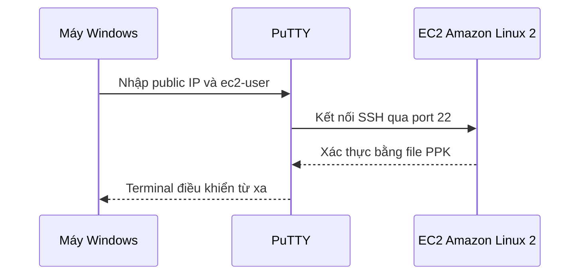

# 🖥️ SSH vào EC2 từ Windows với PuTTY (Hướng dẫn từng bước)

> Nguồn: `040-How-to-SSH-using-Windows.txt` · [Udemy](https://ua.udemy.com/course/aws-certified-cloud-practitioner-new/learn/lecture/20055720)

Sau khi đã hiểu SSH là gì, hôm nay chúng ta sẽ **thực hành SSH vào EC2 Instance bằng Windows**. Nếu bạn đang dùng Windows 7, Windows 8 hay bản Windows cũ hơn thì bài này chính là dành cho bạn — còn Windows 10 sẽ có cách khác ở bài sau, nhưng kỹ thuật này vẫn dùng được.

*Đừng lo nếu bạn chưa từng dùng PuTTY bao giờ* — lần đầu sẽ hơi rối một chút, nhưng làm theo từng bước là được ngay.

---

### 🎯 SSH là gì và bối cảnh bài học

SSH là một trong những chức năng quan trọng nhất khi làm việc với Amazon cloud: nó cho phép các bạn **điều khiển một máy từ xa hoàn toàn bằng command line (dòng lệnh)**.

Bối cảnh của chúng ta:

* EC2 machine đang chạy **Amazon Linux 2** và có **public IP**.
* Security group đã cho phép **SSH trên port 22** từ mọi IP.
* Máy Windows của các bạn kết nối qua internet trực tiếp vào máy đó để điều khiển bằng dòng lệnh.

Công cụ chúng ta dùng là **PuTTY** — một SSH client miễn phí cho Windows.

---

### 📥 Bước 1: Tải và cài PuTTY

1. Truy cập trang PuTTY và tải bản **64-bit installer** (file đầu tiên).
2. Chạy bộ cài, bấm **Next, Next, Yes** để cài đặt.
3. Hoàn tất: bạn sẽ có 2 ứng dụng là **PuTTY** và **PuTTYgen**.

---

### 🔑 Bước 2: Chuyển file PEM sang PPK bằng PuTTYgen

Nếu file key của các bạn chưa ở định dạng **PPK**, hãy mở **PuTTYgen** và làm như sau:

1. Bấm **Load** để tìm file key.
2. File `.pem` có thể không hiện ra — hãy chọn **show all files** ở góc dưới bên phải, rồi chọn `EC2tutorial.pem`.
3. Sau khi import thành công, bấm **Save private key** và xác nhận không đặt passphrase (nếu bạn không muốn).
4. Lưu file `EC2tutorial.PPK` ra desktop — vậy là bạn đã chuyển thành công từ PEM sang PPK.

Nếu bạn đã có sẵn file PPK thì bỏ qua bước này.

---

### ⚙️ Bước 3: Cấu hình PuTTY để kết nối

1. Mở **PuTTY**, nhập **public IPv4 address** của "My First Instance" vào ô host name, connection type là **SSH**.
2. Lưu session này dưới tên **EC2 Instance** và bấm **Save** — nhưng chưa xong đâu nhé.
3. Chỉ định key: vào **SSH → Auth**, chọn **Browse** tới file PPK vừa tạo (hoặc file PPK tải sẵn từ AWS console).
4. Quay lại tab **Session** và bấm **Save** lần nữa để lưu toàn bộ profile — lần sau không phải làm lại từ đầu.

Bấm **Open** và chấp nhận host key (**Yes**) vì ta tin tưởng host này. Lưu ý: lần đầu thử đăng nhập bằng "EC2 user" sẽ không xác thực được — các bạn cần sửa host name thành **`ec2-user@<public-IP>`** rồi lưu lại. `ec2-user` là user có sẵn trên Amazon Linux 2.

---

### ✅ Bước 4: Đăng nhập và kiểm tra

Thế là các bạn đã vào được **Amazon Linux 2 AMI** — SSH bằng PuTTY thành công! Giờ thử vài lệnh nhé:

* `whoami` → kết quả là `ec2-user`.
* `ping google.com` → bắt đầu ping; bấm **Ctrl + C** để dừng.
* Đóng cửa sổ để thoát session.

Mở lại PuTTY, **Load** profile EC2 Instance — các bạn sẽ thấy toàn bộ cài đặt ở trên và cả SSH Auth đã được lưu; bấm **Open** là vào thẳng instance.

*Trong khóa học, khi mình nói "SSH", nghĩa là các bạn hãy PuTTY vào instance ít nhất một lần.* Vậy là xong phần SSH trên Windows cổ điển. Ở bài tiếp theo, mình sẽ hướng dẫn cách SSH trên **Windows 10**. Hẹn gặp các bạn! 🚀
