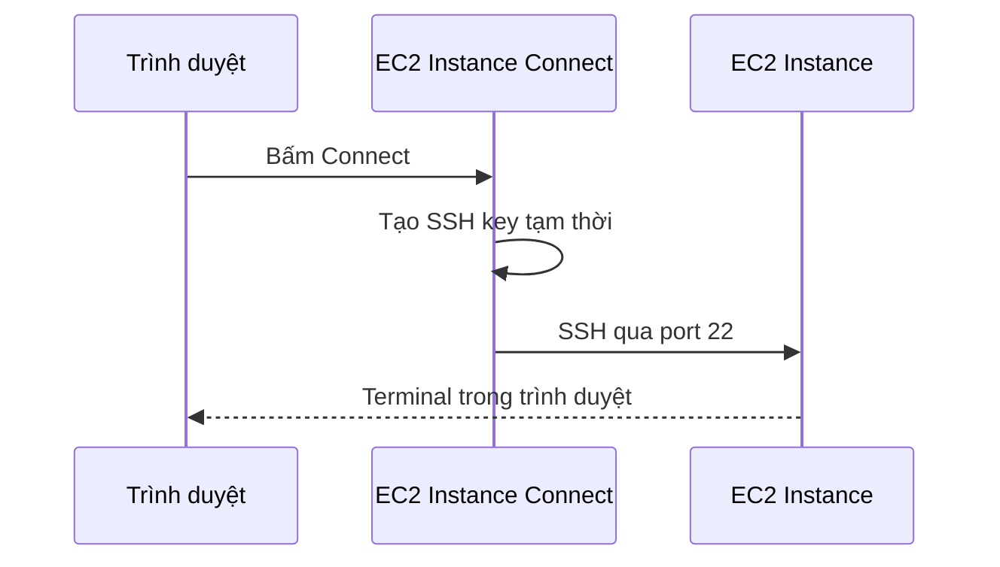

# 🌐 EC2 Instance Connect: SSH ngay trên trình duyệt (Không cần quản lý key)

> Nguồn: `042-EC2-Instance-Connect.txt` · [Udemy](https://ua.udemy.com/course/aws-certified-cloud-practitioner-new/learn/lecture/20244642)

Mình muốn giới thiệu một cách thay thế SSH mà mình thấy **dễ hơn rất nhiều**: **EC2 Instance Connect**. Thay vì cài đặt và cấu hình công cụ, các bạn chỉ cần trình duyệt là vào được máy.

---

### 🔍 EC2 Instance Connect là gì?

Từ EC2 console, chọn instance **My First Instance**, bấm nút **Connect** ở phía trên. AWS đưa ra nhiều lựa chọn, trong đó có **SSH client** như chúng ta đã học, nhưng công cụ mình muốn nói tới là **EC2 Instance Connect** — cho phép mở **phiên SSH ngay trong trình duyệt**.

---

### ⚙️ Kết nối không cần SSH key

Trong hộp thoại kết nối:

* **Public IP address** đã được xác minh — tốt.
* **Username** mặc định là `ec2-user`, vì AWS tự đoán đúng hệ điều hành Amazon Linux; các bạn có thể đổi, nhưng *sẽ không hoạt động nếu không phải `ec2-user`*.
* **Không có ô chọn SSH key** — vì khi bấm kết nối, EC2 Instance Connect sẽ **tự upload một SSH key tạm thời** và thiết lập kết nối. Nhờ vậy chúng ta **không cần quản lý key**, rất tiện.

Bấm **Connect** → một tab mới mở ra, và chỉ vài giây sau các bạn đã ở trong **Amazon Linux 2 AMI**, chạy lệnh thoải mái như `whoami` hay `ping google.com`.

---

### 🔓 Một điều kiện bắt buộc: port 22 phải mở

EC2 Instance Connect vẫn dựa trên SSH ở bên dưới. Mình đã thử xóa rule SSH inbound khỏi security group, và kết quả là **không kết nối được**.

Cách khắc phục:

1. Quay lại launch wizard/security group, **sửa inbound rule**.
2. Thêm lại rule **SSH from anywhere (IPv4)** và save.
3. Nếu vẫn không được, **đôi khi là do bạn đang dùng IPv6** — hãy thêm cả **from anywhere IPv6** nữa. Tùy thiết lập, bạn cần cả 2 entry để Instance Connect hoạt động.

Sau khi thêm rule, bấm connect lại — và các bạn đã vào được instance.

---

### 💡 Dùng cách nào cũng được

Điểm mấu chốt: trong khóa học, nếu mình nói "hãy SSH", các bạn có thể chọn bất kỳ cách nào:

* Terminal riêng của bạn (Linux/Mac).
* **PuTTY** trên Windows.
* Lệnh `ssh` trên Windows 10.
* Hoặc **EC2 Instance Connect** — bất kể bạn dùng Windows, Linux hay Mac.

Cá nhân mình sẽ dùng Instance Connect rất nhiều trong khóa học vì sự tiện lợi của nó. Hẹn gặp các bạn ở bài giảng tiếp theo! 🚀
