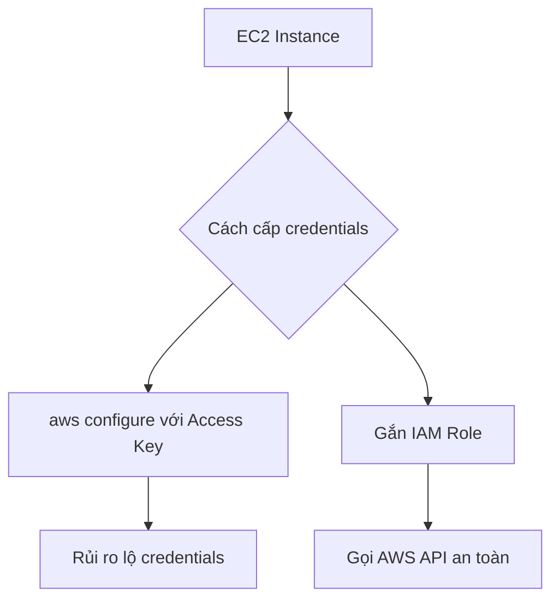

# 🔐 Thực hành IAM Roles cho EC2 Instance (Đừng bao giờ chạy aws configure!)

> Nguồn: `043-EC2-Instance-Roles-Demo.txt` · [Udemy](https://ua.udemy.com/course/aws-certified-cloud-practitioner-new/learn/lecture/20055746)

Bài này chúng ta sẽ **thực hành gắn IAM role (vai trò IAM) cho EC2 Instance** — một trong những kiến thức quan trọng nhất của chương EC2. Mình kết nối bằng EC2 Instance Connect cho nhanh, nhưng dùng SSH hay PuTTY cũng ra kết quả như nhau.

---

### 🖥️ Kết nối vào Instance

Sau khi kết nối, các bạn sẽ thấy prompt dạng `ec2-user@<private-ip>`. *Dù bạn dùng Instance Connect, SSH terminal hay PuTTY, thấy dòng này là chúng ta đang ở cùng một điểm xuất phát.*

Giờ có thể chạy vài lệnh Linux quen thuộc:

* `ping google.com` → nhận thông tin từ Google; bấm **Ctrl + C** để dừng.
* `clear` → xóa màn hình.

*Bạn không cần biết các lệnh Linux này cho kỳ thi* — đây chỉ là một terminal Linux đang chạy trên cloud mà thôi.

---

### ⚠️ Tại sao KHÔNG nên chạy `aws configure`?

AMI Amazon Linux chúng ta đang dùng **đã cài sẵn AWS CLI**, nên thử ngay:

```bash
aws iam list users
```

Kết quả: *"Unable to locate credentials... you can configure credentials by using aws configure"*. Về mặt kỹ thuật, chúng ta **có thể** chạy `aws configure` để nhập Access Key ID, Secret Access Key và region — nhưng đó là **một ý tưởng cực kỳ tồi tệ**:

* Khi bạn nhập thông tin cá nhân lên EC2 Instance, **bất kỳ ai khác trong tài khoản** cũng có thể kết nối vào instance đó (ví dụ bằng EC2 Instance Connect) và **lấy lại toàn bộ credentials** của bạn.

Nguyên tắc vàng: **đừng bao giờ nhập Access Key ID và Secret Access Key vào một EC2 Instance**. Nếu bạn thấy ai đó làm vậy, hãy chỉ họ xem bài này!

---

### 🔑 Cách đúng: gắn IAM Role vào Instance

Nhớ lại bài IAM trước: chúng ta đã tạo sẵn role **DemoRoleForEC2** với policy **IAMReadOnlyAccess**. Giờ gắn nó vào instance:

1. Vào tab **Actions → Security → Modify IAM role**.
2. Chọn **DemoRoleForEC2** và bấm **Save**.
3. Kiểm tra lại tab **Security** → thấy IAM role đã gắn vào instance.

Bây giờ chạy lại `aws iam list users` — **không cần `aws configure`**, lệnh trả về danh sách user từ IAM ngay.

---

### 🧪 Chứng minh role thực sự gắn với Instance

Để kiểm chứng, mình vào role và **detach permission** → chạy lại lệnh → nhận **access denied**. Rõ ràng role đã gắn chặt với EC2 Instance.

Khi **gắn lại policy IAMReadOnlyAccess**, lần chạy đầu có thể vẫn bị *access denied* — vì **thay đổi từ IAM đôi khi cần chút thời gian để propagate (lan truyền)**. Chạy lại lần nữa là có kết quả như mong đợi.



---

### 🎯 Tự kiểm tra nhanh

**Câu 1:** Tại sao không nên chạy `aws configure` trên EC2 Instance?

<details>
<summary><b>Xem đáp án</b></summary>

**Đáp án:** Vì bất kỳ ai trong tài khoản cũng có thể kết nối vào instance và lấy cắp credentials.

Giải thích: Credentials nằm ngay trên instance — không bao giờ nhập Access Key vào EC2.

Tham chiếu: Mục Tại sao KHÔNG nên chạy aws configure.

</details>

**Câu 2:** Cách đúng để cấp quyền AWS cho EC2 Instance là gì?

<details>
<summary><b>Xem đáp án</b></summary>

**Đáp án:** Gắn IAM role cho instance.

Giải thích: Chỉ cấp credentials cho EC2 thông qua IAM roles.

Tham chiếu: Mục Cách đúng gắn IAM Role vào Instance.

</details>

**Câu 3:** Policy nào được gắn trong role DemoRoleForEC2 của bài demo?

<details>
<summary><b>Xem đáp án</b></summary>

**Đáp án:** IAMReadOnlyAccess.

Giải thích: Nhờ policy này, instance gọi được `aws iam list users`.

Tham chiếu: Mục Cách đúng gắn IAM Role vào Instance.

</details>

**Câu 4:** Thao tác gắn IAM role trên console nằm ở đâu?

<details>
<summary><b>Xem đáp án</b></summary>

**Đáp án:** Actions → Security → Modify IAM role.

Giải thích: Chọn role DemoRoleForEC2 rồi Save.

Tham chiếu: Mục Cách đúng gắn IAM Role vào Instance.

</details>

**Câu 5:** Khi detach policy khỏi role rồi chạy lại lệnh, kết quả là gì?

<details>
<summary><b>Xem đáp án</b></summary>

**Đáp án:** Access denied.

Giải thích: Điều này chứng minh role thực sự gắn với instance. Khi gắn lại policy, có thể cần chờ một chút để thay đổi lan truyền.

Tham chiếu: Mục Chứng minh role thực sự gắn với Instance.

</details>

---

Vậy là các bạn đã nắm được nguyên tắc quan trọng bậc nhất: **EC2 Instance nhận quyền AWS chỉ thông qua IAM roles**. Đây là kiến thức chắc chắn xuất hiện trong đề thi, nên đừng bỏ qua nhé. Hẹn gặp các bạn ở bài tiếp theo! 🚀
