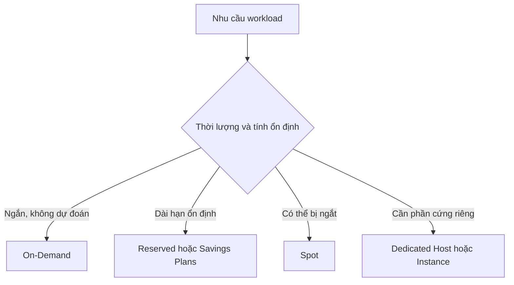

# 💰 Các tùy chọn mua EC2: On-Demand, Reserved, Savings Plans, Spot và hơn thế

> Nguồn: `044-EC2-Instance-Purchasing-Options.txt` · [Udemy](https://ua.udemy.com/course/aws-certified-cloud-practitioner-new/learn/lecture/20055756)

Đây là một trong những bài **quan trọng nhất của chương EC2** và chắc chắn xuất hiện trong đề thi: làm sao chọn đúng **purchasing option (tùy chọn mua)** cho từng loại workload. Mình sẽ đi qua từng loại, kèm ví dụ và bảng so sánh ở cuối bài.

*Đừng lo nếu bạn thấy nhiều loại quá — mình sẽ đào sâu từng loại trong các bài sau.*

---

### 🧭 Tổng quan các tùy chọn

Tới giờ chúng ta dùng **On-Demand**: chạy instance theo nhu cầu, hợp với workload ngắn, giá dự đoán được, trả tiền theo giây. Nhưng với các workload khác, các bạn có thể tối ưu chi phí bằng cách chọn đúng loại:

* **Reserved Instances** — kỳ hạn 1 hoặc 3 năm, dành cho **workload dài hạn** (ví dụ database chạy lâu dài). Có bản **Convertible** cho phép đổi instance type linh hoạt.
* **Savings Plans** — kỳ hạn 1 hoặc 3 năm, hiện đại hơn: bạn **cam kết một số tiền sử dụng** thay vì một instance type cụ thể.
* **Spot Instances** — workload rất ngắn, cực rẻ nhưng có thể **mất instance bất kỳ lúc nào**.
* **Dedicated Host** — thuê nguyên một **máy chủ vật lý**, kiểm soát placement.
* **Dedicated Instances** — phần cứng không chia sẻ với khách hàng khác.
* **Capacity Reservations** — giữ chỗ capacity ở một **AZ (Availability Zone)** cụ thể.

---

### 💵 Chi tiết từng tùy chọn

**1. On-Demand:** trả tiền cho những gì bạn dùng. Linux/Windows tính **theo giây sau phút đầu tiên**; các OS khác tính **theo giờ**. Chi phí cao nhất nhưng **không trả trước, không cam kết dài hạn** → hợp với workload ngắn hạn, không gián đoạn và không dự đoán được hành vi.

**2. Reserved Instances:** giảm tới **72%** so với On-Demand. Bạn reserve các thuộc tính cụ thể: instance type, region, tenancy, OS; kỳ hạn 1–3 năm; trả **no upfront / partial upfront / all upfront** (all upfront giảm nhiều nhất). Scope có thể là region hoặc AZ. Dùng cho **steady-state usage**, ví dụ database. Có thể **mua bán lại reserved instances trên marketplace**. Bản **Convertible** cho phép đổi instance type, instance family, OS, scope, tenancy — linh hoạt hơn nên giảm ít hơn: tối đa **66%**.

**3. Savings Plans:** giảm giá dựa trên sử dụng dài hạn — **tương đương reserved (70%)**. Bạn cam kết kiểu *"tôi sẽ chi 10 USD/giờ trong 1, 2, 3 năm tới"*; phần dùng vượt cam kết tính theo giá On-Demand. Bạn **bị khóa vào một instance family và region** (ví dụ M5 ở us-east-1) nhưng **linh hoạt về instance size** (m5.xlarge, m5.2xlarge...), **OS** (Linux, Windows...) và **tenancy** (host, dedicated, default).

**4. Spot Instances:** mức giảm **hấp dẫn nhất — tới 90%**. Bạn đặt **max price** muốn trả; nếu giá spot vượt qua mức đó, bạn **mất instance**. Đây là loại tiết kiệm nhất và phù hợp với workload **chịu được lỗi**: batch jobs, data analysis, image processing, workload phân tán hoặc có thời gian bắt đầu/kết thúc linh hoạt. **KHÔNG dùng cho job quan trọng hay database** — đề thi sẽ hỏi điểm này.

**5. Dedicated Host:** nguyên một **máy chủ vật lý** dành riêng cho bạn. Dùng khi có yêu cầu **compliance** hoặc cần dùng **license phần mềm gắn với máy chủ** (tính theo per-socket, per-core, per-VM). Trả theo On-Demand (per giây) hoặc reserve 1–3 năm. Đây là **lựa chọn đắt nhất** của AWS. Use case: **bring your own license (BYOL)** hoặc công ty có nhu cầu regulatory/compliance mạnh.

**6. Dedicated Instances:** instance chạy trên phần cứng dành riêng cho bạn — nhưng **khác Dedicated Host ở chỗ** bạn có thể chia sẻ phần cứng với các instance khác trong cùng tài khoản và **không kiểm soát được instance placement**. Đề thi hiếm khi đánh lừa giữa hai loại này, nhưng hãy nhớ: Dedicated Instance = instance riêng trên phần cứng riêng; Dedicated Host = truy cập cả máy chủ vật lý, nhìn thấy hạ tầng cấp thấp hơn.

**7. Capacity Reservations:** giữ capacity cho On-Demand instances ở một AZ cụ thể, **không cam kết thời gian**, có thể hủy bất cứ lúc nào, **không có giảm giá** (mục đích duy nhất là giữ chỗ). Bạn bị tính theo **giá On-Demand dù có chạy instance hay không**. Muốn giảm giá thì kết hợp với **regional reserved instances** hoặc **savings plan**. Hợp với workload ngắn hạn, không gián đoạn cần nằm ở một AZ cụ thể.

---

### 🏨 Ví dụ khu resort cho dễ nhớ

* **On-Demand:** bạn đến resort bất cứ lúc nào, ở bao lâu cũng được — trả **giá đầy đủ**.
* **Reserved:** bạn biết mình sẽ ở rất lâu (1–3 năm) nên **đặt trước và được giảm giá**.
* **Savings Plans:** bạn cam kết chi một số tiền cố định mỗi tháng (ví dụ 300 USD/tháng trong 12 tháng), đổi loại phòng thoải mái (king, suite, sea view...).
* **Spot:** phòng trống giảm giá phút chót, mọi người **đấu giá** — rất rẻ, nhưng bạn có thể **bị đuổi bất cứ lúc nào** nếu có người trả cao hơn.
* **Dedicated Host:** bạn **đặt nguyên cả tòa nhà** của resort.
* **Capacity Reservation:** bạn **đặt giữ một phòng** — dù không ở vẫn mất tiền, nhưng chắc chắn có phòng khi cần.

---

### 📊 Bảng so sánh nhanh

| Tùy chọn | Cam kết | Giảm giá | Phù hợp với |
|---|---|---|---|
| On-Demand | Không | Mức giá gốc | Workload ngắn, không dự đoán |
| Reserved | 1–3 năm | Tới 72% | Ứng dụng steady-state, database |
| Convertible Reserved | 1–3 năm | Tới 66% | Cần đổi cấu hình linh hoạt |
| Savings Plans | 1–3 năm | Tương đương reserved | Dài hạn, linh hoạt size/OS/tenancy |
| Spot | Không | Tới 90% | Batch, phân tích, chịu lỗi |
| Dedicated Host | On-Demand hoặc 1–3 năm | Đắt nhất, reserve tới 70% | Compliance, BYOL |
| Capacity Reservation | Không | Không giảm giá | Giữ chỗ ở AZ cụ thể |

Trong ví dụ so sánh giá của mình với **m4.large ở us-east-1**: On-Demand là **10 cent**; Spot trong ví dụ rẻ hơn tới **61%**; reserved có nhiều mức giá tùy 1 hay 3 năm, trả trước hay không; savings plan tương đương reserved; dedicated host theo giá On-Demand còn **dedicated host reservation giảm tới 70%**; capacity reservation vẫn tính giá On-Demand.

*Các con số này có thể thay đổi theo thời gian, nhưng chúng cho bạn hình dung rõ về mức chênh lệch.*

---

### 🎯 Tự kiểm tra nhanh

**Câu 1:** Loại instance nào có mức giảm tới 90% và có thể bị mất bất cứ lúc nào?

<b>Xem đáp án</b>

**Đáp án:** Spot Instances.

Giải thích: Bạn đặt max price; nếu giá spot vượt mức đó, instance bị thu hồi.

Tham chiếu: Mục Chi tiết từng tùy chọn.

**Câu 2:** Ứng dụng database chạy dài hạn, ổn định nên dùng tùy chọn nào?

<b>Xem đáp án</b>

**Đáp án:** Reserved Instances (hoặc Savings Plans).

Giải thích: Reserved dành cho steady-state usage như database.

Tham chiếu: Mục Chi tiết từng tùy chọn.

**Câu 3:** Convertible Reserved khác Reserved thường ở điểm nào?

<b>Xem đáp án</b>

**Đáp án:** Cho phép đổi instance type, family, OS, scope, tenancy — nhưng giảm ít hơn (tối đa 66% so với 72%).

Giải thích: Linh hoạt hơn thì mức giảm thấp hơn.

Tham chiếu: Mục Chi tiết từng tùy chọn.

**Câu 4:** Capacity Reservation có mang lại giảm giá không?

<b>Xem đáp án</b>

**Đáp án:** Không. Bạn bị tính giá On-Demand dù có chạy instance hay không.

Giải thích: Mục đích duy nhất là giữ capacity; muốn giảm giá phải kết hợp regional reserved instances hoặc savings plan.

Tham chiếu: Mục Chi tiết từng tùy chọn.

**Câu 5:** Khi nào nên dùng Dedicated Host?

<b>Xem đáp án</b>

**Đáp án:** Khi có yêu cầu compliance hoặc cần dùng license phần mềm gắn với máy chủ (per-socket, per-core, per-VM).

Giải thích: Đây là lựa chọn đắt nhất vì bạn thuê nguyên máy chủ vật lý.

Tham chiếu: Mục Chi tiết từng tùy chọn.

---

Vậy là các bạn đã có đủ "vũ khí" để chọn đúng tùy chọn mua EC2 theo workload — đề thi luôn yêu cầu kiểu câu hỏi này, và *đừng lo, chúng ta sẽ luyện tập thêm trong các bài sau*. Hẹn gặp các bạn ở bài tiếp theo! 🚀
