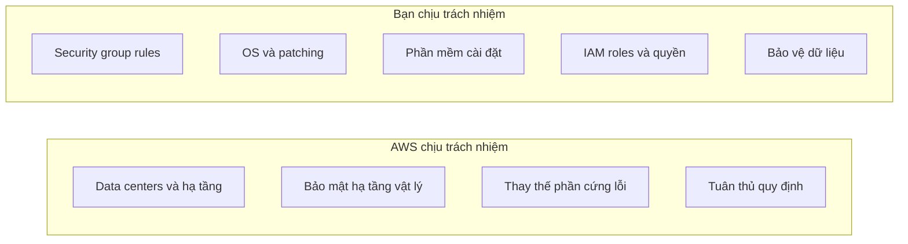

# 🛡️ Mô hình trách nhiệm chung khi dùng EC2: AWS lo gì, bạn lo gì?

> Nguồn: `045-Shared-Responsibility-Model-for-EC2.txt` · [Udemy](https://ua.udemy.com/course/aws-certified-cloud-practitioner-new/learn/lecture/20055758)

Nhắc lại một chút về **Shared Responsibility Model (Mô hình trách nhiệm chung)** — lần này áp dụng cụ thể cho **EC2**. Chỉ cần nhớ một câu: **AWS chịu trách nhiệm bảo mật "của" cloud, còn bạn chịu trách nhiệm bảo mật "trong" cloud**.

---

### ☁️ AWS chịu trách nhiệm những gì?

* Toàn bộ **data centers (trung tâm dữ liệu)**, hạ tầng và việc bảo mật chúng.
* Đảm bảo **cách ly trên physical host (máy chủ vật lý)** — ví dụ khi bạn dùng dedicated host.
* **Thay thế phần cứng lỗi** nếu một server của họ gặp sự cố.
* Đảm bảo **tuân thủ các quy định (compliance)** mà họ đã cam kết.

---

### 🔐 Bạn chịu trách nhiệm những gì?

* **Security group rules** — chính bạn định nghĩa ai được truy cập EC2 instance của mình.
* **Toàn bộ máy ảo** bên trong EC2 instance: hệ điều hành Windows/Linux, mọi **bản vá và cập nhật (patches and updates)** — bạn làm, không phải AWS. AWS chỉ đưa bạn máy ảo, phần còn lại là của bạn.
* **Phần mềm và tiện ích** cài trên instance.
* **Gắn IAM roles đúng cách** và đảm bảo permissions chính xác.
* **Bảo vệ dữ liệu** trên instance của bạn.

---

### 🎯 Tự kiểm tra nhanh

**Câu 1:** Với EC2, ai chịu trách nhiệm vá và cập nhật hệ điều hành?

<b>Xem đáp án</b>

**Đáp án:** Bạn — người dùng.

Giải thích: Bạn sở hữu toàn bộ máy ảo bên trong EC2 instance; AWS chỉ cung cấp máy ảo.

Tham chiếu: Mục Bạn chịu trách nhiệm những gì.

**Câu 2:** Ai chịu trách nhiệm thay thế phần cứng lỗi của AWS?

<b>Xem đáp án</b>

**Đáp án:** AWS.

Giải thích: Đây là trách nhiệm về hạ tầng vật lý của AWS.

Tham chiếu: Mục AWS chịu trách nhiệm những gì.

**Câu 3:** Security group rules do ai định nghĩa?

<b>Xem đáp án</b>

**Đáp án:** Bạn.

Giải thích: Bạn quyết định ai được truy cập EC2 instance của mình.

Tham chiếu: Mục Bạn chịu trách nhiệm những gì.

**Câu 4:** Việc gắn IAM roles đúng cách và đảm bảo permissions chính xác thuộc trách nhiệm của ai?

<b>Xem đáp án</b>

**Đáp án:** Bạn.

Giải thích: Cùng với phần mềm cài đặt và dữ liệu trên instance, đây là trách nhiệm của người dùng.

Tham chiếu: Mục Bạn chịu trách nhiệm những gì.

**Câu 5:** AWS đảm bảo điều gì liên quan tới physical host?

<b>Xem đáp án</b>

**Đáp án:** Cách ly (isolation) trên máy chủ vật lý — ví dụ khi bạn dùng dedicated host.

Giải thích: AWS chịu trách nhiệm hạ tầng, data centers và bảo mật vật lý.

Tham chiếu: Mục AWS chịu trách nhiệm những gì.

---

Chỉ cần phân biệt rõ hai nửa trách nhiệm này là các bạn đã nắm chắc một chủ đề **rất hay xuất hiện trong đề thi**. Hẹn gặp các bạn ở bài tiếp theo! 🚀
