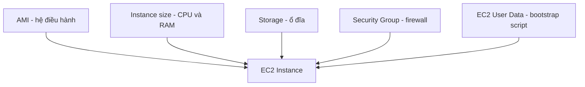

# 🗺️ Tóm tắt EC2: Tất cả kiến thức cần nhớ trước khi thi

> Nguồn: `046-EC2-Summary.txt` · [Udemy](https://ua.udemy.com/course/aws-certified-cloud-practitioner-new/learn/lecture/20260612)

Chúng ta đã đi hết chương EC2 rồi! Bài này mình sẽ **tóm tắt lại toàn bộ** để các bạn có một "tấm bản đồ" trong đầu trước khi bước sang chương tiếp theo. *Đây cũng là những kiến thức hay xuất hiện trong đề thi nhất.*

---

### 🧱 Một EC2 Instance gồm những gì?

1. **AMI (Amazon Machine Image)** — định nghĩa hệ điều hành.
2. **Instance size** — quyết định CPU và RAM.
3. **Storage** — mô tả ổ đĩa cho instance.
4. **Security groups** — "tường lửa" của instance.
5. **EC2 User Data** — bootstrap script chạy khi instance khởi động.

---

### 🔐 Security Groups, User Data, SSH và Instance Role

* **Security groups** gắn với EC2 instance và là **firewall nằm ngoài instance**; bạn định nghĩa rule cho phép **port nào, IP nào** truy cập instance.
* **EC2 User Data** là script chạy ở **lần khởi động đầu tiên**; trong bài thực hành chúng ta dùng nó để biến instance thành web server và chào "Hello, world".
* **SSH** là cách mở terminal từ máy tính của bạn vào EC2 instance để gõ lệnh — qua **port 22**.
* **EC2 Instance Role** — sau khi SSH vào, chúng ta gắn role tương tự IAM role để instance gọi lệnh tới **IAM**.

---

### 💰 Purchasing options phải nhớ cho đề thi

* **On-Demand**
* **Spot Instances**
* **Reserved Instances** — bản **Standard** hoặc **Convertible**
* **Dedicated Host**
* **Dedicated Instance**

---

### 🎯 Tự kiểm tra nhanh

**Câu 1:** AMI định nghĩa điều gì?

<b>Xem đáp án</b>

**Đáp án:** Hệ điều hành.

Giải thích: AMI là thành phần đầu tiên cấu thành nên EC2 instance.

Tham chiếu: Mục Một EC2 Instance gồm những gì.

**Câu 2:** Instance size quyết định điều gì?

<b>Xem đáp án</b>

**Đáp án:** CPU và RAM.

Giải thích: Bạn chọn size tùy theo nhu cầu tính toán.

Tham chiếu: Mục Một EC2 Instance gồm những gì.

**Câu 3:** Security group được mô tả là gì?

<b>Xem đáp án</b>

**Đáp án:** Firewall nằm ngoài instance, cho phép cấu hình port và IP được truy cập.

Giải thích: Security group gắn trực tiếp với EC2 instance.

Tham chiếu: Mục Security Groups, User Data, SSH và Instance Role.

**Câu 4:** EC2 User Data chạy khi nào?

<b>Xem đáp án</b>

**Đáp án:** Ở lần khởi động đầu tiên của instance.

Giải thích: Trong bài thực hành, script này biến instance thành web server chào "Hello, world".

Tham chiếu: Mục Security Groups, User Data, SSH và Instance Role.

**Câu 5:** Kể tên các purchasing option cần nhớ cho đề thi.

<b>Xem đáp án</b>

**Đáp án:** On-Demand, Spot, Reserved (Standard hoặc Convertible), Dedicated Host, Dedicated Instance.

Giải thích: Đây là danh sách mình cần nắm chắc khi vào phòng thi.

Tham chiếu: Mục Purchasing options phải nhớ cho đề thi.

---

Vậy là chương EC2 đã khép lại với một nền tảng rất vững: từ AMI, instance size, storage, security group, user data đến SSH và purchasing options. *Các bạn cứ ôn lại bản tóm tắt này vài lần là nhớ lâu thôi.* Hẹn gặp các bạn ở chương tiếp theo! 🚀
