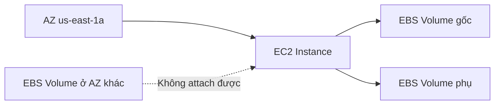

# 📦 EBS Volume: Ổ đĩa mạng không thể thiếu của EC2

> Nguồn: `047-EBS-Overview.txt` · [Udemy](https://ua.udemy.com/course/aws-certified-cloud-practitioner-new/learn/lecture/20055762)

Chào mừng các bạn đến với section mới về **các lựa chọn lưu trữ cho EC2 instance**. Mở màn là dịch vụ quan trọng nhất: **EBS volume**. *Đừng lo nếu bạn thấy khái niệm này mới* — thật ra chúng ta đã dùng EBS suốt khóa học mà không hề biết đấy!

---

### 🧱 EBS Volume là gì?

**EBS (Elastic Block Store)** là một **network drive (ổ đĩa mạng)** mà các bạn có thể gắn vào instance trong lúc instance đang chạy.

* EBS cho phép **dữ liệu tồn tại ngay cả sau khi instance bị terminate** — đó chính là mục đích của nó.
* Bạn có thể tạo lại instance mới và **mount lại đúng EBS volume cũ**, dữ liệu sẽ quay về nguyên vẹn.
* Hãy nghĩ về EBS như một **network USB stick**: bạn rút từ máy này "cắm" sang máy khác qua network, không cần thao tác vật lý.
* Ở cấp độ CCP, một EBS volume **chỉ gắn được vào một instance tại một thời điểm**, nhưng một instance có thể có **nhiều EBS volume** — như cắm hai chiếc USB vào cùng một máy.

---

### 🗺️ EBS bị khóa vào một Availability Zone

Mỗi EBS volume khi tạo ra sẽ **gắn chặt với một Availability Zone (AZ — vùng sẵn sàng) cụ thể**.

* Volume tạo ở AZ này **không thể attach** vào instance ở AZ khác.
* Muốn có volume ở AZ khác, bạn phải **tạo riêng ở AZ đó** — giống hệt cách EC2 instance bị ràng buộc với AZ.
* Cách "di chuyển" volume xuyên AZ là dùng **snapshot** — mình sẽ nói chi tiết ở bài sau.

---

### ⚡ Network drive: linh hoạt nhưng có độ trễ

Vì EBS hoạt động qua network nên **có thể có một chút latency (độ trễ)** khi instance giao tiếp với volume. Đổi lại, bạn nhận được sự linh hoạt cực lớn:

* **Detach** volume khỏi instance này và **attach** sang instance khác rất nhanh — cực hữu ích khi cần **failover (chuyển đổi dự phòng)**.
* Có thể tạo EBS volume và **để trống, chưa gắn vào đâu**, rồi attach khi cần.
* Phải **provision (cấp phát) dung lượng trước**: bao nhiêu GB và bao nhiêu **IOPS (Input/Output Operations Per Second — số thao tác đọc ghi mỗi giây)**.
* Bạn bị **tính phí theo dung lượng đã provision**, và có thể **tăng dần** khi cần thêm dung lượng hoặc hiệu năng.

---

### ⚠️ Delete on Termination — bẫy thi hay gặp

Thuộc tính **delete on termination (xóa volume khi instance bị chấm dứt)** **có thể xuất hiện trong đề thi**, nên các bạn chú ý nhé:

| Volume | Delete on Termination mặc định | Sau khi terminate instance |
|---|---|---|
| Root volume | Bật (yes) | Bị xóa |
| EBS volume gắn thêm | Tắt (no) | Được giữ lại |

* Khi tạo EC2 instance, bạn sẽ thấy cột **delete on termination** trong bảng cấu hình storage.
* Bạn có thể **bật/tắt tùy ý** cho từng volume trong console.

**Use case thực tế:** muốn giữ root volume sau khi terminate (ví dụ để lưu dữ liệu), hãy **tắt delete on termination cho root volume** — thế là xong. Đây là dạng tình huống rất dễ gặp trong đề đấy!

---

### 🎯 Tự kiểm tra nhanh

**Câu 1:** EBS là viết tắt của gì?

<b>Xem đáp án</b>

**Đáp án:** Elastic Block Store.

Giải thích: Đây là network drive có thể gắn vào EC2 instance.

Tham chiếu: Mục EBS Volume là gì.

**Câu 2:** Một EBS volume gắn được vào bao nhiêu instance cùng lúc ở cấp CCP?

<b>Xem đáp án</b>

**Đáp án:** Một instance duy nhất.

Giải thích: Tuy nhiên một instance có thể gắn nhiều EBS volume.

Tham chiếu: Mục EBS Volume là gì.

**Câu 3:** Chuyện gì xảy ra nếu bạn tạo EBS volume ở một AZ khác với instance?

<b>Xem đáp án</b>

**Đáp án:** Không thể attach volume vào instance đó.

Giải thích: EBS volume bị khóa vào một AZ; muốn di chuyển phải dùng snapshot.

Tham chiếu: Mục EBS bị khóa vào một Availability Zone.

**Câu 4:** Mặc định, root volume có bị xóa khi terminate instance không?

<b>Xem đáp án</b>

**Đáp án:** Có — delete on termination được bật mặc định cho root volume.

Giải thích: Các EBS volume mới gắn thêm thì mặc định không bị xóa.

Tham chiếu: Mục Delete on Termination.

**Câu 5:** Bạn bị tính phí EBS dựa trên gì?

<b>Xem đáp án</b>

**Đáp án:** Dung lượng đã provision trước.

Giải thích: Bạn khai báo số GB và IOPS, và có thể tăng dần theo thời gian.

Tham chiếu: Mục Network drive.

---

Vậy là các bạn đã nắm được EBS volume — "trái tim" lưu trữ của EC2. *Nhớ kỹ hai điểm dễ vào đề: volume gắn với một AZ, và delete on termination bật mặc định cho root volume.*

Ở bài tiếp theo, chúng ta sẽ mở console và thực hành tạo, gắn, xóa EBS volume chỉ trong vài giây. Hẹn gặp các bạn ở đó! 🚀
