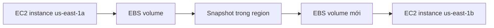

# 📸 EBS Snapshots: Sao lưu ổ đĩa và di chuyển xuyên vùng

> Nguồn: `049-EBS-Snapshots-Overview.txt` · [Udemy](https://ua.udemy.com/course/aws-certified-cloud-practitioner-new/learn/lecture/20055798)

Tiếp nối EBS volume, hôm nay chúng ta nói về **EBS Snapshots** — cách backup và di chuyển dữ liệu xuyên Availability Zone và region. *Đây là kỹ năng cực thực dụng, nhất là khi các bạn cần khôi phục dữ liệu hoặc mở rộng hệ thống ra toàn cầu.*

---

### 📸 Snapshot là gì?

**EBS snapshot** chính là một **bản backup của EBS volume**, và bạn có thể tạo bất cứ lúc nào.

* Snapshot lưu lại trạng thái của volume tại thời điểm chụp.
* Kể cả khi EBS volume sau này bị terminate, bạn vẫn có thể **restore lại từ snapshot**.
* Bạn **không bắt buộc phải detach volume** trước khi snapshot, nhưng **nên làm vậy** để đảm bảo volume "sạch" — dữ liệu toàn vẹn.
* Bạn có thể **stop EC2 instance trước** cho chắc, hoặc snapshot "nóng" ngay khi instance đang chạy — tùy cách bạn cấu hình ứng dụng của mình.

---

### 🌍 Copy snapshot xuyên AZ và region

Đây là công dụng "đắt giá" nhất của snapshot. Ví dụ mình muốn chuyển một EBS volume từ **us-east-1a** sang **us-east-1b**:

* Snapshot tồn tại tại **region của bạn**; từ snapshot, bạn **restore thành EBS volume mới ở AZ khác**.
* Sau đó attach volume mới vào instance ở AZ đích — vậy là đã "chuyển nhà" thành công cho volume.
* Bạn cũng có thể **copy snapshot sang region khác** để đưa dữ liệu đi xa hơn, **tận dụng hạ tầng toàn cầu của AWS**.

---

### 🗄️ Snapshot Archive — tiết kiệm tới 75%

**EBS Snapshot Archive** cho phép bạn chuyển snapshot sang một **storage tier mới gọi là archive tier**, với chi phí **rẻ hơn 75%**.

* Đổi lại, thời gian **restore từ archive mất từ 24 đến 72 giờ**.
* Vì vậy tính năng này dành cho những snapshot **không cần khôi phục gấp**, nhưng bạn vẫn muốn **tiết kiệm chi phí**.

---

### ♻️ Recycle Bin — lưới an toàn cho snapshot

Mặc định khi xóa snapshot là... mất luôn. Nhưng bạn có thể bật **Recycle Bin (thùng rác)**:

* Snapshot bị xóa sẽ được **chuyển vào recycle bin** thay vì biến mất.
* Bạn cấu hình **thời gian lưu giữ từ 1 ngày đến 1 năm**, sau đó snapshot mới thực sự bị xóa khỏi bin.
* Nhờ vậy, bạn được bảo vệ trước **việc xóa nhầm snapshot** — và có thể khôi phục khi cần.

---

### 🎯 Tự kiểm tra nhanh

**Câu 1:** EBS snapshot là gì?

<b>Xem đáp án</b>

**Đáp án:** Là bản backup của EBS volume, có thể tạo bất cứ lúc nào.

Giải thích: Snapshot lưu trạng thái volume tại thời điểm chụp và dùng để restore khi cần.

Tham chiếu: Mục Snapshot là gì.

**Câu 2:** Có bắt buộc detach volume trước khi tạo snapshot không?

<b>Xem đáp án</b>

**Đáp án:** Không bắt buộc, nhưng nên detach để volume "sạch".

Giải thích: Bạn có thể stop instance trước hoặc snapshot ngay khi instance đang chạy, tùy cách ứng dụng được lập trình.

Tham chiếu: Mục Snapshot là gì.

**Câu 3:** Snapshot giúp di chuyển EBS volume như thế nào?

<b>Xem đáp án</b>

**Đáp án:** Restore snapshot thành volume mới ở AZ khác, hoặc copy snapshot sang region khác.

Giải thích: Đây là cách vượt qua ràng buộc volume bị khóa theo AZ.

Tham chiếu: Mục Copy snapshot xuyên AZ và region.

**Câu 4:** Archive tier rẻ hơn bao nhiêu và restore mất bao lâu?

<b>Xem đáp án</b>

**Đáp án:** Rẻ hơn 75%; restore mất từ 24 đến 72 giờ.

Giải thích: Phù hợp với snapshot không cần khôi phục gấp, muốn tiết kiệm chi phí.

Tham chiếu: Mục Snapshot Archive.

**Câu 5:** Recycle Bin giữ snapshot đã xóa trong bao lâu?

<b>Xem đáp án</b>

**Đáp án:** Từ 1 ngày đến 1 năm.

Giải thích: Recycle Bin bảo vệ bạn khỏi việc xóa nhầm snapshot.

Tham chiếu: Mục Recycle Bin.

---

Vậy là các bạn đã hiểu **EBS Snapshots**: vừa là bản backup an toàn, vừa là "cầu nối" di chuyển volume giữa các AZ và region. *Nhớ con số 75% của archive tier và 24–72 giờ restore — đề thi rất thích những chi tiết này.*

Ở bài tiếp theo, chúng ta sẽ vào console thực hành tạo snapshot, copy xuyên region và khôi phục từ Recycle Bin. Hẹn gặp các bạn ở đó! 🚀
