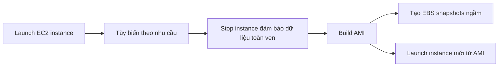

# 💿 AMI: Khuôn mẫu khởi tạo EC2 Instance

> Nguồn: `051-AMI-Overview.txt` · [Udemy](https://ua.udemy.com/course/aws-certified-cloud-practitioner-new/learn/lecture/20055810)

Chúng ta đã dùng EC2 instance suốt khóa học — nhưng điều gì đứng sau "sức mạnh" đó? Câu trả lời là **AMI**. Trong bài này, mình sẽ giúp các bạn hiểu AMI là gì, có những loại nào và quy trình tạo ra sao. *Đây là kiến thức nền tảng mà đề thi rất hay hỏi.*

---

### 💿 AMI là gì?

**AMI (Amazon Machine Image)** đại diện cho một **bản tùy biến (customization) của EC2 instance**.

* Bạn có thể dùng AMI do **AWS tạo sẵn**, hoặc **tự tùy biến** thành AMI của riêng mình.
* Nhờ AMI, bạn khởi tạo EC2 instance với đầy đủ cấu hình mong muốn mà không phải làm lại từ đầu.

---

### 📦 Trong AMI có gì?

Một AMI có thể chứa:

* **Cấu hình phần mềm** của riêng bạn.
* **Hệ điều hành (OS)** đã được thiết lập sẵn.
* Các **công cụ monitoring (giám sát)** nếu bạn cần.

Điểm đáng giá nhất: nếu bạn tự tạo AMI, bạn sẽ có **thời gian boot và thời gian cấu hình nhanh hơn** — vì mọi phần mềm cần cài đều đã được **đóng gói sẵn (prepackaged)** trong AMI.

AMI được build cho **một region cụ thể**, và có thể **copy sang các region khác** để tận dụng hạ tầng toàn cầu của AWS.

---

### 🛒 Ba nguồn AMI bạn cần biết

| Loại AMI | Ai tạo | Đặc điểm |
|---|---|---|
| **Public AMI** | AWS | Ví dụ **Amazon Linux 2** — AMI rất phổ biến, dùng ngay |
| **AMI của bạn** | Chính bạn | Tự tạo và tự bảo trì; có công cụ để tự động hóa |
| **Marketplace AMI** | Vendor bên thứ ba | Ai đó tạo và bán qua AWS Marketplace để bạn tiết kiệm thời gian |

* **Public AMI**: loại chúng ta đã dùng từ đầu khóa, được AWS cung cấp (như Amazon Linux 2).
* **AMI của bạn**: bạn toàn quyền tạo, nhưng phải tự bảo trì — may là có các công cụ hỗ trợ tự động hóa.
* **Marketplace AMI**: các vendor tạo AMI/phần mềm với cấu hình đẹp rồi bán qua marketplace; bạn mua để tiết kiệm thời gian. *Thậm chí bạn cũng có thể kinh doanh bán AMI trên AWS Marketplace — một số doanh nghiệp đang làm đúng như vậy.*

---

### ⚙️ Quy trình tạo AMI từ EC2 instance

1. **Khởi tạo EC2 instance** và tùy biến nó.
2. **Stop instance** để đảm bảo **data integrity (toàn vẹn dữ liệu)**.
3. **Build AMI** từ instance đó — quá trình này **tạo EBS snapshots ở hậu trường**.
4. **Launch instance mới từ AMI** — ví dụ từ **us-east-1a** sang **us-east-1b**, bạn sẽ có một bản sao hoàn chỉnh của instance.

---

### 🎯 Tự kiểm tra nhanh

**Câu 1:** AMI là viết tắt của gì?

<b>Xem đáp án</b>

**Đáp án:** Amazon Machine Image.

Giải thích: AMI đại diện cho một bản tùy biến của EC2 instance.

Tham chiếu: Mục AMI là gì.

**Câu 2:** Vì sao dùng AMI tự tạo lại boot nhanh hơn?

<b>Xem đáp án</b>

**Đáp án:** Vì phần mềm đã được đóng gói sẵn trong AMI.

Giải thích: Bạn tiết kiệm thời gian boot và thời gian cấu hình.

Tham chiếu: Mục Trong AMI có gì.

**Câu 3:** Khi build AMI từ một EC2 instance, cái gì được tạo ở hậu trường?

<b>Xem đáp án</b>

**Đáp án:** EBS snapshots.

Giải thích: Quá trình build AMI tạo snapshot ngầm bên dưới.

Tham chiếu: Mục Quy trình tạo AMI.

**Câu 4:** Ba nguồn AMI mà bạn có thể sử dụng là gì?

<b>Xem đáp án</b>

**Đáp án:** Public AMI của AWS, AMI do bạn tự tạo, và AMI mua trên AWS Marketplace.

Giải thích: Mỗi loại phù hợp với nhu cầu và mức độ kiểm soát khác nhau.

Tham chiếu: Mục Ba nguồn AMI.

**Câu 5:** AMI được build cho một region — muốn dùng ở region khác thì làm sao?

<b>Xem đáp án</b>

**Đáp án:** Copy AMI sang region đó.

Giải thích: Nhờ vậy bạn tận dụng được hạ tầng toàn cầu của AWS.

Tham chiếu: Mục Trong AMI có gì.

---

Vậy là các bạn đã nắm được **AMI** — khuôn mẫu để nhân bản EC2 instance với đầy đủ phần mềm cài sẵn. *Nhớ ba nguồn AMI và chi tiết "build AMI tạo EBS snapshots ngầm" — đó là những ý đề thi rất thích.*

Ở bài tiếp theo, chúng ta sẽ thực hành tạo AMI từ instance và launch instance mới từ AMI. Hẹn gặp các bạn ở đó! 🚀
