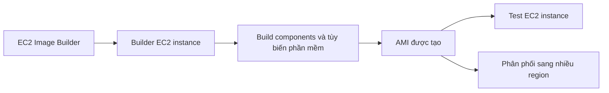

# 🏭 EC2 Image Builder: Dây chuyền tự động hóa tạo AMI

> Nguồn: `053-EC2-Image-Builder-Overview.txt` · [Udemy](https://ua.udemy.com/course/aws-certified-cloud-practitioner-new/learn/lecture/24682456)

Có một dịch vụ mình rất thích và **hiện đã xuất hiện trong đề thi**: **EC2 Image Builder**. Đây là "dây chuyền sản xuất" giúp các bạn tự động hóa việc tạo, kiểm thử và phân phối AMI. *Nếu bạn từng thấy việc tạo AMI thủ công tốn thời gian, dịch vụ này sinh ra dành cho bạn.*

---

### 🏭 EC2 Image Builder là gì?

Dịch vụ này dùng để **tự động hóa việc tạo virtual machine (máy ảo) hoặc container image**.

Với đề thi, các bạn chỉ cần nhớ: **EC2 Image Builder cho phép tự động hóa việc tạo (create), bảo trì (maintain), kiểm định (validate) và kiểm thử (test) AMI cho EC2 instance.**

---

### ⚙️ Bên trong dây chuyền hoạt động thế nào?

Khi Image Builder chạy, nó tự động tạo một **Builder EC2 instance**. Instance này sẽ **build các component và tùy biến phần mềm** — ví dụ:

* Cài **Java**
* Cập nhật **CLI**
* Cập nhật hệ thống phần mềm
* Cài **firewall**
* Cài đặt ứng dụng của bạn

...tất cả những gì bạn định nghĩa trước. Khi hoàn tất, một **AMI được tạo ra từ instance đó** — toàn bộ quá trình đều được tự động hóa.

---

### 🧪 Validate, Test và Distribution

* **Test**: Image Builder tự động tạo một **test EC2 instance** từ AMI mới, rồi chạy các bài kiểm tra bạn định nghĩa sẵn — AMI có hoạt động không? Có an toàn không? Ứng dụng có chạy đúng không? Nếu bạn không muốn test, hoàn toàn có thể **bỏ qua bước này**.
* **Distribution**: AMI sau khi kiểm thử có thể được **phân phối sang nhiều region**, giúp ứng dụng và workflow của bạn thực sự **vươn ra toàn cầu**.

---

### 🗓️ Lịch chạy và chi phí

* **Schedule**: bạn có thể cho Image Builder chạy **theo lịch hàng tuần**, chạy **khi có package được cập nhật**, hoặc chạy **thủ công** — tùy nhu cầu.
* **Pricing**: Image Builder là **dịch vụ miễn phí**; bạn chỉ trả tiền cho **các tài nguyên bên dưới**:
  * **EC2 instance** được tạo ra trong quá trình build và test.
  * **Storage của AMI** ở nơi nó được tạo và được phân phối tới.

Nghe rất hợp lý phải không? *Bạn chỉ trả cho những gì thực sự được dùng.*

---

### 🎯 Tự kiểm tra nhanh

**Câu 1:** EC2 Image Builder dùng để làm gì?

<b>Xem đáp án</b>

**Đáp án:** Tự động hóa việc tạo, bảo trì, kiểm định và kiểm thử AMI cho EC2 instance.

Giải thích: Nó cũng dùng để tự động tạo virtual machine hoặc container image.

Tham chiếu: Mục EC2 Image Builder là gì.

**Câu 2:** Instance mà Image Builder tạo ra để build phần mềm gọi là gì?

<b>Xem đáp án</b>

**Đáp án:** Builder EC2 instance.

Giải thích: Nó build các component và tùy biến phần mềm như cài Java, cập nhật CLI, cài firewall.

Tham chiếu: Mục Bên trong dây chuyền hoạt động thế nào.

**Câu 3:** Sau khi tạo AMI, Image Builder làm gì để kiểm tra chất lượng?

<b>Xem đáp án</b>

**Đáp án:** Tự động tạo một test EC2 instance từ AMI và chạy các bài test bạn định nghĩa.

Giải thích: Bạn hoàn toàn có thể bỏ qua bước test nếu không cần.

Tham chiếu: Mục Validate, Test và Distribution.

**Câu 4:** Image Builder có thể chạy theo lịch không?

<b>Xem đáp án</b>

**Đáp án:** Có — theo lịch hàng tuần, khi có package cập nhật, hoặc chạy thủ công.

Giải thích: Bạn toàn quyền chọn cách kích hoạt phù hợp với quy trình của mình.

Tham chiếu: Mục Lịch chạy và chi phí.

**Câu 5:** Chi phí sử dụng EC2 Image Builder được tính như thế nào?

<b>Xem đáp án</b>

**Đáp án:** Dịch vụ miễn phí; bạn chỉ trả cho EC2 instance và storage của AMI.

Giải thích: Tức là trả cho các tài nguyên bên dưới mà Image Builder tạo ra.

Tham chiếu: Mục Lịch chạy và chi phí.

---

Vậy là các bạn đã nắm được **EC2 Image Builder**: tự động hóa toàn bộ vòng đời AMI từ build, test đến phân phối đa region — và **có thể xuất hiện trong đề thi**. *Chỉ cần nhớ "tự động hóa create, maintain, validate, test AMI" là bạn đã ăn điểm câu hỏi về dịch vụ này.*

Ở bài tiếp theo, chúng ta sẽ tìm hiểu **EC2 Instance Store** — ổ đĩa phần cứng tốc độ cực cao gắn trực tiếp vào server vật lý. Hẹn gặp các bạn ở đó! 🚀
