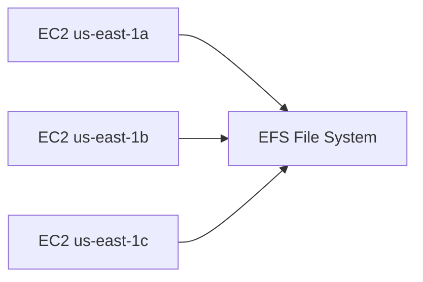

# 🗂️ EFS Overview: Hệ thống file mạng dùng chung cho hàng trăm EC2

> Nguồn: `055-EFS-Overview.txt` · [Udemy](https://ua.udemy.com/course/aws-certified-cloud-practitioner-new/learn/lecture/20055824)

Sau EBS và Instance Store, chúng ta đến với kiểu lưu trữ thứ ba có thể gắn vào EC2: **network file system (NFS — hệ thống file mạng)**. Dịch vụ này tên là **EFS (Elastic File System)** — và đây là chủ đề rất hay gặp trong đề thi, đặc biệt ở dạng câu hỏi so sánh EBS với EFS.

Cùng mình "mổ xẻ" nhé!

---

### 🔍 EFS là gì?

**EFS (Elastic File System)** là một **managed network file system (hệ thống file mạng được quản lý)** bởi AWS.

Điểm khác biệt cốt lõi so với EBS:

* EBS chỉ gắn được vào **một EC2 instance tại một thời điểm**.
* EFS có thể được **mount (gắn) vào hàng trăm EC2 instance cùng lúc** → trở thành **shared NFS (hệ thống file mạng dùng chung)**.

Hai đặc điểm bắt buộc nhớ:

1. EFS **chỉ hoạt động với EC2 instance chạy Linux**.
2. EFS hoạt động **xuyên nhiều Availability Zone (vùng sẵn sàng)** — instance ở AZ này và instance ở AZ khác có thể cùng gắn một EFS volume.

Về đặc tính vận hành: EFS **highly available (sẵn sàng cao)**, **scalable (mở rộng linh hoạt)** nhưng **khá đắt** — khoảng **3 lần giá của EBS gp2**. Bù lại, các bạn **trả tiền theo mức sử dụng (pay per use)** và **không phải lên kế hoạch dung lượng trước**: ví dụ lưu 20 GB dữ liệu thì chỉ trả tiền cho đúng 20 GB đó.

---

### 🌍 EFS trải rộng qua nhiều Availability Zone

EFS file system có một **security group (nhóm bảo mật)**, và các EC2 instance ở nhiều AZ khác nhau đều kết nối tới nó qua **mount target**:

Tất cả các instance — dù ở **us-east-1a**, **us-east-1b** hay **us-east-1c** — đều nhìn thấy **cùng một bộ file** trên EFS. Đây chính là điểm "ăn tiền" của EFS.

---

### ⚖️ EBS khác EFS như thế nào?

**Với EBS:**

* Volume gắn vào **một instance duy nhất** trong **một AZ cụ thể**, và **bị ràng buộc vào AZ đó**.
* Muốn chuyển dữ liệu sang AZ khác: tạo **EBS snapshot**, rồi **restore snapshot** vào AZ mới. Đây là một bản **copy**, không phải bản replica đồng bộ (in-sync replica).

**Với EFS:**

* Là network file system dùng chung: mọi thứ mounted vào đều thấy chung dữ liệu.
* Nhiều instance ở AZ 1 và AZ 2 cùng mount một EFS drive qua mount target → tất cả thấy cùng file.

| Tiêu chí | EBS | EFS |
|---|---|---|
| Loại | Ổ đĩa mạng gắn 1 instance | Hệ thống file mạng dùng chung |
| Số instance gắn được | 1 | Hàng trăm |
| Phạm vi AZ | Bị khóa vào 1 AZ | Nhiều AZ |
| Hệ điều hành | Linux và Windows | Chỉ Linux |
| Chi phí | Rẻ hơn | Khoảng gấp 3 lần gp2 |

*Đây chính là nội dung mà đề thi sẽ kiểm tra các bạn đấy!*

---

### 💰 EFS-IA: tối ưu chi phí cho file ít truy cập

EFS có các **storage class (lớp lưu trữ)** khác nhau, và có một lớp các bạn cần biết tên: **EFS-IA (EFS Infrequent Access — truy cập không thường xuyên)**.

* Dành cho những file **không được truy cập thường xuyên**.
* Chi phí lưu trữ **thấp hơn tới 92%** so với lớp **EFS Standard**.
* Nếu bật EFS-IA, EFS sẽ **tự động di chuyển file** dựa trên **lần truy cập gần nhất** và một **lifecycle policy (chính sách vòng đời)**.

Ví dụ dễ hiểu: một file nằm trong EFS Standard **60 ngày không được đọc/ghi** → lifecycle policy có thể tự động chuyển nó sang EFS-IA để tiết kiệm chi phí. Khi file được truy cập lại, nó sẽ **tự động quay về EFS Standard**.

Điểm tuyệt vời: quá trình này **hoàn toàn trong suốt với ứng dụng** — ứng dụng không cần biết file đang ở Standard hay IA, vẫn truy cập y như cũ. EFS lo mọi thứ ở hậu trường.

---

### 🎯 Ghi nhớ để vào phòng thi

* Cần **network file system dùng chung cho nhiều EC2 Linux, xuyên nhiều AZ** → nghĩ ngay đến **EFS**.
* Cần **tối ưu chi phí cho file ít dùng** → nhớ đến **EFS-IA** với mức giảm tới **92%**.
* EFS **không áp dụng cho Windows** — đó là việc của FSx ở bài sau.

---

### 🧪 Tự kiểm tra nhanh

**Câu 1:** EFS là loại lưu trữ gì?

<b>Xem đáp án</b>

**Đáp án:** Managed network file system (NFS) có thể mount vào hàng trăm EC2 instance cùng lúc.

Giải thích: Khác với EBS chỉ gắn được vào một instance tại một thời điểm.

Tham chiếu: Mục EFS là gì.

**Câu 2:** EFS hoạt động với hệ điều hành nào và phạm vi ra sao?

<b>Xem đáp án</b>

**Đáp án:** Chỉ với EC2 instance chạy Linux, và hoạt động xuyên nhiều Availability Zone.

Giải thích: Instance ở các AZ khác nhau có thể cùng gắn một EFS file system.

Tham chiếu: Mục EFS là gì.

**Câu 3:** Muốn chuyển một EBS volume sang AZ khác thì làm thế nào?

<b>Xem đáp án</b>

**Đáp án:** Tạo EBS snapshot rồi restore snapshot đó vào AZ mới.

Giải thích: Đây là bản copy, không phải in-sync replica.

Tham chiếu: Mục EBS khác EFS như thế nào.

**Câu 4:** EFS-IA giúp tiết kiệm bao nhiêu chi phí lưu trữ?

<b>Xem đáp án</b>

**Đáp án:** Tối đa 92% so với EFS Standard.

Giải thích: Dành cho các file không được truy cập thường xuyên.

Tham chiếu: Mục EFS-IA.

**Câu 5:** Điều gì xảy ra khi file trong EFS-IA được truy cập lại?

<b>Xem đáp án</b>

**Đáp án:** File được đưa trở lại EFS Standard.

Giải thích: Quá trình di chuyển do lifecycle policy tự động thực hiện và hoàn toàn trong suốt với ứng dụng.

Tham chiếu: Mục EFS-IA.

---

Vậy là các bạn đã nắm chắc **EFS**: hệ thống file dùng chung cho nhiều EC2 Linux, chạy xuyên AZ, tối ưu chi phí với EFS-IA. Ghi nhớ bảng so sánh EBS vs EFS là các bạn đã nắm trong tay một câu hỏi "ăn điểm" của đề thi.

Ở bài tiếp theo, chúng ta cùng điểm qua **mô hình trách nhiệm chung (Shared Responsibility Model)** áp dụng riêng cho lưu trữ EC2. Hẹn gặp các bạn! 🚀
