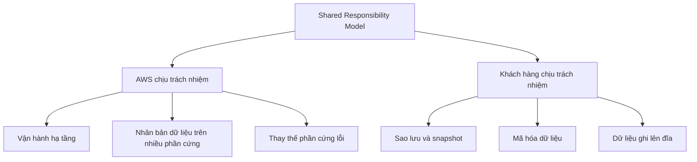

# 🔐 Shared Responsibility Model cho EC2 Storage: AWS lo gì, bạn lo gì?

> Nguồn: `056-Shared-Responsibility-Model-for-EC2-Storage.txt` · [Udemy](https://ua.udemy.com/course/aws-certified-cloud-practitioner-new/learn/lecture/20055828)

**Shared Responsibility Model (Mô hình trách nhiệm chung)** là chủ đề xuất hiện xuyên suốt kỳ thi **Cloud Practitioner**, và lưu trữ EC2 cũng không phải ngoại lệ. Câu hỏi đặt ra rất đơn giản: với **EBS, EFS và EC2 Instance Store**, phần việc nào thuộc về AWS và phần việc nào thuộc về các bạn?

Cùng mình chia rõ "ranh giới trách nhiệm" nhé — đây là dạng câu hỏi rất dễ ghi điểm nếu nắm chắc!

---

### 🧭 Vì sao phải nắm mô hình trách nhiệm chung?

Như mọi khi, **shared responsibility** là phần quan trọng của đề thi Cloud Practitioner. Với lưu trữ EC2, các bạn cần phân biệt được hai phía:

---

### ☁️ Phần việc của AWS

AWS chịu trách nhiệm cho **hạ tầng (infrastructure)** của họ. Cụ thể với lưu trữ EC2:

* Theo **đặc tả kỹ thuật của EBS và EFS**, dữ liệu của bạn được **nhân bản (replicated) trên nhiều phần cứng** — AWS có trách nhiệm thực hiện việc nhân bản đó. Nhờ vậy, nếu một ngày nào đó phần cứng gặp sự cố, khách hàng **không bị ảnh hưởng**.
* Khi một **EBS drive** (hoặc một phần của nó) hỏng, AWS phải **thay thế phần cứng lỗi**.
* Vì đây là nơi lưu dữ liệu, AWS phải đảm bảo **nhân viên của họ không thể truy cập vào dữ liệu của bạn**.

---

### 🧑💻 Phần việc của bạn với tư cách khách hàng

Đây là những gì các bạn phải tự lo:

1. **Thiết lập quy trình backup/snapshot và các hướng dẫn liên quan** — cực kỳ quan trọng để không mất dữ liệu.
2. **Thiết lập mã hóa dữ liệu (data encryption)** — một lớp bảo vệ bổ sung, đảm bảo không ai truy cập được dữ liệu của bạn (dù là AWS hay khách hàng AWS khác). *Dù chắc chắn đã có các lớp bảo mật khác, mã hóa vẫn là lớp phòng thủ thứ hai rất đáng giá.*
3. **Mọi dữ liệu bạn đặt lên ổ đĩa** — bất cứ thứ gì bạn ghi lên disk đều là trách nhiệm của bạn.
4. Nếu dùng **EC2 Instance Store**, bạn phải **hiểu rõ rủi ro**: ổ đĩa có thể mất khi phần cứng hỏng, hoặc dữ liệu mất sạch khi bạn **stop/terminate** instance. Vì thế, **backup là trách nhiệm của bạn** ngay từ đầu.

| Hạng mục | AWS | Bạn |
|---|---|---|
| Hạ tầng vật lý | ✅ | — |
| Nhân bản dữ liệu trên nhiều phần cứng | ✅ | — |
| Thay thế phần cứng lỗi | ✅ | — |
| Nhân viên AWS không truy cập dữ liệu | ✅ | — |
| Quy trình backup/snapshot | — | ✅ |
| Mã hóa dữ liệu | — | ✅ |
| Dữ liệu ghi lên đĩa | — | ✅ |
| Rủi ro khi dùng Instance Store | — | ✅ |

---

### ⚠️ Nhớ kỹ với EC2 Instance Store

Vì Instance Store là **ephemeral storage (lưu trữ tạm thời)**, các bạn cần đặc biệt lưu tâm:

* Phần cứng hỏng → ổ đĩa hỏng theo.
* Stop hoặc terminate instance → dữ liệu biến mất.
* Không có "phép màu" nào từ AWS cứu dữ liệu đó — **chính bạn phải backup từ trước**.

*Đừng lo, chỉ cần nhớ nguyên tắc: dữ liệu của bạn là trách nhiệm của bạn.*

---

### 🧪 Tự kiểm tra nhanh

**Câu 1:** Ai chịu trách nhiệm nhân bản dữ liệu EBS/EFS trên nhiều phần cứng?

<b>Xem đáp án</b>

**Đáp án:** AWS.

Giải thích: Đây là trách nhiệm thuộc hạ tầng, được quy định trong đặc tả kỹ thuật của EBS và EFS.

Tham chiếu: Mục Phần việc của AWS.

**Câu 2:** Vì sao AWS phải đảm bảo nhân viên của họ không truy cập dữ liệu khách hàng?

<b>Xem đáp án</b>

**Đáp án:** Vì đây là trách nhiệm của AWS khi vận hành dịch vụ lưu trữ.

Giải thích: Nằm trong phần trách nhiệm bảo mật hạ tầng của AWS.

Tham chiếu: Mục Phần việc của AWS.

**Câu 3:** Khách hàng cần làm gì để bảo vệ dữ liệu khỏi mất mát?

<b>Xem đáp án</b>

**Đáp án:** Thiết lập quy trình backup/snapshot và mã hóa dữ liệu.

Giải thích: Đây là hai nhóm trách nhiệm quan trọng nhất của khách hàng với lưu trữ EC2.

Tham chiếu: Mục Phần việc của bạn.

**Câu 4:** Rủi ro nào đi kèm khi dùng EC2 Instance Store?

<b>Xem đáp án</b>

**Đáp án:** Mất dữ liệu khi phần cứng hỏng, hoặc khi stop/terminate instance.

Giải thích: Vì Instance Store là ephemeral storage, bạn phải tự backup.

Tham chiếu: Mục Nhớ kỹ với EC2 Instance Store.

**Câu 5:** Ai chịu trách nhiệm cho nội dung bạn ghi lên ổ đĩa?

<b>Xem đáp án</b>

**Đáp án:** Bạn — khách hàng.

Giải thích: Mọi dữ liệu đặt lên drive đều thuộc trách nhiệm của khách hàng.

Tham chiếu: Mục Phần việc của bạn.

---

Vậy là các bạn đã nắm được **mô hình trách nhiệm chung cho lưu trữ EC2**: AWS lo hạ tầng, nhân bản và thay thế phần cứng; bạn lo backup, mã hóa và dữ liệu của chính mình. *Hãy nhớ đây là dạng câu hỏi "tủ" của đề thi — nắm chắc là ăn điểm chắc chắn.*

Ở bài tiếp theo, chúng ta sẽ làm quen với **Amazon FSx** — dịch vụ file system hiệu năng cao cho Windows và HPC. Hẹn gặp các bạn! 🚀
