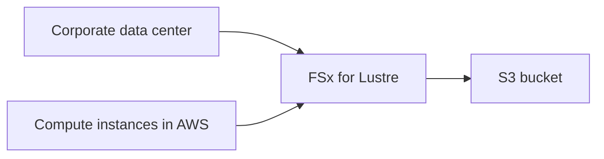

# 🪟 Amazon FSx Overview: File system hiệu năng cao cho Windows và HPC

> Nguồn: `057-Amazon-FSx-Overview.txt` · [Udemy](https://ua.udemy.com/course/aws-certified-cloud-practitioner-new/learn/lecture/26623482)

Nếu các bạn không muốn dùng **EFS** hay **S3**, mà cần một **file system hiệu năng cao của bên thứ ba** trên AWS, thì **Amazon FSx** chính là câu trả lời. Đây là dịch vụ được quản lý hoàn toàn (managed service), cho phép các bạn chạy nhiều loại file system khác nhau trên nền tảng AWS.

Trong bài này, mình sẽ tập trung vào **hai phiên bản quan trọng nhất cho đề thi**. Cùng bắt đầu nhé!

---

### 🔍 Amazon FSx là gì?

**Amazon FSx** là dịch vụ được quản lý giúp các bạn có được các **third-party high-performance file system (hệ thống file hiệu năng cao của bên thứ ba)** trên AWS.

Hiện tại FSx có **ba phiên bản**:

1. **FSx for Lustre**
2. **FSx for Windows File Server**
3. **FSx for NetApp ONTAP**

AWS có thể bổ sung thêm file system mới cho FSx theo thời gian, nhưng nội dung quan trọng nhất của bài này là **Lustre** và **Windows File Server**. *Hai phiên bản này là những gì các bạn cần nắm cho kỳ thi.*

---

### 🪟 FSx for Windows File Server

Đây là **Windows native shared file system (hệ thống file dùng chung gốc Windows)** — được quản lý hoàn toàn, độ tin cậy cao và có khả năng mở rộng, xây dựng trên **Windows File Server**.

* Dành cho **Windows instance**.
* Triển khai thường **trải trên hai Availability Zone**.
* Hỗ trợ đầy đủ các **giao thức gốc của Windows**:
  * **SMB protocol** (Server Message Block)
  * **Windows NTFS** (New Technology File System)
* Nhờ đó, các bạn có thể **mount file system này lên máy Windows**.

Về khả năng truy cập:

* Từ **corporate data center (trung tâm dữ liệu doanh nghiệp)**: máy **Windows Client** kết nối qua **SMB** tới Windows file server.
* Từ **EC2 instance chạy Windows** trong AWS: cũng truy cập được file server này.
* Từ **hạ tầng on-premises (tại chỗ)** của bạn: vẫn truy cập được.

Vì đây là dịch vụ mang "chất" Microsoft, FSx for Windows File Server có **tích hợp với Microsoft Active Directory** để quản lý bảo mật người dùng.

---

### ⚡ FSx for Lustre

Phiên bản thứ hai là **Amazon FSx for Lustre** — **fully managed, high-performance và scalable file storage cho HPC (High Performance Computing — tính toán hiệu năng cao)**.

Mẹo nhớ cực dễ: hễ thấy **storage cho HPC** → nghĩ ngay đến **FSx for Lustre**.

Vì sao tên là "Lustre"? Đó là ghép của **Linux** và **cluster** — các bạn cứ hình dung đến xử lý dạng cluster là sẽ nhớ ra ngay.

FSx for Lustre phục vụ nhiều use case nặng:

* **Machine learning**
* **Analytics**
* **Video processing**
* **Financial modeling**

Hiệu năng của nó cực "khủng":

* Trao đổi dữ liệu tới **hàng trăm GB/giây**
* **Hàng triệu IO operations mỗi giây**
* **Độ trễ dưới một mili-giây (sub-millisecond latency)**

Cách hoạt động:

FSx for Lustre kết nối tới **corporate data center** hoặc trực tiếp tới **compute instance trong AWS**. Ở hậu trường, dữ liệu của nó có thể được lưu trên **Amazon S3 bucket**.

---

### ⚖️ So sánh nhanh hai phiên bản

| Tiêu chí | FSx for Windows File Server | FSx for Lustre |
|---|---|---|
| Đối tượng | Máy chủ Windows | Tính toán hiệu năng cao HPC |
| Công nghệ | Windows File Server, SMB, NTFS | Lustre — Linux + cluster |
| Tích hợp | Microsoft Active Directory | Kết nối compute, lưu trên S3 |
| Use case | File dùng chung cho Windows | Machine learning, analytics, video, tài chính |

---

### 🎯 Chốt lại để vào phòng thi

* **FSx for Windows File Server** → file system dùng chung cho **Windows**, SMB + NTFS, tích hợp **Active Directory**.
* **FSx for Lustre** → file system hiệu năng cao cho **HPC**, tên ghép từ **Linux + cluster**, có thể lưu dữ liệu trên **S3**.
* Với FSx, **không có bài hands-on** để thực hành — chỉ cần nhớ hai phiên bản này là các bạn ổn.

---

### 🧪 Tự kiểm tra nhanh

**Câu 1:** Amazon FSx là dịch vụ gì?

<b>Xem đáp án</b>

**Đáp án:** Managed service cung cấp các file system hiệu năng cao của bên thứ ba trên AWS.

Giải thích: Dùng khi bạn không muốn dùng EFS hoặc S3 mà cần loại file system khác.

Tham chiếu: Mục Amazon FSx là gì.

**Câu 2:** Phiên bản FSx nào dành cho Windows?

<b>Xem đáp án</b>

**Đáp án:** FSx for Windows File Server.

Giải thích: Hỗ trợ SMB protocol và Windows NTFS, tích hợp Microsoft Active Directory.

Tham chiếu: Mục FSx for Windows File Server.

**Câu 3:** Tên "Lustre" được ghép từ hai từ nào?

<b>Xem đáp án</b>

**Đáp án:** Linux và cluster.

Giải thích: Đây là mẹo nhớ để gắn FSx for Lustre với các workload dạng cluster, HPC.

Tham chiếu: Mục FSx for Lustre.

**Câu 4:** FSx for Lustre phù hợp với use case nào?

<b>Xem đáp án</b>

**Đáp án:** Machine learning, analytics, video processing, financial modeling — các workload HPC.

Giải thích: Nhờ hiệu năng hàng trăm GB/giây, hàng triệu IOPS, độ trễ dưới mili-giây.

Tham chiếu: Mục FSx for Lustre.

**Câu 5:** Dữ liệu của FSx for Lustre có thể được lưu ở đâu?

<b>Xem đáp án</b>

**Đáp án:** Có thể lưu trên Amazon S3 bucket.

Giải thích: FSx for Lustre lưu trữ dữ liệu ở hậu trường, kết nối với compute instance hoặc data center.

Tham chiếu: Mục FSx for Lustre.

---

Vậy là các bạn đã nắm được **Amazon FSx** với hai phiên bản cốt lõi: **Windows File Server** cho máy Windows và **Lustre** cho HPC. Chỉ cần nhớ đúng "từ khóa kích hoạt" của từng phiên bản, các bạn sẽ xử lý gọn mọi câu hỏi về FSx trong đề thi.

Ở bài tiếp theo, chúng ta sẽ **tổng kết toàn bộ section EC2 Instance Storage** để hệ thống hóa kiến thức trước khi bước sang phần mới. Hẹn gặp các bạn! 🚀
