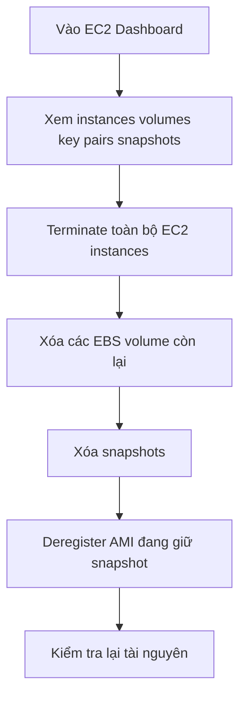

# 🧹 Section Cleanup: Dọn dẹp tài nguyên EC2 để không trả phí oan

> Nguồn: `059-Section-Cleanup.txt` · [Udemy](https://ua.udemy.com/course/aws-certified-cloud-practitioner-new/learn/lecture/20207862)

Kết thúc section **EC2 Instance Storage**, chúng ta cùng làm một buổi **dọn dẹp (cleanup)** để tài khoản AWS luôn sạch sẽ và các bạn không bị tính phí oan — kể cả khi đang ở **free tier (gói miễn phí)**.

*Việc dọn dẹp chỉ mất vài phút, nhưng đây là thói quen cực tốt khi học AWS.* Cùng mình làm từng bước nhé!

---

### 🧹 Vì sao cần dọn dẹp?

Mục tiêu rất đơn giản: giữ một **"clean slate" (bàn giấy trắng)** cho phần học tiếp theo và **tránh trả tiền vượt mức** — dù chúng ta đang dùng free tier.

Nguyên tắc chung:

* Tài nguyên **không tốn tiền** thì có thể giữ nguyên hoặc xóa tùy ý.
* Tài nguyên **có thể phát sinh phí** như instance, volume, snapshot thì nên dọn ngay khi không còn dùng.

---

### 📊 Kiểm tra tài nguyên trên EC2 Dashboard

Vào **EC2 Dashboard**, các bạn sẽ thấy mọi tài nguyên đang chạy trong **region (vùng)** của mình. Trong bản demo, mình có:

* **2 EC2 instance** đang chạy
* **4 volumes** (EBS volume)
* **4 key pairs**
* **2 snapshots**
* **Security group** các loại

Cách xử lý:

* **Key pairs** và **security group**: không tốn tiền, **giữ nguyên cũng được**.
* **Instance, volume, snapshot**: cần dọn dẹp.

---

### 🔥 Các bước dọn dẹp

Thực hiện lần lượt:

1. **Terminate EC2 instance:** chọn tất cả instance, **right-click** rồi chọn **Terminate**. *Đơn giản vậy thôi — đây chính là sức mạnh của cloud!*
2. **Xóa EBS volume:** các **root EBS volume** sẽ tự động bị xóa khi instance bị terminate. Với những volume còn lại (trong demo là 2 cái), các bạn **xóa thủ công**.
3. **Xóa snapshot:** chọn snapshot → **Actions** → **Delete snapshot**. Một snapshot có thể báo **không xóa được vì đang được dùng bởi một AMI** — đó là lúc cần bước 4.
4. **Deregister AMI:** vào mục **AMI** ở thanh bên trái, chọn AMI đang giữ snapshot, bấm **Deregister** và xác nhận. Quay lại snapshots, lúc này các bạn đã **xóa được snapshot đó**.

---

### ✅ Xác nhận hoàn tất

Sau khi dọn xong, hãy kiểm tra lại từng mục:

* **Instances:** tất cả đều ở trạng thái **terminated**.
* **EBS volumes:** không còn volume nào.
* **Snapshots:** trống.
* **AMI:** trống.

Refresh lại trang một lần nữa để chắc chắn tài khoản đã sạch sẽ.

---

Dọn dẹp xong, các bạn đã sẵn sàng bước sang section tiếp theo với một tài khoản AWS gọn gàng và an toàn về chi phí. *Đừng xem nhẹ thói quen cleanup nhé — nó giúp các bạn học AWS an toàn và chuyên nghiệp hơn rất nhiều.*

Hẹn gặp các bạn ở section mới! 🚀
